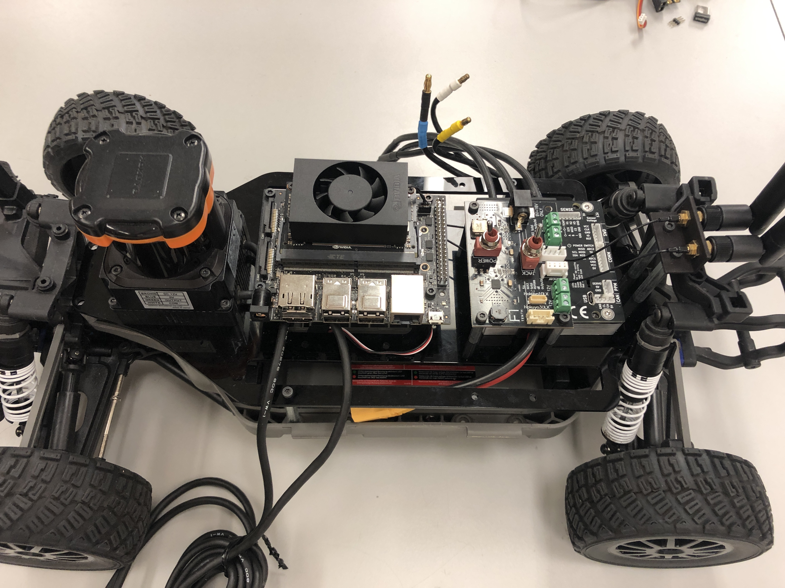
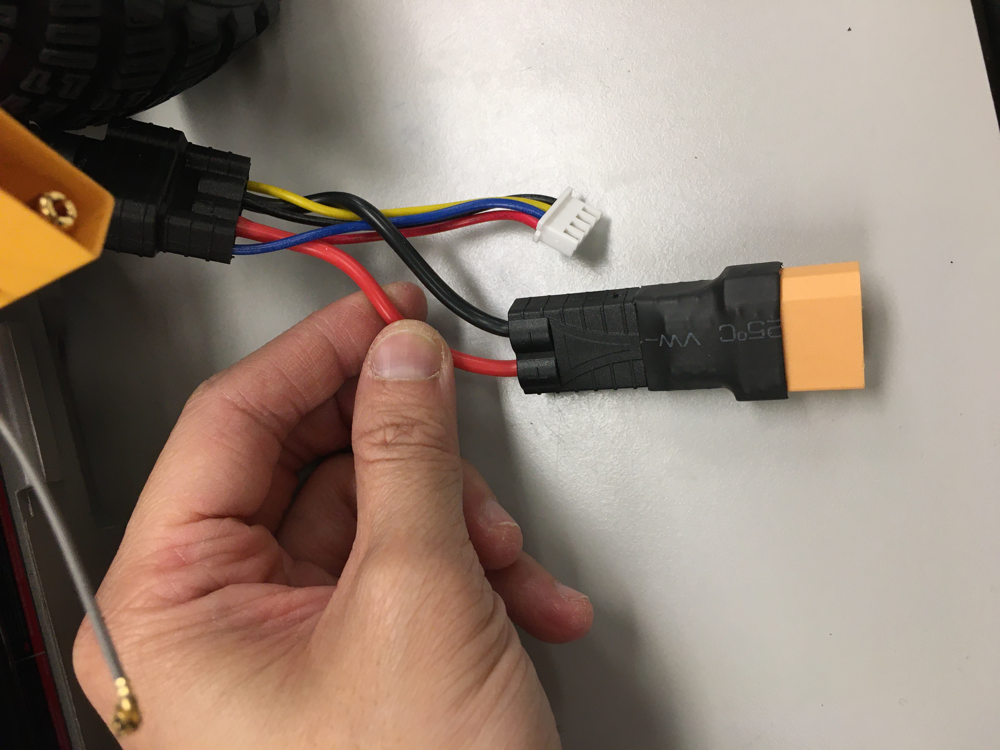
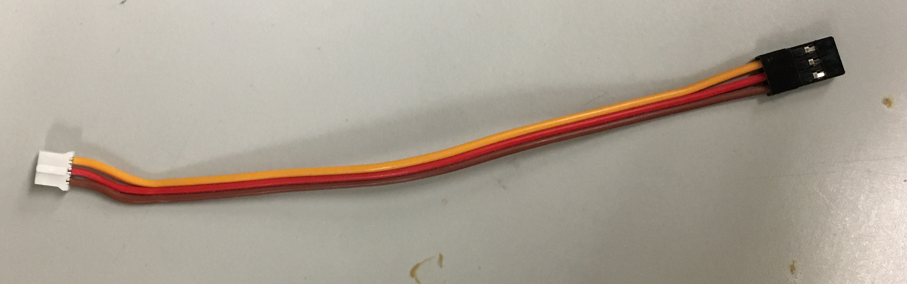
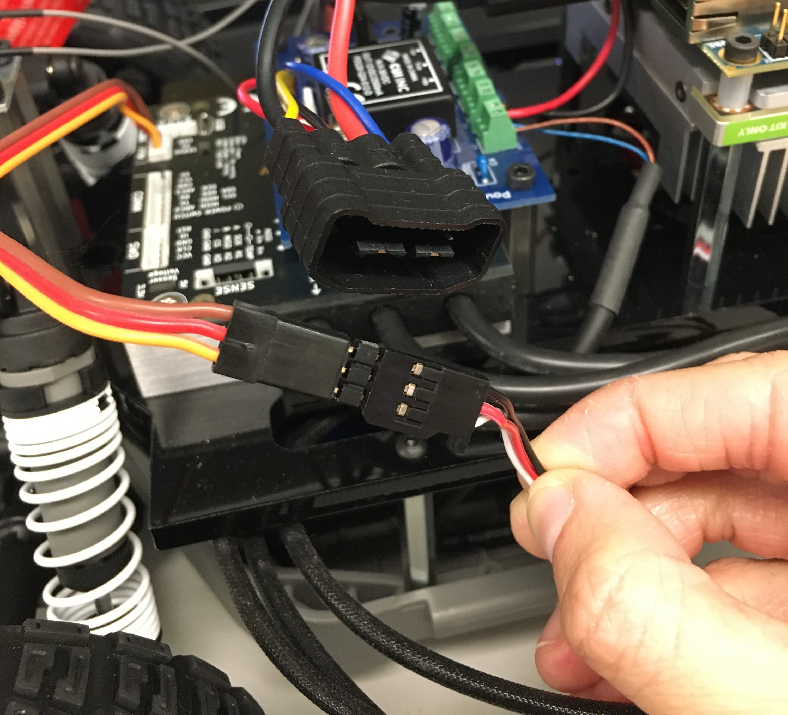

.. _doc_build_all_together:

4. Putting it all together
============================

Now that we have the autonomy elements attached to the upper level chassis, we are going to attach the upper level chassis to the lower level chassis. This part may be a tad unwieldy due to the amount of wires and cables that have to be contained. The complete process for the last hardware part can be watched in this video tutorial too.

.. raw:: html

	<iframe width="560" height="315" src="https://www.youtube.com/embed/vNVFCq688ck" frameborder="0" allow="accelerometer; autoplay; clipboard-write; encrypted-media; gyroscope; picture-in-picture" allowfullscreen></iframe>

1. Mounting the Upper Level Chassis to the Lower Level Chassis
---------------------------------------------------------------
Gently place the upper level chassis on top of the standoffs of the lower level chassis. The VESC should be towards the back of the car. Thread the PPM cable from the lower level chassis, through one of the Platform Deck slot.

	Upper Level Chassis gently placed on top of Lower Level Chassis.

.. figure:: img/together/together02.JPG
	:align: center

	Lidar cables carefully arranged on top of battery.

Use three M3 x 10mm (these are the ones that were removed from the chassis during the Lower Level Chassis build section) screws to attach the Platform Deck to the standoffs on the lower level chassis.

It may be useful to use a zip tie to secure the USB cable from the lidar to the platform.

.. danger::
	The driveshaft that runs along the length of the chassis rotates when the car moves. You can manage the cables and wires in whatever manner you like but make sure that you keep them away from any rotating assemblies, including the driveshaft. If you don't, then the rotating assemblies will pull on all the cables and the last 1-2 hours of your life will have been in vain.

2. Connecting the Brushless Motor to the VESC
----------------------------------------------
Take three 4mm to 3.5mm bullet adapters.

.. figure:: img/together/together07.png
	:align: center

	4mm to 3.5mm bullet adapters.

Attach the adapters to the blue, yellow, and white wires of the Brushless Motor.

 .. figure:: img/together/together08.JPG
 	:align: center

	Blue, yellow, white wires from Brushless Motor.

The VESC also has three wires labelled **A**, **B**, and **C**.

 .. figure:: img/together/together10.jpg
  	:align: center

	VESCMKIII.

Now, we are going to connect these to the VESC. This part is a tad tricky.

	* **A** -> **WHITE**
	* **B** -> **YELLOW**
	* **C** -> **BLUE**

.. figure:: img/together/together09.JPG
  	:align: center

	Brushless Motor wires connected to the Bullet Adapters then connceted to the VESC wires.

.. important::
	After you flash the firmware on the VESC, if the vehicle runs backwards to the expected motion, simply swap the WHITE wire to "C" and BLUE wire to "A".

3. Connecting the Battery with the VESC
----------------------------

Plug the `charge adapter <https://www.amazon.com/gp/product/B078P9V99B/ref=crt_ewc_title_huc_1?ie=UTF8&psc=1&smid=A87AJ0MK8WLZZ>`_ into the battery plug,

.. danger:: **MAKE SURE THAT RED/POWER AND BLACK/GROUND ARE CONNECTED CORRECTLY TO THE RED/POWER AND BLACK/GROUND OF THE CHARGE ADAPTER** Fire will happen if this is plugged backwards.

.. figure:: img/llchassis/llchassis15.JPG
	:align: center

	Charge adapter cable plugged into the Lipo battery.

Then, connect the other side of the charge adapter to a TRX to XT90 adapter.

.. figure:: img/llchassis/llchassis16.JPG
	:align: center

	Plugging in the TRX to XT90 adapter.

It should look like this:

	TRX to XT90 adapter installed.

4. Connecting the NVIDIA Jetson NX with the VESC
----------------------------

5. Lidar Connection
------------------------------

	 The lidar comes with two very long cables. We are going to try out best to manage them. Split the two cables of the lidar and loop them under the slots on the Platform Deck.

	 .. figure:: img/ulchassis/ulchassis15.JPG
	 	:align: center

	 	Looping the lidar cables through the slots.

	 Using a twist tie, rubber band, or zip tie, gather the majority of the cables on each side.

	 For the stripped cable side, insert the **BROWN (POWER)** and **BLUE (GROUND)** wires into one of the 12V terminal blocks on the Powerboard.

	 .. DANGER::
	 	***BROWN is POWER and BLUE is GROUND.*  DO NOT MIX THESE UP OTHERWISE YOU WILL FRY YOUR VERY EXPENSIVE LIDAR.** And then life will be very very sad. When in doubt, check the side of the Hokuyo. It will list out the correspondence of each wire.

	 .. figure:: img/ulchassis/ulchassis16.JPG
	 	:align: center

	 	Side view with wires coiled.

	 .. figure:: img/ulchassis/ulchassis17.JPG
	 	:align: center

	 	Lidar power is plugged into the terminal block with Brown to Power and Blue to Ground.

	 If using the UTM-30LX, plug the USB into one of the ports on the USB hub.

	 .. figure:: img/ulchassis/ulchassis18.JPG
	 	:align: center

	 	USB side of lidar plugged into USB hub. If you are using a 10LX, plug it into the ethernet port on the Orbitty.

	 If using the UST-10LX, plug the ethernet cable into the ethernet port on the Orbitty board.

6. Attaching the PPM Cable
----------------------------
Now we are going to connect the PPM (Pulse-Position Modulation) cable to the Servo. The PPM cable connects the Servo to the VESC, which we will install on the Upper Level Chassis later.

	PPM cable. Note that it has a white end and a black end.

Take 3 header pins,

.. figure:: img/llchassis/llchassis18.JPG
	:align: center

	Header pins.

Plug it into the servo wires.

.. figure:: img/llchassis/llchassis19.JPG
	:align: center

	Header pin connected to Servo cable of the Servo on the Traxxas chassis.

Connect the ppm cable with the servo wire.

.. danger::
	**BROWN is GROUND. It should be connected to the BLACK wire of the Servo Cable.** Make sure the polarity of the PPM cable to servo is correct.

	PPM cable connected to Servo cable.

In additon you can plug it into the ppm slot on the VESC.

.. figure:: img/together/together03.JPG
	 :align: center

	PPM cable plugged into VESC.

The Lower Level chassis is now set up and we can move on to the autonomy elements. First accomplishment completed!

.. figure:: img/llchassis/llchassis22.gif
  :align: center

7. Final Touches
------------------------------
Almost there!

Attach the two wires for the Jetson Wi-Fi antenna to the two gold-colored connectors near the fan connector on the heat sink (the order of the wires doesn’t matter). This can be a little tricky, so you might want to use a flathead screwdriver to ensure the connections are tight. ​ Don’t press too hard​ , however as you can easily damage the connectors if you use excessive force!

.. figure:: img/together/together05.JPG
  	:align: center

	Attached antenna wires.

Connect a micro USB from the VESC to the USB hub.

.. figure:: img/together/together06.JPG
  	:align: center

	Micro USB plugged into the VESC. Plug the USB side into the USB hub.

Finally, screw on the antennas included with the Jetson TX2 Kit to the Antenna Terminals.

8. Voila!
----------
Your final vehicle should look like the following:

 .. figure:: img/together/together04.JPG
   	:align: center

	Final product! It looks a bit messy but cable management is an art!

Now we're ready to start driving!

.. figure:: img/together/together05.gif
   :align: center
   :width: 300px
