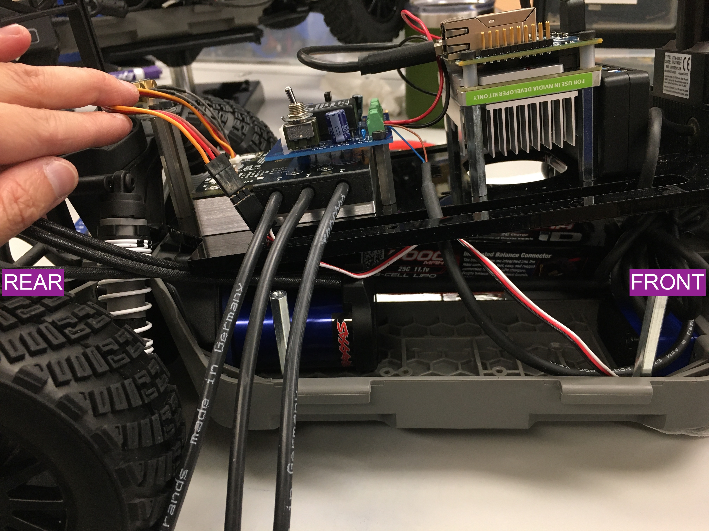
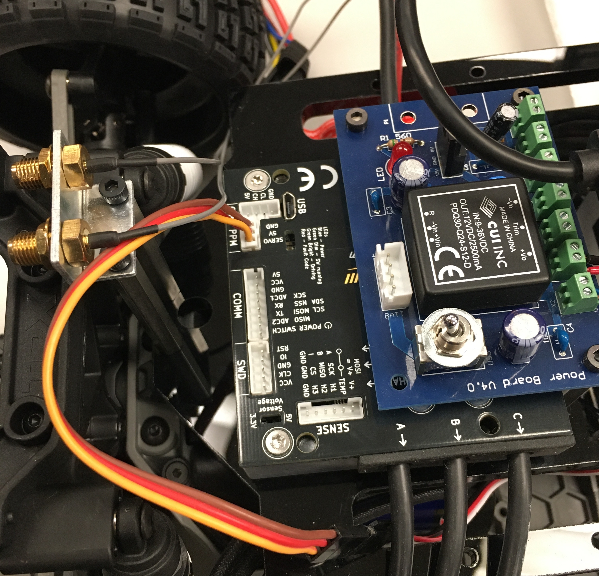
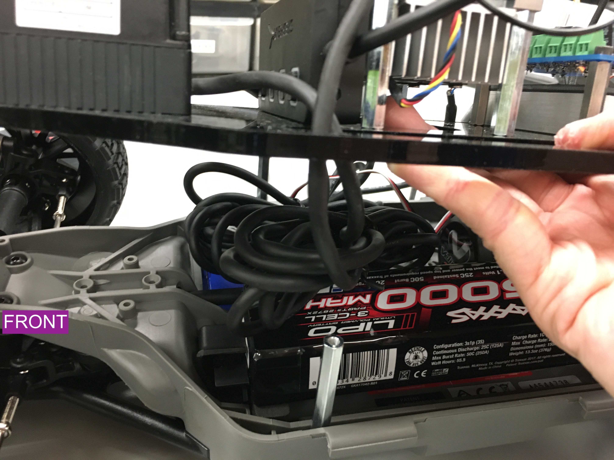
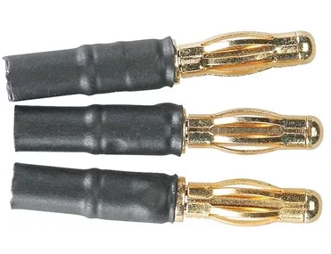
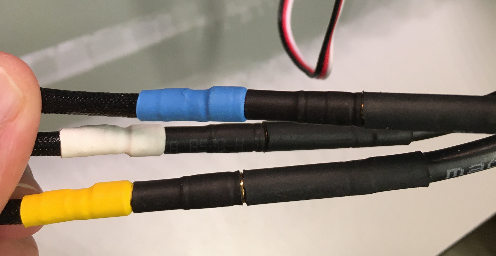
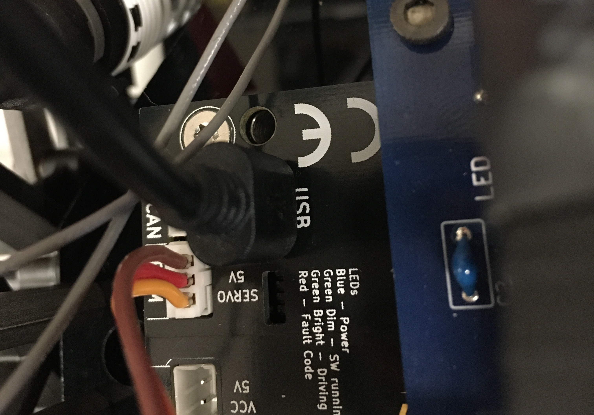
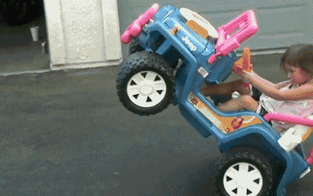

.. _doc_build_all_together:

4. Putting it all together
============================

Now that we have the autonomy elements attached to the upper level chassis, we are going to attach the upper level chassis to the lower level chassis. This part may be a tad unwieldy due to the amount of wires and cables that have to be contained.

1. Mounting the Upper Level Chassis to the Lower Level Chassis
---------------------------------------------------------------
Gently place the upper level chassis on top of the standoffs of the lower level chassis. The VESC should be towards the back of the car. Thread the PPM cable from the lower level chassis, through one of the Platform Deck slot, and plug it into the ppm slot on the VESC.

	Upper Level Chassis gently placed on top of Lower Level Chassis.

	PPM cable plugged into VESC.

	Lidar cables carefully arranged on top of battery.

Use three M3 x 10mm (these are the ones that were removed from the chassis during the Lower Level Chassis build section) screws to attach the Platform Deck to the standoffs on the lower level chassis.

It may be useful to use a zip tie to secure the USB cable from the lidar to the platform.

.. danger::
	The driveshaft that runs along the length of the chassis rotates when the car moves. You can manage the cables and wires in whatever manner you like but make sure that you keep them away from any rotating assemblies, including the driveshaft. If you don't, then the rotating assemblies will pull on all the cables and the last 1-2 hours of your life will have been in vain.

2. Connecting the Brushless Motor to the VESC
----------------------------------------------
Take three 4mm to 3.5mm bullet adapters.

	4mm to 3.5mm bullet adapters.

Attach the adapters to the blue, yellow, and white wires of the Brushless Motor.

 .. figure:: img/together/together08.JPG
 	:align: center

	Blue, yellow, white wires from Brushless Motor.
 
The VESC also has three wires labelled **A**, **B**, and **C**.

 .. figure:: img/together/together10.jpg
  	:align: center

	VESCMKIII.

Now, we are going to connect these to the VESC. This part is a tad tricky. 
	
	* **A** -> **WHITE**
	* **B** -> **YELLOW**
	* **C** -> **BLUE**

	Brushless Motor wires connected to the Bullet Adapters then connceted to the VESC wires.

.. important:: 
	After you flash the firmware on the VESC, if the vehicle runs backwards to the expected motion, simply swap the WHITE wire to "C" and BLUE wire to "A".

3. Final Touches
------------------------------
Almost there!

Attach the two wires for the Jetson Wi-Fi antenna to the two gold-colored connectors near the fan connector on the heat sink (the order of the wires doesn’t matter). This can be a little tricky, so you might want to use a flathead screwdriver to ensure the connections are tight. ​ Don’t press too hard​ , however as you can easily damage the connectors if you use excessive force!

.. figure:: img/together/together05.JPG  
  	:align: center

	Attached antenna wires.

Connect a micro USB from the VESC to the USB hub.

	Micro USB plugged into the VESC. Plug the USB side into the USB hub.

Finally, screw on the antennas included with the Jetson TX2 Kit to the Antenna Terminals. 

4. Voila!
----------
Your final vehicle should look like the following:

 .. figure:: img/together/together04.JPG  
   	:align: center

	Final product! It looks a bit messy but cable management is an art!

Now we're ready to start driving!

