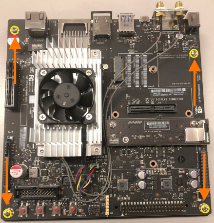
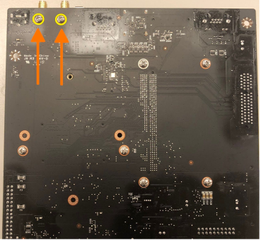
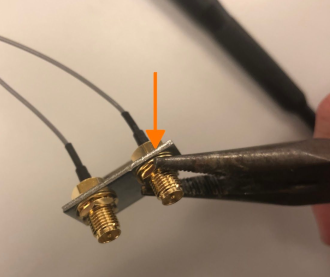
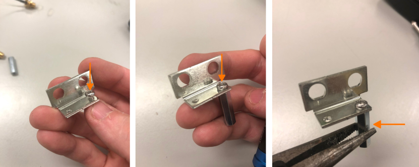

.. _doc_build_autonomy_elements:

2. Autonomy Elements
======================

1. Removing the TX2 and Antenna
---------------------------------
When you purchase a Jetson TX2, it is attached to a development board. In order to use it on the car, you will need to unscrew the Jetson TX2 and its Wi-Fi antenna from the development board.

Before you remove the antenna, you will need to remove the bottom plate from the development board. Remove the four screws marked below and lift the development board away from the plate.

	TX2 still in its development board. Remove the four circled screws.

Next, remove the Wi-Fi antenna by unscrewing the two screws marked below. Keep the screws in a safe place, as you’ll use them in a bit to attach the antennas to standoffs.

	Remove the antenna by unscrewing the two circled screws.

Remove the two brass-colored nuts holding the antennas to the L-shaped bracket, and then remove the two antennas from the bracket. It helps to use two pairs of pliers: one to hold the rear nuts in place and another to unscrew the nuts on the end with the antenna connectors.

	Removing nuts from the L-shaped bracked.

Using a Phillips screwdriver, thread the two screws you saved earlier completely into the bracket as pictured below. Attach two M3 FF 45mm standoffs to the opposite ends of the screws and hand-tighten them until they won’t turn anymore. Use the pliers to tighten the standoffs more while you hold the head of the screw in place using the screwdriver. Once you’ve done these steps, place the antennas and washers back into the bracket, and tighten the brass nuts onto the threaded connectors again.

	Screwing standoffs onto the bracket.

Unplug the Jetson TX2’s fan and remove the Jetson TX2 from the development board by using a T3 Torx screwdriver to unscrew the Jetson TX2 (the large silver heat sink), and then pull up gently to detach it from the development board. Keep the Jetson TX2 in a safe place while you attach the antennas to the power board.

.. figure:: img/autonomy/autonomy09.png
	:align: center

	Unplugging and removing the Jetson TX2's fan.

2. Attaching the Orbitty to the TX2
-------------------------------------
Seat the TX2 Module connector to the Orbitty board connector like so:

.. figure:: img/autonomy/autonomy01.JPG
	:align: center

	Attach the Orbitty Carrier Board to the TX2.

Put an M3 x 20mm screw through one of the Orbitty mount holes followed by one 8mm nylon spacer then 35mm FF M3 standoffs.  Repeat for the remaining three mounting holes.

.. figure:: img/autonomy/autonomy02.JPG
	:align: center

	Screw, spacer, and standoff mounted.

The results should look like this:

.. figure:: img/autonomy/autonomy03.JPG
	:align: center

	Orbitty Carrier board mounted on top of TX2 with standoffs attached.

Plug the TX2 fan connector into the Orbitty board.

.. figure:: img/autonomy/autonomy04.JPG
	:align: center

	Plugging the Jetson's fan to the Orbitty board.

We can now move on to mounting all of the autonomy elements onto the Upper Level Chassis in the next section. Second accomplishment completed.

.. figure:: img/autonomy/autonomy10.gif
   :align: center

