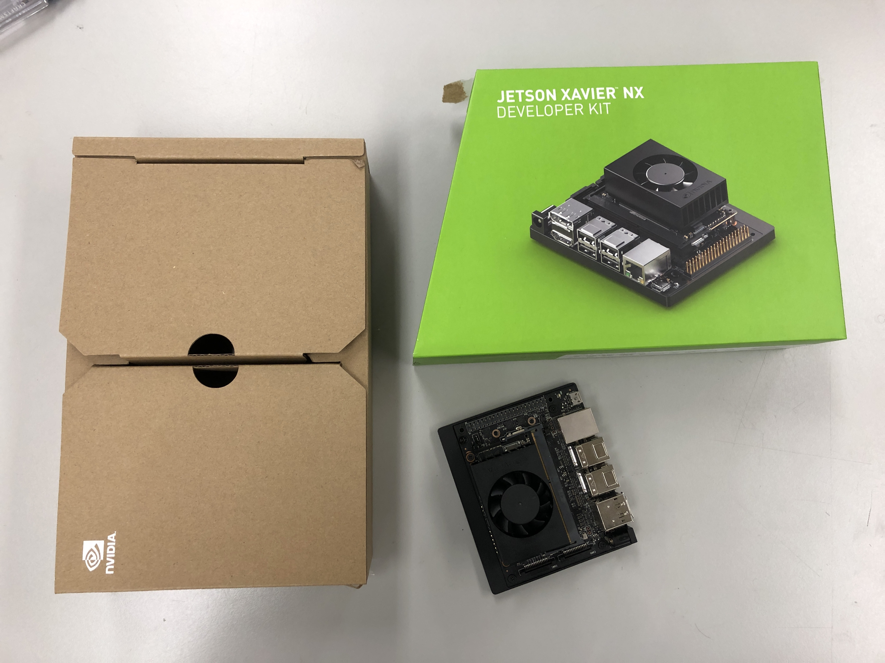
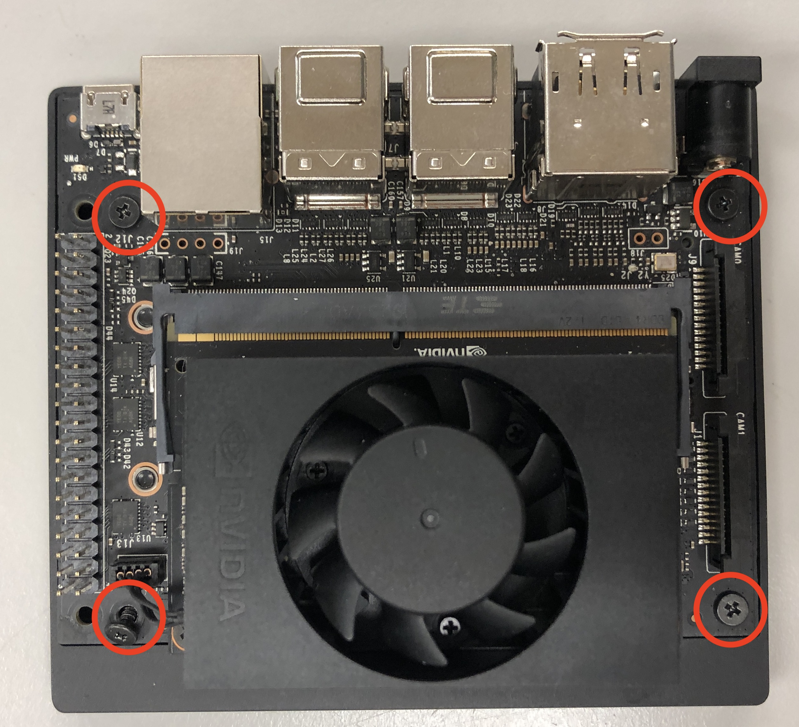
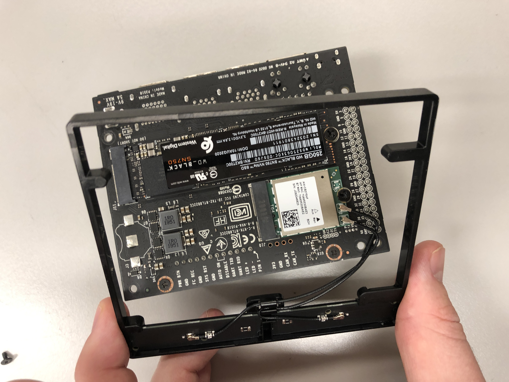
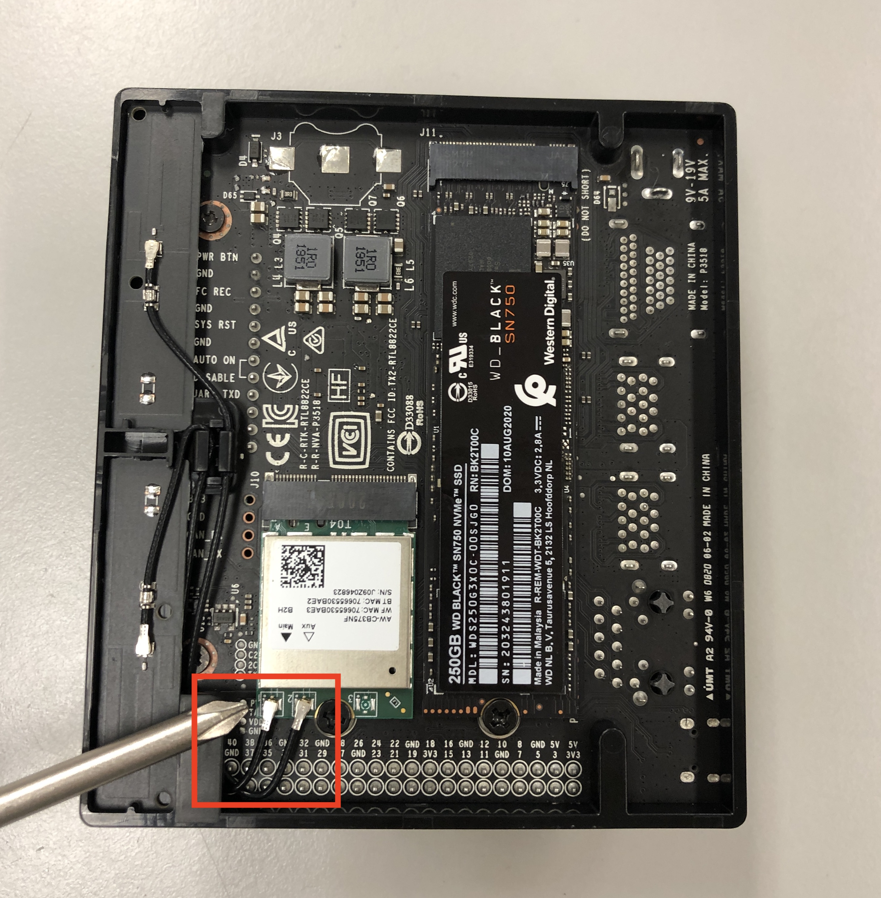
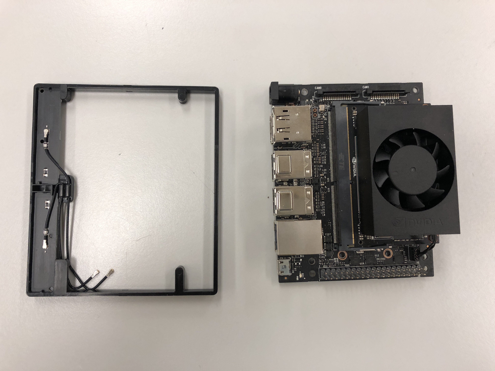
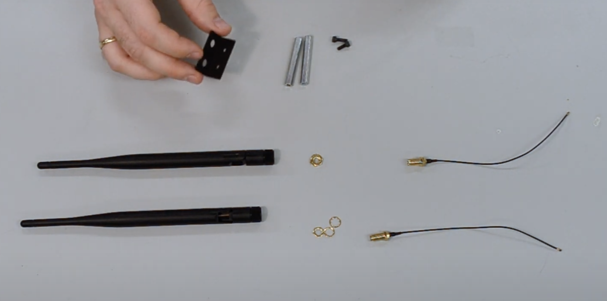
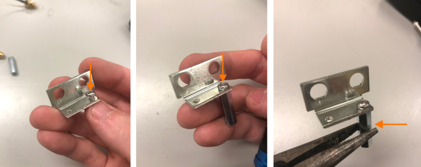
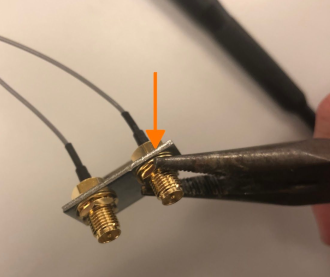

.. _doc_build_autonomy_elements:

2. Autonomy Elements
======================
In the second part of the hardware setup we start preparing the autonomy elements for our RoboRacer car. The complete process for the second hardware part can be watched in this video tutorial too.

.. raw:: html

	<iframe width="560" height="315" src="https://www.youtube.com/embed/L-V-0zzkl10" frameborder="0" allow="accelerometer; autoplay; clipboard-write; encrypted-media; gyroscope; picture-in-picture" allowfullscreen></iframe>

1. Preparing the NVIDIA Jetson NX
---------------------------------
When you purchase a NVIDIA Jetson NX, it is attached to small plastic development board. In order to use it on the car, you will need to unscrew the Jetson NX and its Wi-Fi antenna from the development board. First of all unbox your NVIDIA Jetson NX.

	Unpackage the NVIDIA Jetson NX

When you look on the Jetson NX from above you will see four screws (see red circles in the image). Please unscrew all of these 4 screws.

	Remove the screws that attach the plastic board to the NVIDIA NX

Afterwards you can turn the Jetson NX on the other side. You will see the plastic development board is still attached because of the two antenna cables.

	Plastic development board attached to the NVIDIA NX

The two antenna cables are clipped to the Jetson NX. You have to unclip both of them. You can either use your fingers are lift them with a flat screwdriver.

	Unclip the two antennas from the NVIDA Jetson NX

Afterwards your NVIDA Jetson NX is seperated from the developer board. This is the version you can now screw to the platform deck.

	Nvidia Jetson NX demounted from the developer board

2. Preparing the WiFi Antenna
---------------------------------
In the next step we are providing both Wifi Antennas so we can mount them in the later steps quick and easy. First of all unpackage your antennas and demount the cables from the antennas. Remove the two brass-colored nuts holding the antennas to the L-shaped bracket, and then remove the two antennas from the bracket.

	Demounted Wifi antennas

Afterwards we need to Screw the Standoffs onto the antenna bracket. Using a Phillips screwdriver, thread the two screws you saved earlier completely into the bracket as pictured below. Attach two M3 FF 45mm standoffs to the opposite ends of the screws and hand-tighten them until they won’t turn anymore. Use the pliers to tighten the standoffs more while you hold the head of the screw in place using the screwdriver.

	Screwing standoffs onto the bracket.

Once you’ve done these steps, place the antennas and washers back into the bracket, and tighten the brass nuts onto the threaded connectors again.
It helps to use two pairs of pliers: one to hold the rear nuts in place and another to unscrew the nuts on the end with the antenna connectors.

	Thighten the nuts from the L-shaped bracked.

We can now move on to mounting all of the autonomy elements onto the Upper Level Chassis in the next section. Second accomplishment completed.

