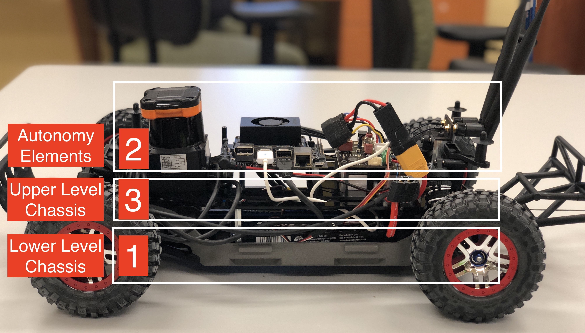

.. _doc_build_car:

Building the F1TENTH Car
=====================
In this build guidelines we are focusing on the hardware setup of our F1TENTH vehicle based on the `Traxxas Slash 4x4 Premium <https://traxxas.com/products/models/electric/6804Rslash4x4platinum>`_ Chassis and the `NVIDIA Jetson Xavier NX <https://developer.nvidia.com/embedded/jetson-xavier-nx-devkit>`_. At the end of this build guidelines, you will have a fully functioning F1TENTH Autonomous Vehicle.

There are three main sections to the car.

| [1] will be referred to as the **Lower Level Chassis**
| [2] will be referred to as the **Autonomy Elements**
| [3] will be referred to as the **Upper Level Chassis**

#. First, we start off by setting up the :ref:`Lower Level Chassis <doc_build_lower_level>` , which serves as the foundation of the vehicle.
#. Then, we put together all of the :ref:`Autonomy Elements <doc_build_autonomy_elements>`.
#. Next, all of the Autonomy Elements will be mounted on the :ref:`Upper Level Chassis <doc_build_upper_level>`.
#. Finally, the Upper Level Chassis will be :ref:`connected <doc_build_all_together>` with the Lower Level Chassis.

.. danger::
	**LIPO (LITHIUM POLYMER) BATTERY SAFETY WARNING**

	The F1TENTH Autonomous Vehicle uses lithium polymer batteries. LiPO batteries allow your car to run for a long time, but they are not something to play with or joke about. They store a large amount of energy in a small space and can damage your car and cause a fire if used improperly. With this in mind, here are some safety tips for using them with the car.

	* When charging batteries, always monitor them and place them in a fireproof bag on a non-flammable surface clear of any other objects.
	* Do not leave a LIPO battery connected to the car when you’re not using it. The battery will discharge and its voltage will drop to a level too low to charge it safely again.
	* Unplug the battery from the car immediately if you notice any popping sounds, bloating of the battery, burning smell, or smoke.
	* Never short the battery leads.
	* Do not plug the battery in backwards. This will damage the VESC and power board (and likely the Jetson as well) and could cause a short circuit.
	* See ​this `video <https://www.youtube.com/watch?v=gz3hCqjk4yc>`_ for an example of what might happen if you don’t take care of your batteries. Be safe and don’t let these happen to you!

**Difficulty Level:** Intermediate

**Approximate Time Investment:** 1.5 hours

.. note::
  If you have any build and/or setup questions, post to the `forum <http://f1tenth.org/forum.html>`_.

.. toctree::
   :maxdepth: 1
   :caption: Building the Car
   :name: sec-build-instructions
   :hidden:

   bom
   lower_level_chassis
   autonomy_elements
   upper_level_chassis
   all_together
   additional_components
