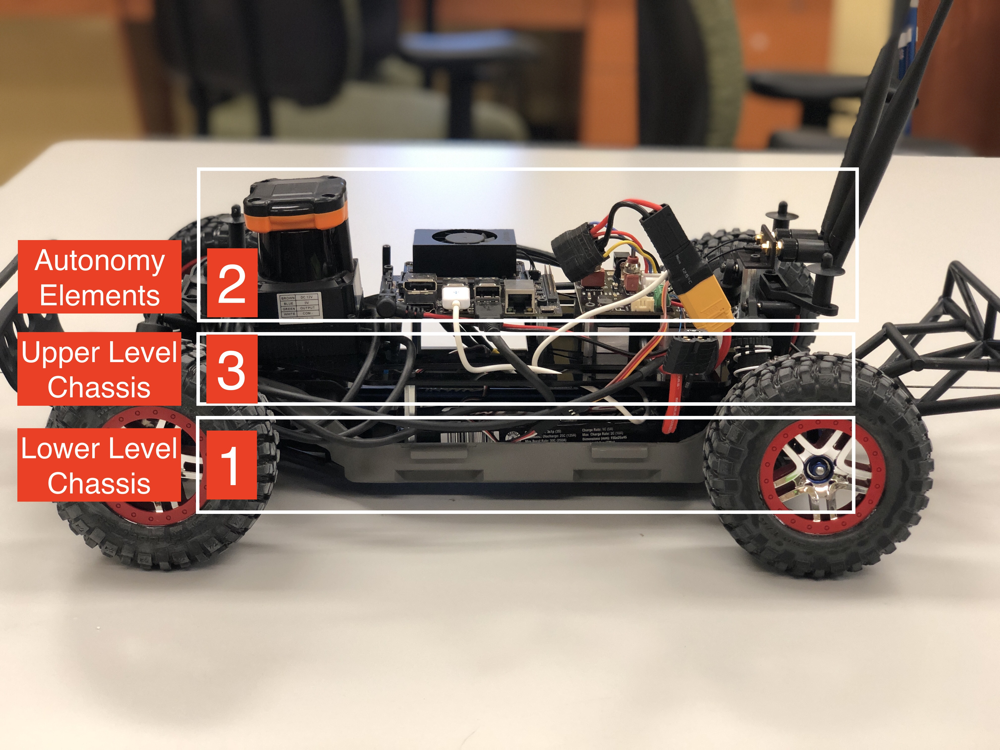

.. _doc_build_car:

Building the Car
==================

At the end of this build section, you will have a fully functioning F1TENTH Autonomous Vehicle.

| **Bill of Materials**:
.. raw:: html

    <iframe width="650" height="950" src="https://docs.google.com/spreadsheets/d/e/2PACX-1vQpeGA74hmfi7aZCqyUDgmA6UDSbyWWVRLzpCmqXuTEX1TZNTnYAlQf3Kv69imXkLvwF-V_q2LC5tEd/pubhtml?widget=true&amp;headers=false"></iframe>

.. `Master BOM <https://docs.google.com/spreadsheets/d/1ykUyrZq-vLlMTf0TIcdMrRbGKcRWglW6ol76QyGst2I/edit#gid=2038095912>`_

**Tools Needed:**
	- M5 hex key
	- the three hex keys (M3, M2.5, M2) included in the TRAXXAS kit 
	- `T3 Torx Screwdriver <https://www.ifixit.com/Store/Tools/T3-Torx-Screwdriver/IF145-041?o=2>`_

**Difficulty Level:** Medium

**Approximate Time Investment:** 1.5 hour

.. warning:: 
	**LIPO (LITHIUM POLYMER) BATTERY SAFETY WARNING**
	
	The F1/10 Autonomous Vehicle uses lithium polymer batteries. LiPO batteries allow your car to run for a long time, but they are not something to play with or joke about. They store a large amount of energy in a small space and can damage your car and cause a fire if used improperly. With this in mind, here are some safety tips for using them with the car.

	* When charging batteries, always monitor them and place them in a fireproof bag on a non-flammable surface clear of any other objects.
	* Do not leave a LIPO battery connected to the car when you’re not using it. The battery will discharge and its voltage will drop to a level too low to charge it safely again.
	* Unplug the battery from the car immediately if you notice any popping sounds, bloating of the battery, burning smell, or smoke.
	* Never short the battery leads.
	* Do not plug the battery in backwards. This will damage the VESC and power board (and likely the Jetson as well) and could cause a short circuit.
	* See ​this `video <https://www.youtube.com/watch?v=gz3hCqjk4yc>`_ for an example of what might happen if you don’t take care of your batteries. Be safe and don’t let these happen to you!

There are three main sections to the car.

| [1] will be referred to as the **Lower Level Chassis**
| [2] will be referred to as the **Autonomy Elements**
| [3] will be referred to as the **Upper Level Chassis**

#. First, we start off by setting up the :ref:`Lower Level Chassis <doc_build_lower_level>` , which serves as the foundation of the vehicle.
#. Then, we put together all of the :ref:`Autonomy Elements <doc_build_autonomy_elements>`.
#. Next, all of the Autonomy Elements will be mounted on the :ref:`Upper Level Chassis <doc_build_upper_level>`.
#. Finally, the Upper Level Chassis will be :ref:`connected <doc_build_all_together>` with the Lower Level Chassis.

If you plan on doing a lot of hardware build, it would make life a lot easier if you purchase a `cabinet <https://www.amazon.com/dp/B07DFDS56H/ref=sspa_dk_detail_0?pd_rd_i=B07DFDS56H&pd_rd_w=ozKLb&pf_rd_p=c83c55b0-5d97-454a-a592-a891098a9709&pd_rd_wg=KgL0C&pf_rd_r=8JJYY9JNB12JSW30ZM0K&pd_rd_r=ebf4fbec-a1e1-46cd-b8f8-8edde070e37c&spLa=ZW5jcnlwdGVkUXVhbGlmaWVyPUFRU00wWTJZWEdIWlYmZW5jcnlwdGVkSWQ9QTA2NTk5NTQyV1pFWENSQlZPUDFVJmVuY3J5cHRlZEFkSWQ9QTAxNDkwNDlXNzlIQ1RKMEtYOU0md2lkZ2V0TmFtZT1zcF9kZXRhaWxfdGhlbWF0aWMmYWN0aW9uPWNsaWNrUmVkaXJlY3QmZG9Ob3RMb2dDbGljaz10cnVl&th=1>`_ of sorts and a `label maker <https://www.amazon.com/Brother-P-touch-PTM95-Styles-Patterns/dp/B01GQHHYFE/ref=sxts_sxwds-bia-wc1_0?cv_ct_cx=label+maker&keywords=label+maker&link_code=qs&pd_rd_i=B01GQHHYFE&pd_rd_r=4ee2aad9-af73-4f7f-b9de-03f0502bbfcc&pd_rd_w=FxGKL&pd_rd_wg=NWCuX&pf_rd_p=c8430d96-912c-40d1-9740-e1beca245dd5&pf_rd_r=WF2G78ZNC8HYQVWWNCEZ&psc=1&qid=1583266676>`_ to organize all the components.  

.. note:: 
  If you have any build and/or setup questions, post to the `forum <http://f1tenth.org/forum.html>`_.

.. toctree::
   :maxdepth: 1
   :caption: Building the Car
   :name: sec-build-instructions

   lower_level_chassis
   autonomy_elements
   upper_level_chassis
   all_together
