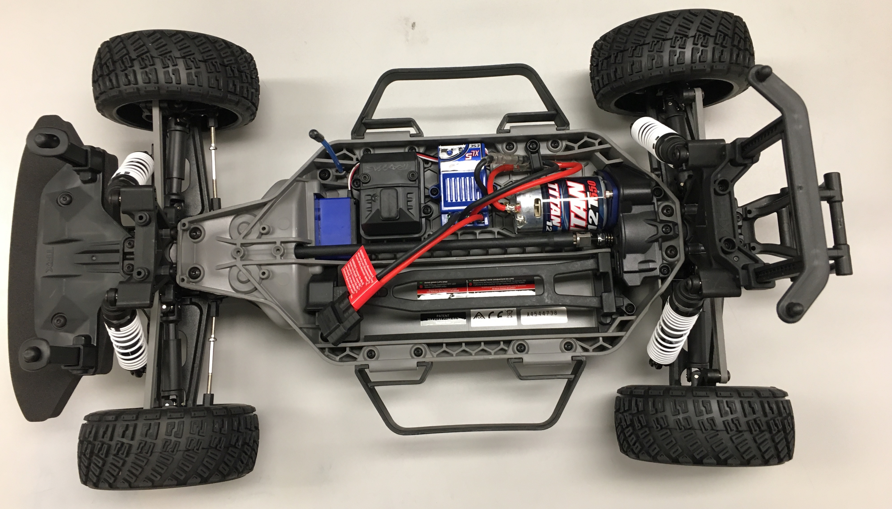
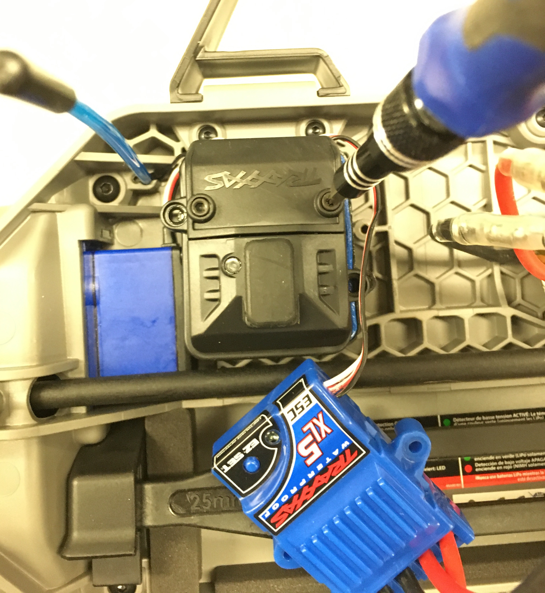
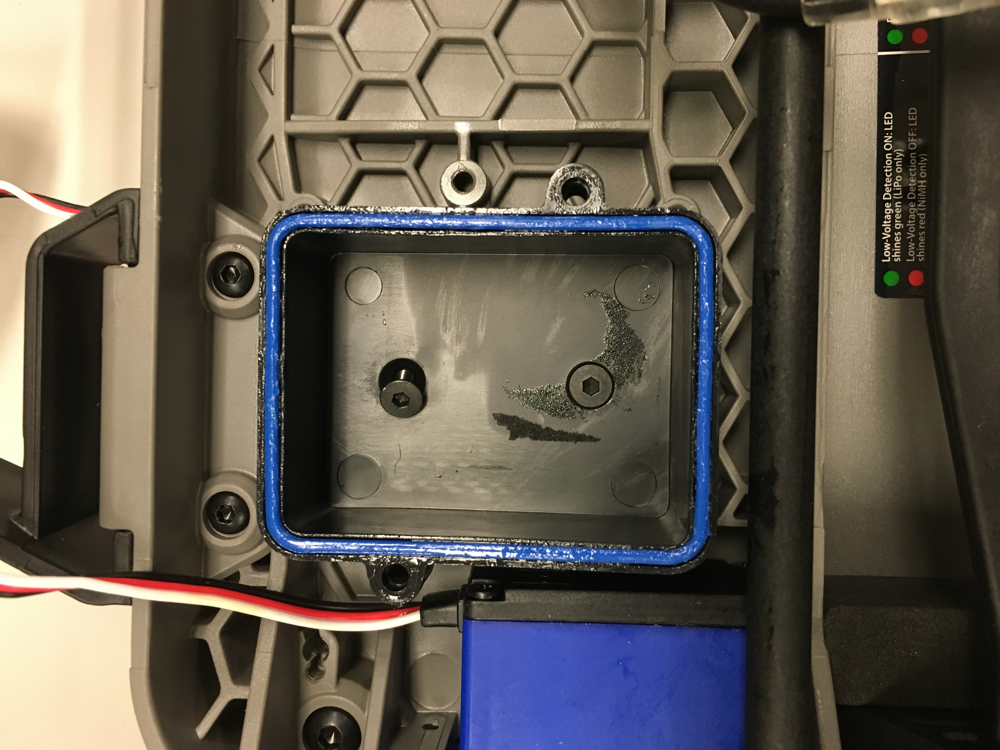
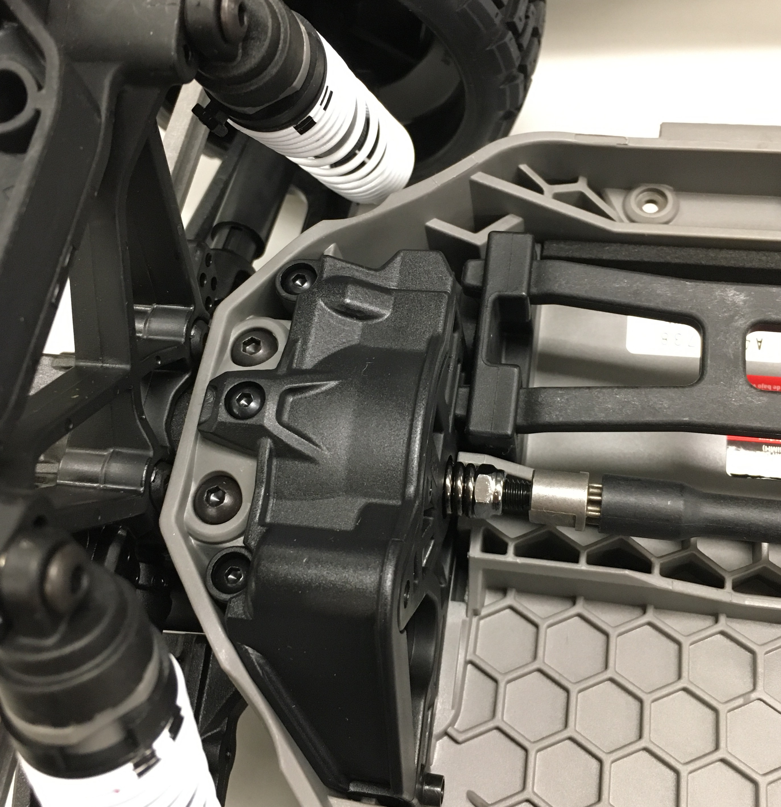
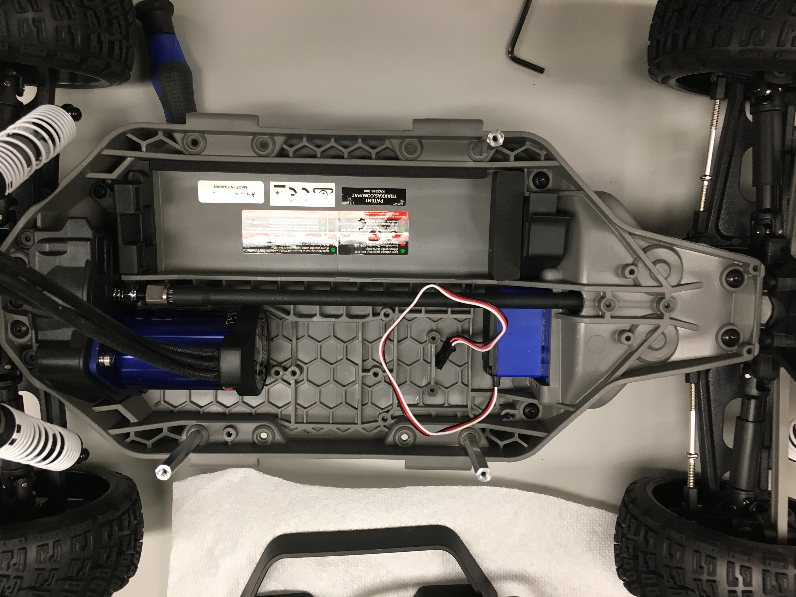

.. _doc_build_lower_level:

Lower Level Chassis
====================

We begin with setting up the Lower Level chassis, which serves as the foundation of the entire vehicle. 

Removing Traxxas Stock Components
-----------------------------------
Take the Traxxas from its box. Remove the four Body Clip to remove the Body so you are left with this:

We are going to remove several electrical assemblies including the Brushed Motor. The only component which we will not be removing it the Servo, which is the little blue box in the upper left. There are three hex keys that come with the Traxxas. You will use this to remove and/or install almost all of the screws on the chassis. You may want to have a bowl or container of sorts nearby to hold all the screws that you’ll be removing as these screws will come in handy later. 

First, remove the Traxxas ESC, the blue box labelled "XL5 ESC", by unscrewing the two screws that attach the ESC to the chassis. Disconnect the wires labelled "Titan" that go from the ESC to the Brushed Motor. The wires are connected by what are called bullet connectors. You can safely pull the wires apart by grabbing each side of the connector and pulling.

A 3 conductor wire runs from the ESC to the black Receiver Box. Remove the black receiver box by first unscrewing the lid of the box.

Once the top is open, you will see the Receiver labelled "TQ Top Qualifier". Disconnect the ESC control wire from the Receiver andt he control wire that goes to the Servo. Move the wires out of the way. The Receiver is attached to bottom of the Receiver Box with double sided tapel. Carefully, but firmly, pry the Receiver from the Receiver Box and remove. 

.. image:: img/llchassis/llchassis03.JPG

This will expose the two screws which mount the Receiver box to the chassis. Unscrew the screws to remove the Receiver Box.

You may find a screw driver or pair of pliers useful in removing the Antenna Tube.

Finally, remove the Brushed Motor from the chassis. There is one screw holding the Motor to the Motor Mount. It is located on the blue Motor Plate towards the top of the vehicle. Remove the screw and set it aside - you will need this screw again later. Remove the Brushed Motor.

Your final Lower Level chassis looks like the following:

.. image:: img/llchassis/llchassis05.JPG

Don't forget to remove the "plastic fork" or the Battery Hold-Down as well.

Installing the Brushless Motor
-------------------------------
To install the brushless motor, first remove the blue Motor Plate and the spur gear from the Brushed Motor. Loosen the set screw with one of the hex keys provided in the Traxxas kit then pull the Spur Gear off. If it feels a bit stuck, carefully use a flathead screwdriver to push it off.

.. image:: img/llchassis/llchassis06.JPG

.. image:: img/llchassis/llchassis07.JPG

Install the blue Motor Plate and Spur Gear onto the Brushless Motor so your Brushless Motor now looks like this:

.. image:: img/llchassis/llchassis08.JPG

We have to align the Spur Gear with the rest of the gears on the Lower Level chassis. Remove the Gear Cover on the Lower Level chassis so you can see if the gears align or not. Only the middle screw as circled below needs to be unscrewed to remove the Gear Cover.

.. image:: img/llchassis/llchassis10.JPG

Adjust the position of the spur gear accordingly so that when you move the car back and forth on the table, the movement should feel smooth and you can see the gears mesh and move without slipping or skipping teeth. Replace the covering once you are satisfied.

.. image:: img/llchassis/llchassis11.JPG

After installation of the Brushless Motor, the Lower Level chassis should look like this:

because the Platform Standoffs still need to be attached.

Attaching the Standoffs
-------------------------
First, remove the two Nerf Bars (black handles) located on either side of the chassis. There are 4 screws that hold each Nerf Bar in place. The screws are accessible from underneath the chassis.

Attach three M3 screws and three 45mm M3 FF standoffs into the chassis as shown.

.. image:: img/llchassis/llchassis13.JPG

User M3 screws from underneath the chassis to secure the standoffs. Two standoffs go on the Motor side and 1 go on the battery side. This arrangement allows for better access to the battery. You may want to use `thread lock <https://www.amazon.com/Loctite-Heavy-Duty-Threadlocker-Single/dp/B000I1RSNS/ref=sxin_1_ac_d_pm?ac_md=1-0-VW5kZXIgJDEw-ac_d_pm&cv_ct_cx=thread+lock&keywords=thread+lock&link_code=qs&pd_rd_i=B000I1RSNS&pd_rd_r=94268c5a-3e09-4447-a20e-0f4af52ac1b2&pd_rd_w=zvAiv&pd_rd_wg=WpfTu&pf_rd_p=516e6e17-ed95-417b-b7a4-ad2c7b9cbae3&pf_rd_r=ZPGZWZ9518Z8FR6860B5&psc=1&qid=1583189105>`_ to secure these standoffs as the vibrations of the car during movement may loosen them over time.

Setting Up the Battery
-----------------------
.. warning:: 
	**LIPO (LITHIUM POLYMER) BATTERY SAFETY WARNING**
	
	LiPO batteries allow your car to run for a long time, but they are not something to play with or joke about. They store a large amount of energy in a small space and can damage your car and cause a fire if used improperly. With this in mind, here are some safety tips for using them with the car.

	* When charging batteries, always monitor them and place them in a fireproof bag on a non-flammable surface clear of any other objects.
	* Do not leave a LIPO battery connected to the car when you’re not using it. The battery will discharge and its voltage will drop to a level too low to charge it safely again.
	* Unplug the battery from the car immediately if you notice any popping sounds, bloating of the battery, burning smell, or smoke.
	* Never short the battery leads.
	* Do not plug the battery in backwards. This will damage the VESC and power board (and likely the Jetson as well) and could cause a short circuit.
	* See ​this `video <https://www.youtube.com/watch?v=gz3hCqjk4yc>`_ for an example of what might happen if you don’t take care of your batteries. Be safe and don’t let these happen to you!

Place the battery into the compartment opposite of the motor.

.. image:: img/llchassis/llchassis14.JPG

Plug the `charge adapter <https://www.amazon.com/gp/product/B078P9V99B/ref=crt_ewc_title_huc_1?ie=UTF8&psc=1&smid=A87AJ0MK8WLZZ>`_ into the battery plug,

.. image:: img/llchassis/llchassis15.JPG

Then, connect the other side of the charge adapter to a TRX to XT90 cable.

.. image:: img/llchassis/llchassis16.JPG

It should look like this:

.. image:: img/llchassis/llchassis17.JPG

Attaching the PPM Cable
-------------------------
Now we are going to connect the PPM cable to the Servo. The PPM cable connects the Servo to the VESC, which we will install on the Upper Level Chassis later.

.. image:: img/llchassis/llchassis21.JPG

Take 3 header pins,

.. image:: img/llchassis/llchassis18.JPG

Plug it into the servo wires.

.. image:: img/llchassis/llchassis19.JPG

Connect the ppm cable with the servo wire.

.. image:: img/llchassis/llchassis20.JPG

.. warning:: 
	**BROWN is GROUND. It should be connected to the BLACK wire of the Servo Cable.** Make sure the polarity of the PPM cable to servo is correct. 

The Lower Level chassis is now set up and we can move on to the autonomy elements. First accomplishment already completed.

.. image:: img/llchassis/llchassis22.gif
   :align: center 
