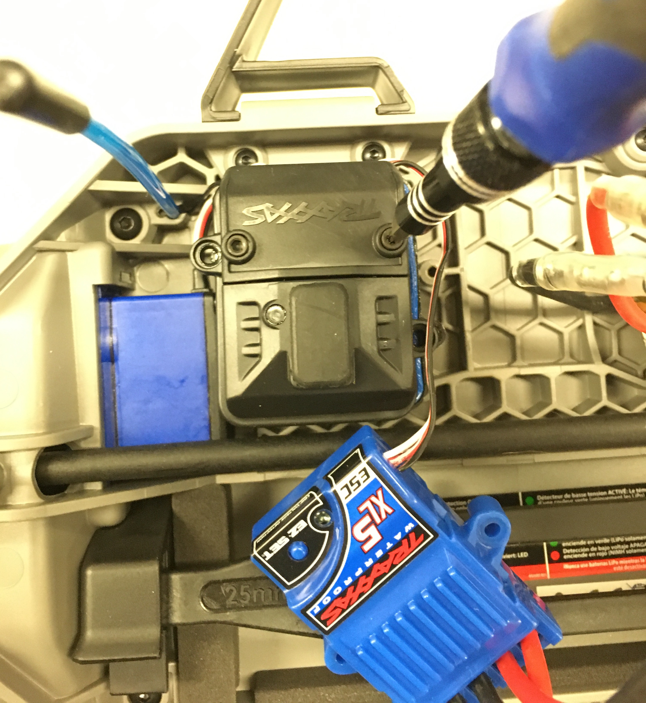
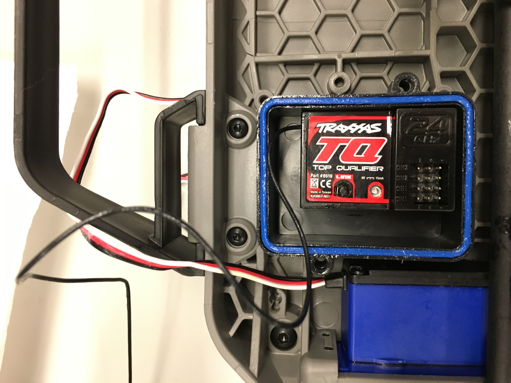
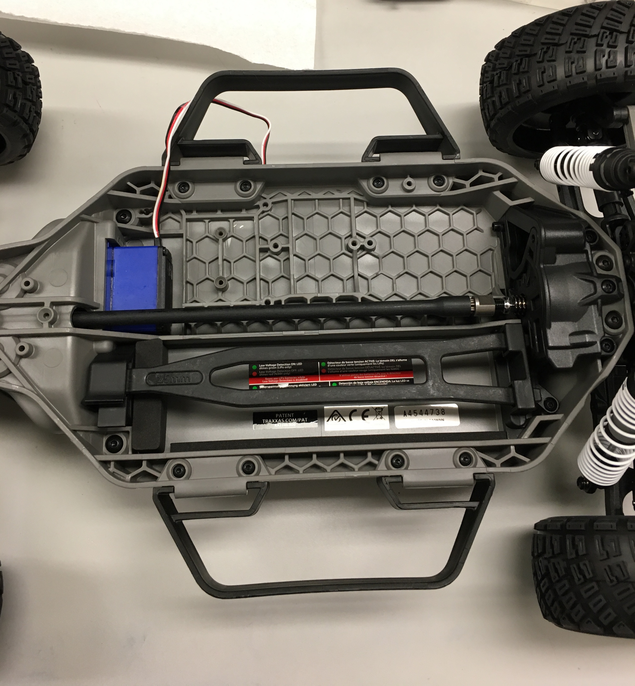
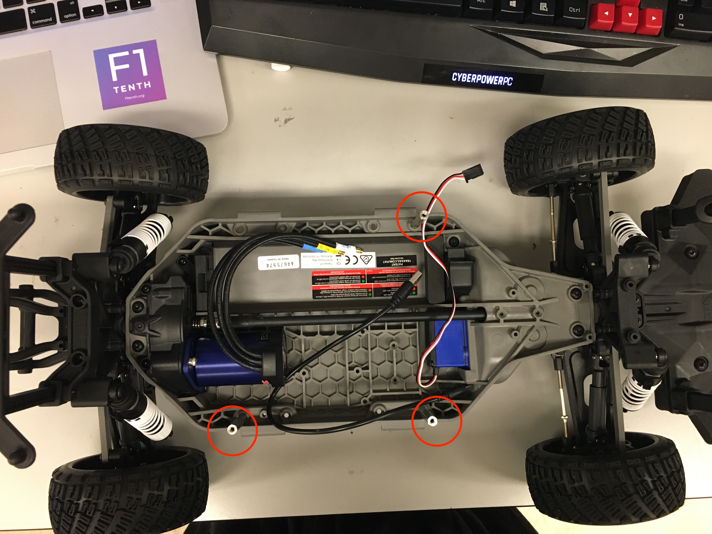
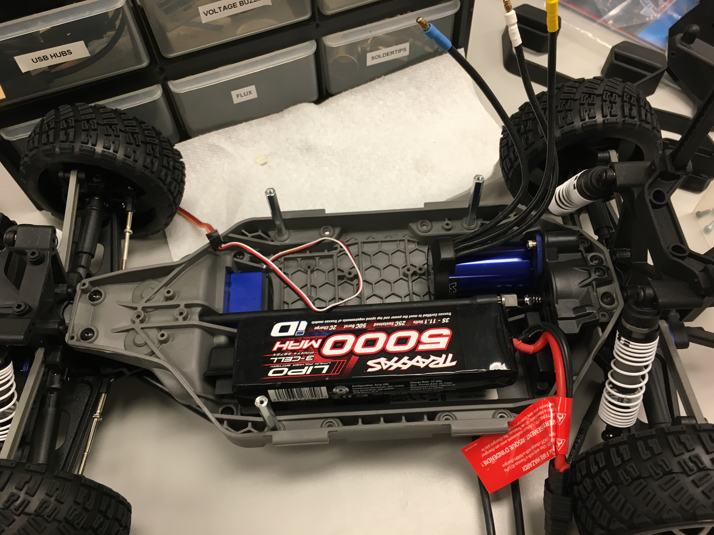

.. _doc_build_lower_level:

1. Lower Level Chassis
========================

We begin with setting up the Lower Level chassis. We will be removing the internal parts of the Traxxas and repopulate it with our own parts. The complete process for the first hardware part can be watched in this video tutorial too.

.. raw:: html

	<iframe width="560" height="315" src="https://www.youtube.com/embed/IoWHUGFfrRE" frameborder="0" allow="accelerometer; autoplay; clipboard-write; encrypted-media; gyroscope; picture-in-picture" allowfullscreen></iframe>

1. Removing Traxxas Stock Components
--------------------------------------
Take the Traxxas from its box. Remove the four `Body Clips <https://www.amainhobbies.com/traxxas-standard-size-body-clips-12-tra1834/p3271?gclid=EAIaIQobChMI4de1q7uk6AIVjYCfCh3UqAz8EAQYASABEgIapvD_BwE>`_ to remove the Body so you are left with this:

.. figure:: img/llchassis/llchassis01.JPG
	:align: center

	Traxxas chassis with Body removed.

We are going to remove several electrical assemblies including the Brushed Motor. The only component which we will not be removing is the Servo, which is the little blue box in the upper left. There are three hex keys that come with the Traxxas. You will use this to remove and/or install almost all of the screws on the chassis. You may want to have a bowl or container of sorts nearby to hold all the screws that you’ll be removing as these screws will be needed later.

First, remove the Traxxas ESC, the blue box labelled "XL5 ESC", by unscrewing the two screws that attach the ESC to the chassis. Disconnect the wires labelled "Titan" that go from the ESC to the Brushed Motor. The wires are connected by what are called bullet connectors. You can safely pull the wires apart by grabbing each side of the connector and pulling.

A 3 conductor wire runs from the ESC to the black Receiver Box. Remove the black receiver box by first unscrewing the lid of the box.

	Unscrewing the top of the black Receiver Box. The XL5 ESC has been unscrewed.

Once the top is open, you will see the Receiver labelled "TQ Top Qualifier". Disconnect the ESC control wire from the Receiver and the control wire that goes to the Servo. Move the wires out of the way. The Receiver is attached to bottom of the Receiver Box with double sided tape. Carefully, but firmly, pry the Receiver from the Receiver Box and remove.

	Inside of Receiver Box.

This will expose the two screws which mount the Receiver box to the chassis. Unscrew the screws to remove the Receiver Box.

.. figure:: img/llchassis/llchassis04.JPG
	:align: center

	Screws are visible once the Receiver Box has been removed.

You may find a screw driver or pair of pliers useful in removing the Antenna Tube.

Finally, remove the Brushed Motor from the chassis. There is one screw holding the Motor to the Motor Mount. It is located on the blue Motor Plate towards the top of the vehicle. Remove the screw and set it aside - you will need this screw again later. Remove the Brushed Motor.

Your final Lower Level chassis looks like the following:

	Traxxas chassis with all components except the Servo removed. You'll also need to remove the "plastic fork"/Battery Hold-Down on the opposite side of the Servo.

Don't forget to remove the "plastic fork" or the Battery Hold-Down as well.

2. Attaching the Standoffs
----------------------------
First, remove the two Nerf Bars (black handles) located on either side of the chassis. There are 4 screws that hold each Nerf Bar in place. The screws are accessible from underneath the chassis.

Attach three M3 screws and three 45mm M3 FF standoffs into the chassis as shown.

	Location of Standoffs.

Use M3 screws from underneath the chassis to secure the standoffs. Arrange the standoffs so that two standoffs go on the Motor side and 1 go on the battery side. This arrangement allows for better access to the battery. You may want to use `thread-locking fluid <https://www.amazon.com/Loctite-Heavy-Duty-Threadlocker-Single/dp/B000I1RSNS/ref=sxin_1_ac_d_pm?ac_md=1-0-VW5kZXIgJDEw-ac_d_pm&cv_ct_cx=thread+lock&keywords=thread+lock&link_code=qs&pd_rd_i=B000I1RSNS&pd_rd_r=94268c5a-3e09-4447-a20e-0f4af52ac1b2&pd_rd_w=zvAiv&pd_rd_wg=WpfTu&pf_rd_p=516e6e17-ed95-417b-b7a4-ad2c7b9cbae3&pf_rd_r=ZPGZWZ9518Z8FR6860B5&psc=1&qid=1583189105>`_ to secure these standoffs as the vibrations of the car during movement may loosen them over time.

3. Setting Up the Battery
--------------------------
.. DANGER::
	**LIPO (LITHIUM POLYMER) BATTERY SAFETY WARNING**

	LiPO batteries allow your car to run for a long time, but they are not something to play with or joke about. They store a large amount of energy in a small space and can damage your car and cause a fire if used improperly. With this in mind, here are some safety tips for using them with the car.

	* When charging batteries, always monitor them and place them in a fireproof bag on a non-flammable surface clear of any other objects.
	* Do not leave a LIPO battery connected to the car when you’re not using it. The battery will discharge and its voltage will drop to a level too low to charge it safely again.
	* Unplug the battery from the car immediately if you notice any popping sounds, bloating of the battery, burning smell, or smoke.
	* Never short the battery leads.
	* Do not plug the battery in backwards. This will damage the VESC and power board (and likely the Jetson as well) and could cause a short circuit.
	* See ​this `video <https://www.youtube.com/watch?v=gz3hCqjk4yc>`_ for an example of what might happen if you don’t take care of your batteries. Be safe and don’t let these happen to you!

Place the battery into the compartment opposite of the motor.

	Lipo battery on Lower Level Chassis.
