.. _doc_optional_compute_nx:

Optional Compute: Jetson Xavier NX
==================================

The standard build for an F1TENTH vehicle uses the NVIDIA Jetson TX2. You can optionally replace (or upgrade) this module with an NVIDIA Jetson Xavier NX. This page details how to upgrade an exsiting, fully-built F1TENTH vehicle with the NVIDIA Jetson Xavier NX Developer Kit.

.. danger::
        **POTENTIAL DAMAGE TO JETSON XAVIER NX DEVELOPER KIT**

        These instructions involve modifying both the chassis of your F1TENTH car and the physical carrier board for the NVIDIA Jetson Xavier NX Developer Kit. If done improperly, these steps can damage your Jetson Xavier NX **beyond repair**. If you do not feel comfortable performing these steps yourself, do not attempt this modification. The F1TENTH Foundation is not responsible for damage to your hardware.

**Difficulty Level:** Advanced

**Approximate Time Investment:** 3-4 hours

Required Parts
--------------
* 2.5mm hex driver
* #2 Phillips-head screwdriver
* Very small (#0 or smaller) flathead screwdriver
* Drill
* 1/8" or 3mm drill bit
* Needle-nosed pliers
* Soldering iron
* Leaded solder (60/40 mix with flux, 0.032" diameter recommended)
* Heat-shrink wire tubing
* 2-pin 0.1"/2.54mm-pitch male header
* Scotch tape, double-sided tape, or glue stick and hot glue gun

Steps
-----
1. Unplug the battery.

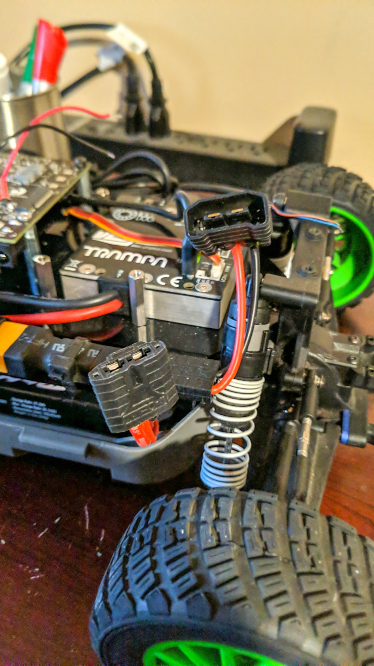

        Battery disconnected.

2. Disconnect the antennas from TX2.

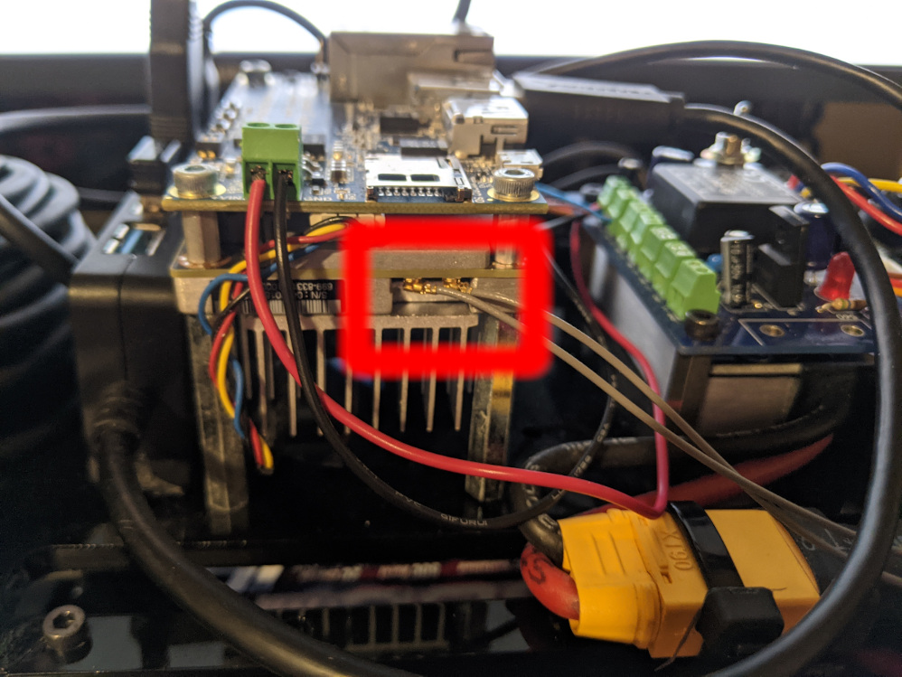

        The antenna connectors on the TX2 module.

* Move antenna cables to the side.

3. Disconnect all USB cables from the USB hub.
4. Disconnect the USB hub from the TX2 carrier board and remove the hub.

  * Set the Logitech USB dongle to the side for later re-installation.
  * The hub will not be re-used.

5. With a small flathead screwdriver, disconnect power from the Orbitty Carrier board.
6. With a 2.5mm hex driver, remove the 4 screws holding the Orbitty Carrier board and the TX2 module to the upper chassis.

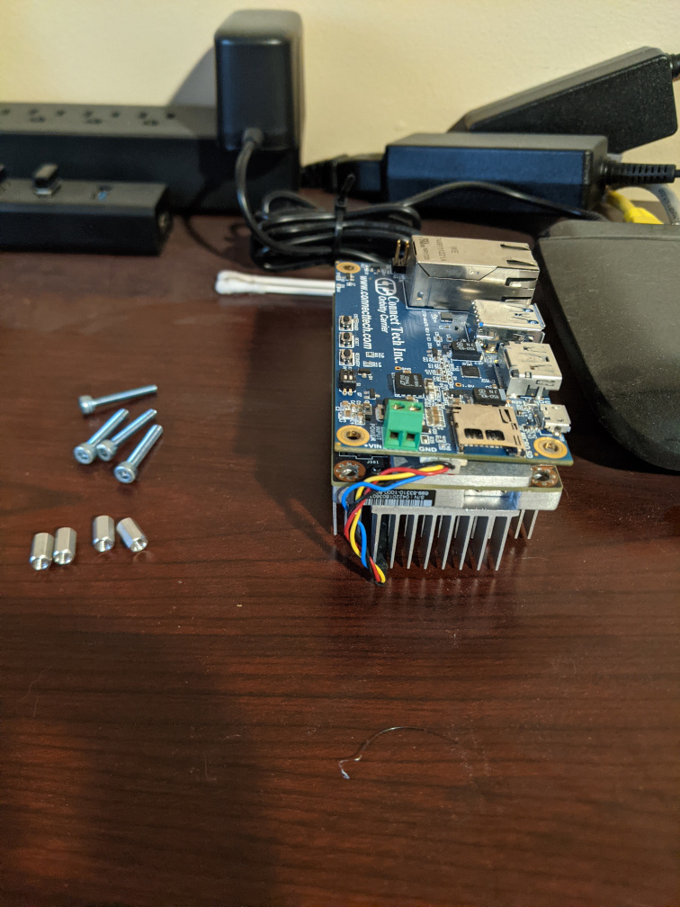

        The TX2 module removed.

7. Disconnect the brushless motor wires and the 3-pin servo cable.

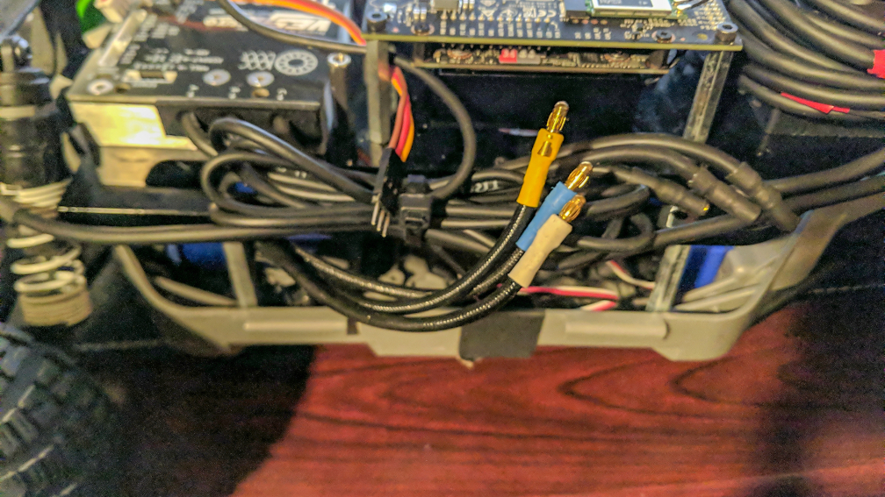

        The motor and servo wires disconnected.

8. With a 2.5mm hex driver, remove the 3 screws holding the upper chassis to the lower chassis.
9. Remove the upper chassis.
10. Remove any remaining stand-offs which were used for supporting the TX2 module.

  * Set the stand-offs and the screws which held them to the upper chassis to the side for re-use.

11. With a small flathead screwdriver, disconnect the power wires for the lidar from the power distribution board.
12. With a 2.5mm hex driver, remove the lidar.
13. With a 2.5mm hex driver, remove the WiFi antenna mount (including the antennas).

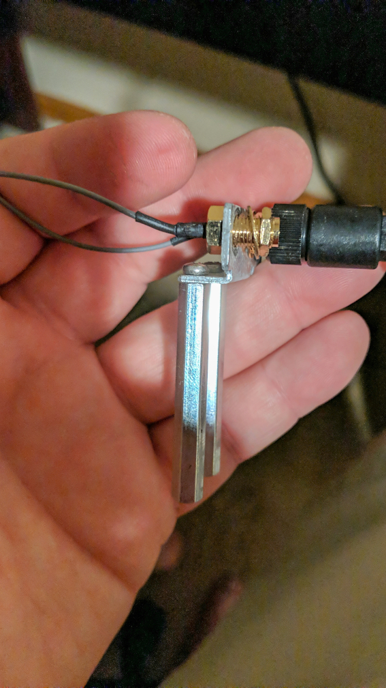

        Removing the existing WiFi antennas.

* With needle-nosed pliers, remove the WiFi antennas from the mounting hardware.
* With a Phillips-head screwdriver, remove the stand-offs from the mounting hardware.
* All four screws obtained from the antenna stand-offs will be used again later - set them off to the side.

14. Disconnect the battery monitoring connector from the power distribution board.
15. With a 2.5mm hex driver, remove the screws holding the power distribution board to the stand-offs. Remove the power distribution board.
16. Unplug the micro USB cable from the VESC.

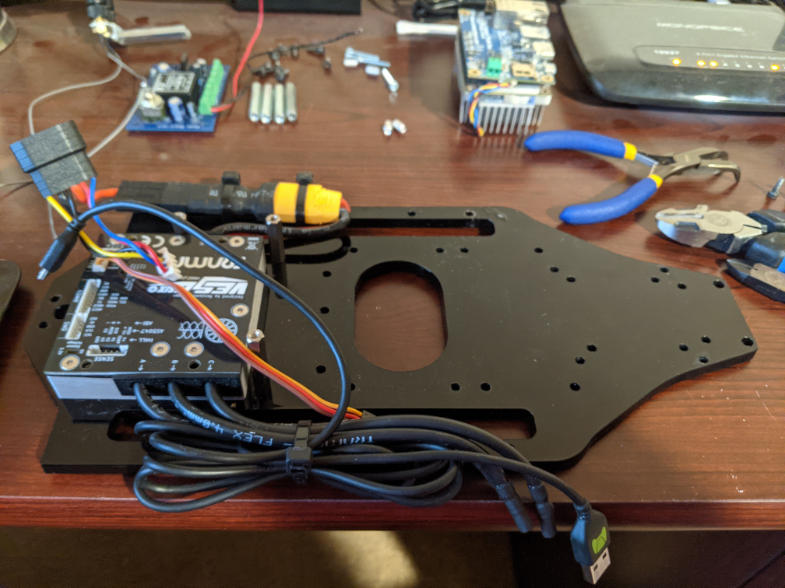

        All required components removed from the upper chassis.

17. Unbox the Jetson Xavier NX Developer Kit.
18. Flip the Jetson Xavier NX Developer Kit upside-down.

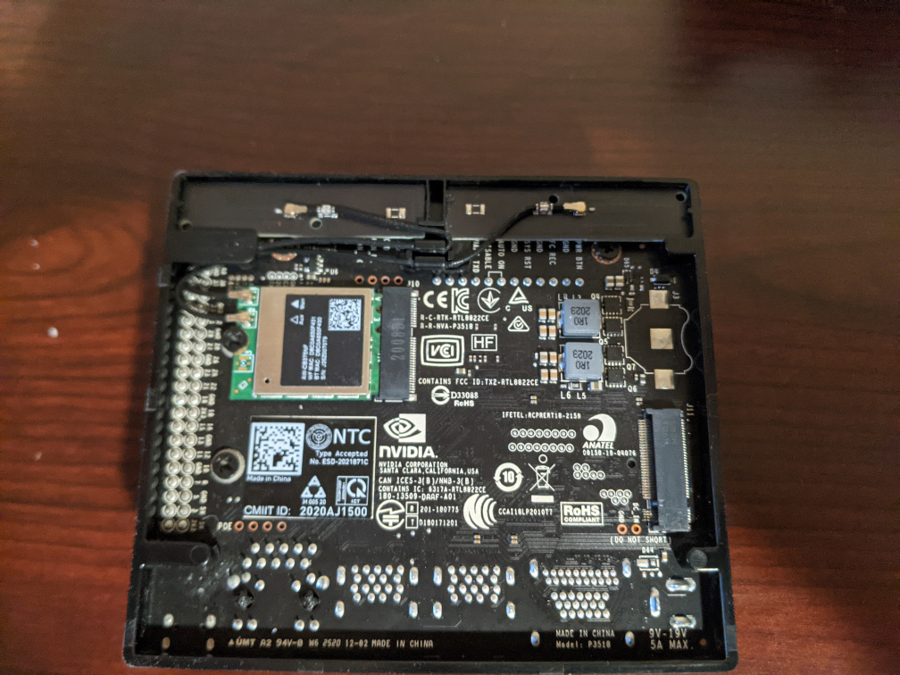

        NVIDIA Jetson Xavier NX Developer Kit upside-down.

19. With needle-nosed pliers, carefully disconnect the antenna connectors on the bottom of the NX carrier board.

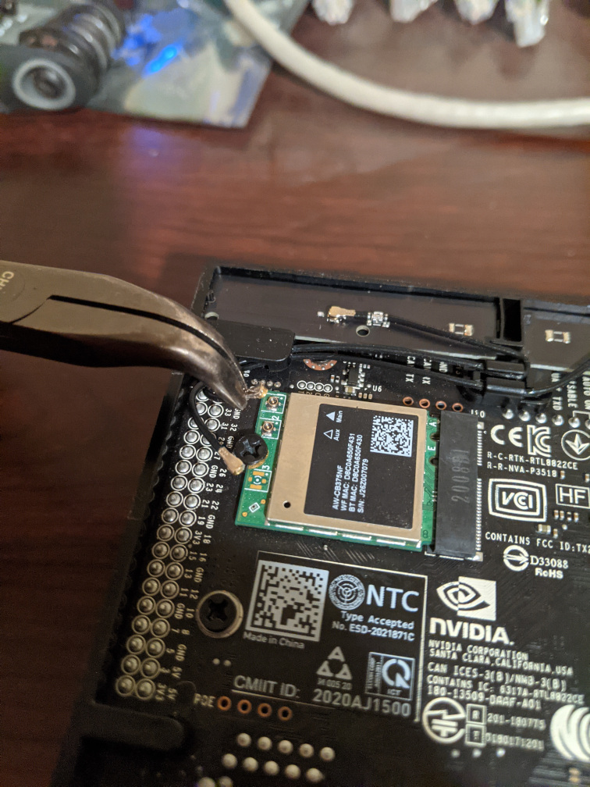

        Removing the antenna connectors from the NX WiFi card.

20. Flip the Jetson Xavier NX Developer Kit right-side-up.
21. With a small, Phillips-head screwdriver, remove the four screws holding the NX carrier board to the plastic mount. Remove the carrier board from the plastic mounting bracket.

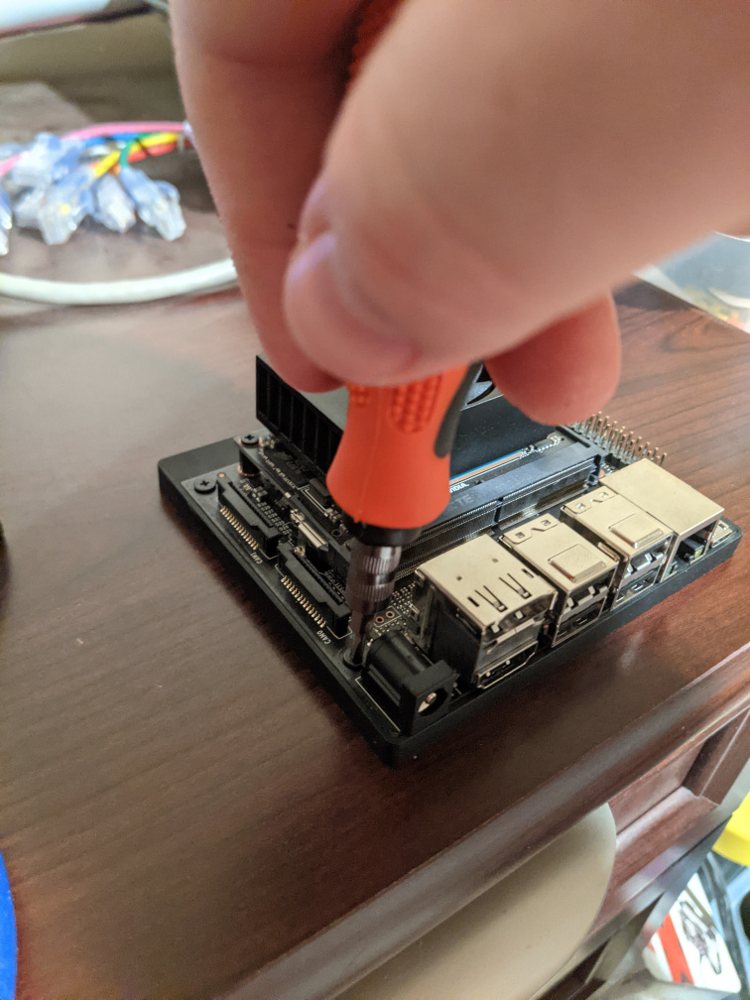

        Removing the screws holding the Jetson Xavier NX carrier board to the mount.

22. Carefully remove the WiFi antennas from the mounting bracket and set aside for re-use.

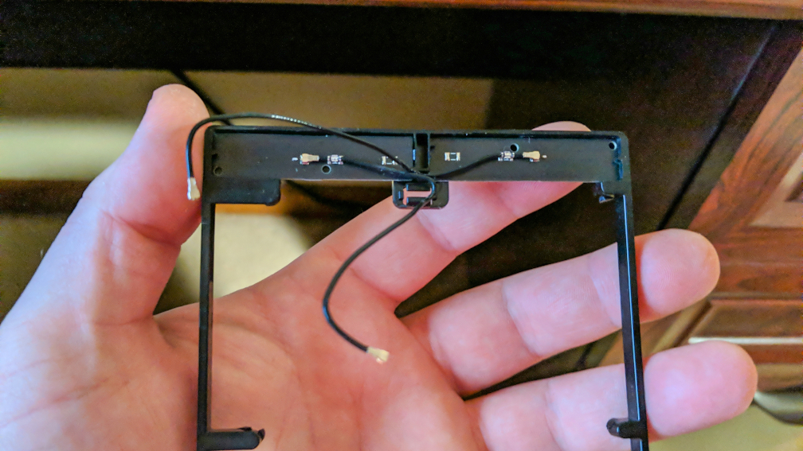

        The WiFi antennas mounted on the bottom of the Developer Kit mount.

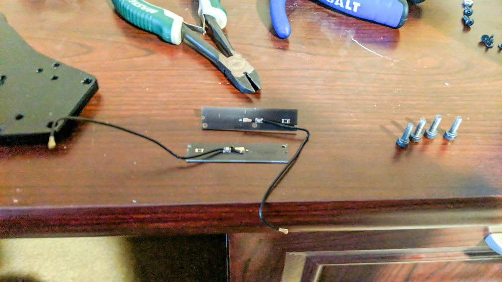

        The WiFi antennas removed from the Developer Kit mount.

23. Use a 1/8" or 3mm drill bit to *slowly and carefully* embiggen the four outer-most mounting holes on the Jetson Xavier NX carrier board.

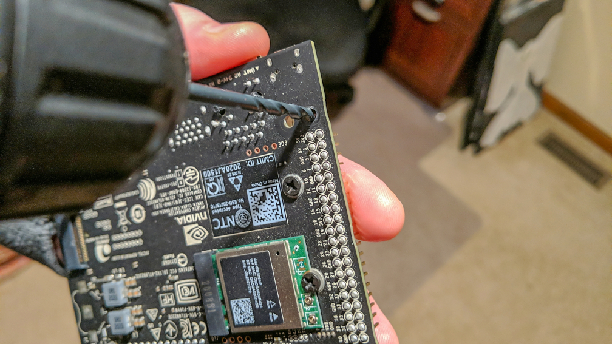

        Carefully embiggen the outer-most mounting holes on the carrier board.

24. Turn the upper chassis upside-down.

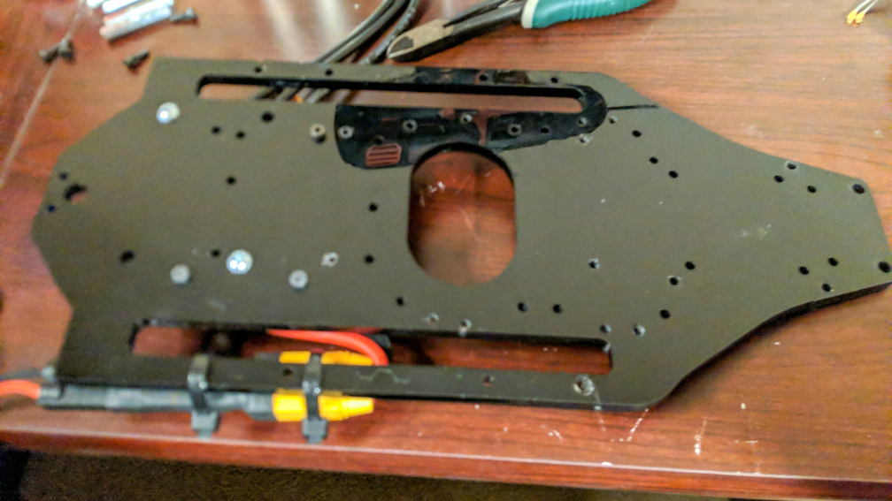

        The upper chassis upside-down.

25. Place the Jetson Xavier NX Developer Kit on the upside-down upper chassis with the GPIO pins at the front of the chassis.
26. As near as possible, align the front of the openings  which run down both sides of the acrylic with the mounting holes at the GPIO edge of the Jetson Xavier NX carrier board.

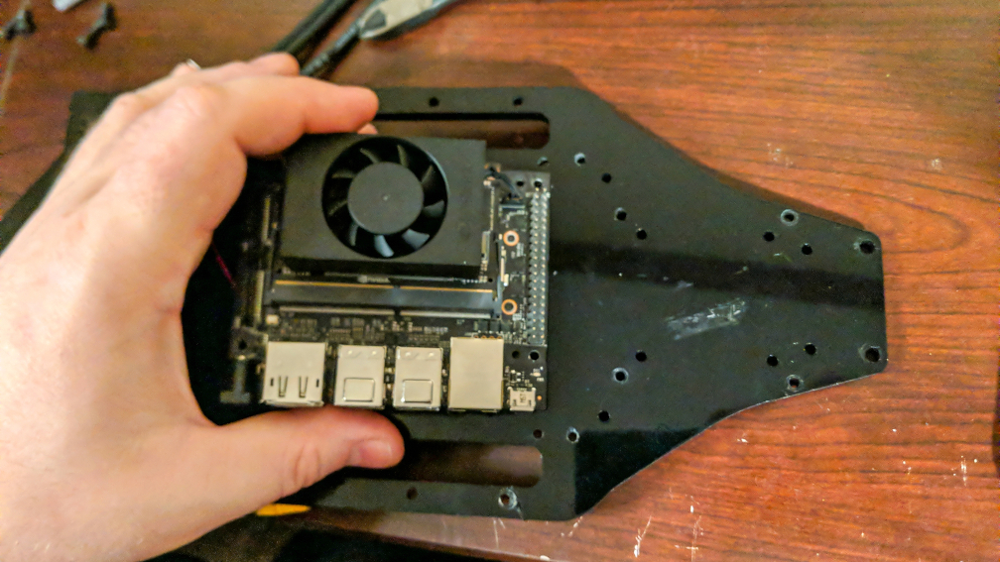

        NX Developer Kit board placement.

27. Use a 1/8" or 3mm drill bit to scribe marks for two of the four outer-most mounting holes on the Jetson Xavier NX carrier board onto the acrylic.
28. Use a 1/8" or 3mm drill bit to carefully drill through the acrylic in the two marked locations. Make sure you do not drill through any wires on either side of the upper chassis.
29. Put two 3mm screws through the two holes in the Jetson Xavier NX carrier board corresponding to the two holes just drilled. Align them with the new holes and use them to hold the carrier board in-place while you scribe the other two holes with a 1/8" or 3mm drill bit.
30. Remove the Jetson Xavier Developer Kit and carefully drill the final two holes. Make sure you do not drill through any wires on either side of the upper chassis.
31. Turn the upper chassis right-side-up.
32. Attach the four stand-offs previously used to mount the Orbitty Carrier Board and the TX2 module to the upper chassis using the four new holes that you just drilled and the 3mm screws used previously for these stand-offs.

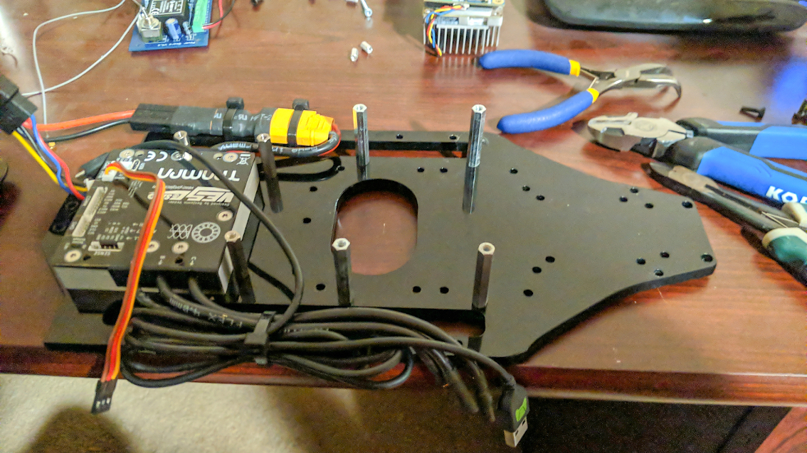

        Stand-offs mounted in new locations.

33. Place the Jetson Xavier NX Developer Kit upside-down on the four stand-offs with the GPIO pins at the front of the vehicle. Align the four outer-most mounting holes with the stand-offs.
34. With a 2.5mm hex driver and a Phillips-head screwdriver, use the four screws obtained from the WiFi mounting bracket in step 13 to attach the Jetson Xavier NX carrier board to the stand-offs.
35. With a 2.5mm hex driver, re-mount the power distribution board.
36. Reconnect the battery monitoring connector to the power distribution board.
37. Solder a two-pin header to the DC_IN and GND through-holes on the bottom of the Jetson Xavier NX carrier board.

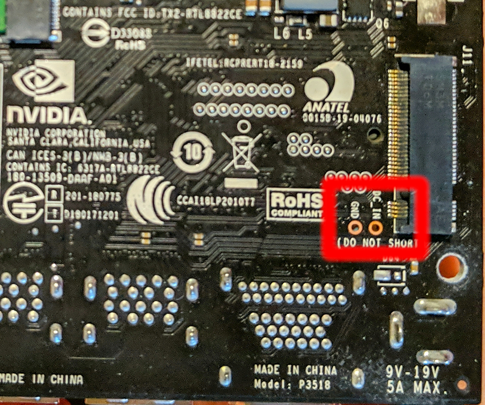

        The DC_IN and GND through-holes on the Jetson Xavier NX carrier board.

38. Test for continuity between the positive pin of the barrel-jack connector on the Jetson Xavier NX carrier board and the DC_IN pin.

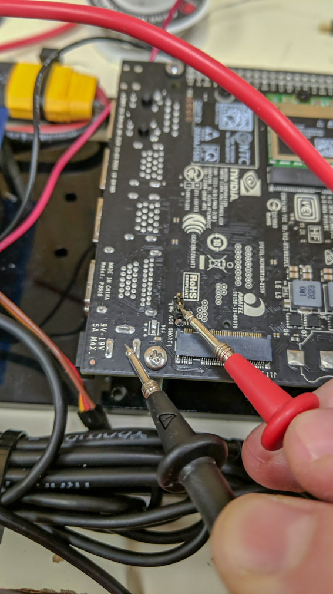

        Testing for continuity on the DC_IN terminal.

39. Test for continuity between the negative pin of the barrel-jack connector on the Jetson Xavier NX carrier board and the GND pin.

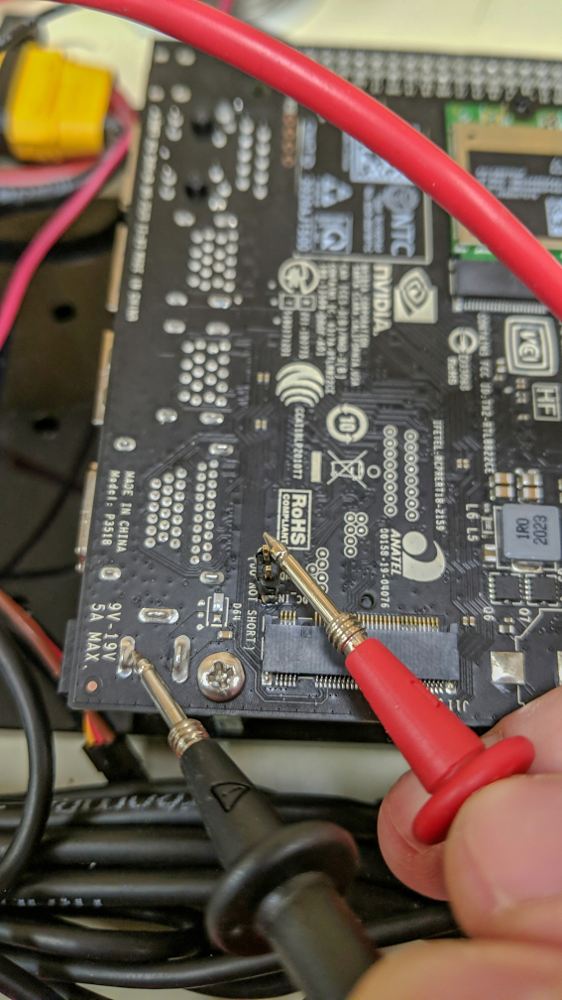

        Testing for continuity on the GND terminal.

40. Solder red (DC_IN) and black (GND) wires to the pins you just soldered to the DC_IN and GND pins on the Jetson Xavier NX carrier board. Don't forget to add heat-shrink tubing.

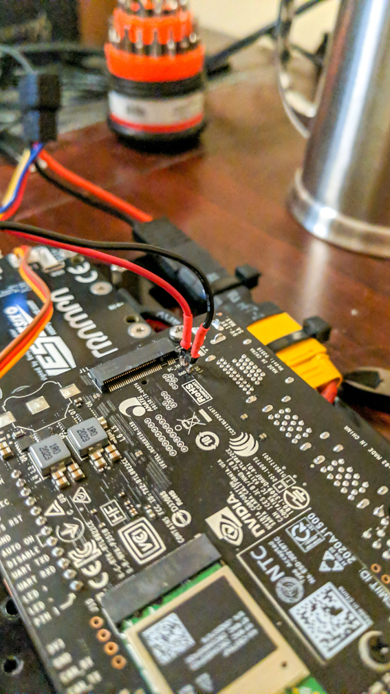

        Power wires soldered to header pins, soldered to DC_IN and GND through-holes.

41. Re-mount the lidar on the front of the upper chassis using the 3mm screws removed previously.
42. Reconnect the power cable for the lidar to the power distribution board.
43. Connect the red (12 V) and black (GND) wires for the Jetson Xavier NX Developer Kit to the power distribution board.
44. Reconnect the micro USB end of the micro USB cable to the power distribution board.
45. With a 2.5mm hex driver, re-mount the power distribution board to the stand-offs with the 3mm screws removed previously.
46. Reconnect the USB A end of the micro USB cable to one of the USB ports on the Jetson Xavier NX Developer Kit.
47. Reconnect the USB A end of the lidar data cable to one of the USB ports on the Jetson Xavier NX Developer Kit.
48. Plug the Logitech dongle into one of the USB ports on the Jetson Xavier NX Developer Kit.
49. Reconnect the brushless motor wires and 3-pin servo cable.
50. With a 2.5mm hex driver, re-mount the upper chassis to the lower chassis.
51. Using clear plastic tape, double-sided tape, or hot glue, attach the Wifi antenna circuit boards removed from the Jetson Xavier NX Developer Kit mount to the top of the lidar with the cables facing the rear of the vehicle.

.. figure:: img/nx/nx-antennas-on-lidar.jpg
        :align: center

        Jetson Xavier NX antenna circuit boards mounted on the lidar.

52. With needle-nosed pliers, carefully attach the WiFi antenna cables to the ports on the mPCIe WiFi adapter card on the bottom of the NVIDIA Jetson NX carrier board.

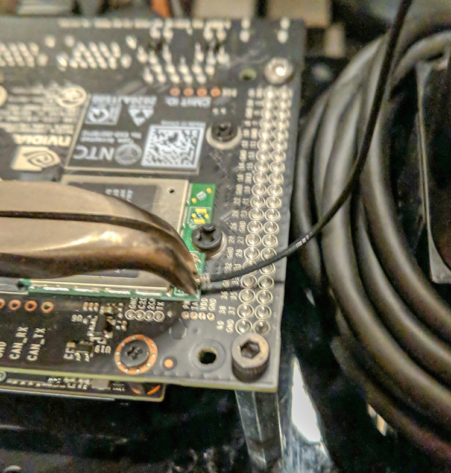

        Like rocket surgery.

.. danger::
        **POTENTIAL DAMAGE TO COMPONENTS**

        If you want to power the NVIDIA Jetson Xavier NX Developer Kit from the power jack, make sure you disconnect the power wires that run from the Developer Kit to the power distribution board. Failure to do so can damage the power distribution board. Additionally, make sure these disconnected wires do not touch while they are disconnected and power is applied to the Developer Kit. This can fry your NVIDIA Jetson Xavier NX.

53. DONE!

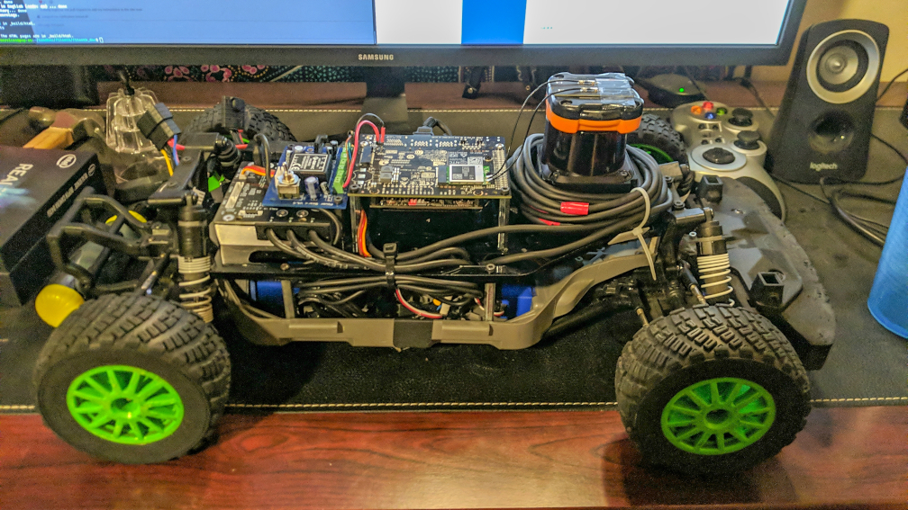

        You did it!
