\.. _doc_build_upper_level:

Upper Level Chassis
====================

Now we’re going to assemble the upper level chassis.

Place the laser cut piece so it’s facing you like this. The laser cut piece will be referred to as the **acrylic** for the rest of the build documentation.

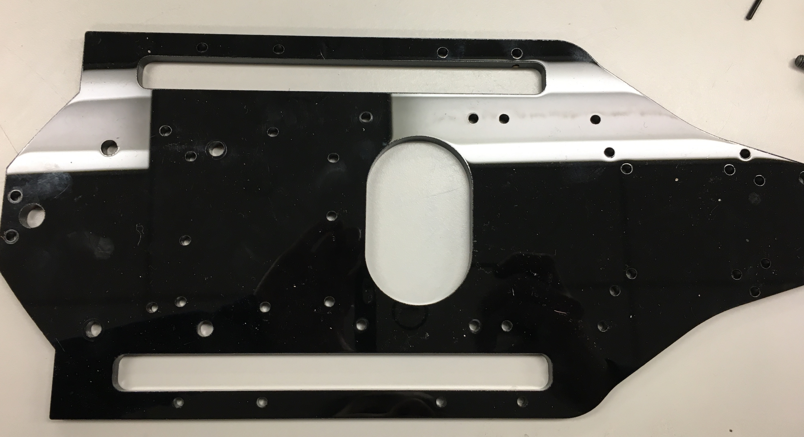

.. note:: 
	**This piece is not symmetric.** Notice that the big M5 VESC mounting holes on the left are not centered. The holes need to be skewed closer to you. 

The following image shows the five components that we will be mounting on the acrylic.

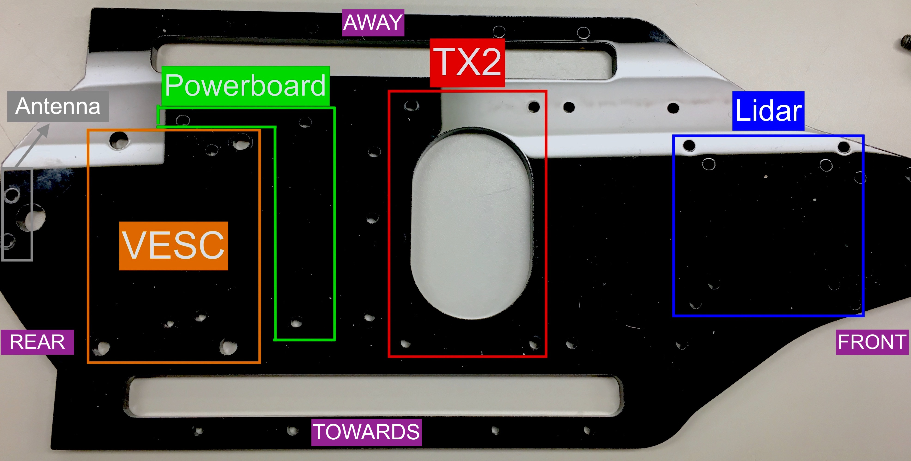

Mounting the VESC and the Powerboard
--------------------------------------
Place the VESC on the acrylic so that the power wires are facing AWAY from you and the yellow, blue, and white cables are facing TOWARDS you.

.. image:: img/ulchassis/ulchassis03.JPG 

Flip the acrylic and the VESC over and use two M5 screws mounted diagonal from each other to attach the VESC to the acrylic, like shown below.

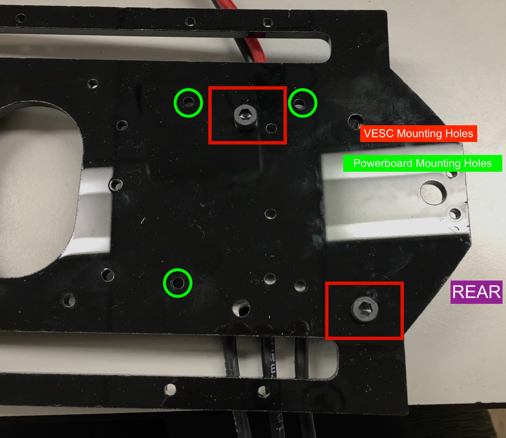

Flip the acrylic with the VESC attached to it back over so the VESC is facing up. Use an M3 x 8mm then a M3 25mm FF standoff for each mounting hole. Only three of the powerboard mounting holes are used. 

.. image:: img/ulchassis/ulchassis05.JPG

There should be a gap between the powerboard and the VESC.

.. image:: img/ulchassis/ulchassis06.JPG  

Mounting the TX2 and Antenna
------------------------------------------------
Mount the TX2 so that the USB ports are facing the VESC. Use four screws. Most of the components require M3 screws so can also use the screws that you unscrewed from the lower level chassis. The fan should be immediately above the middle opening of the acrylic.

.. image:: img/ulchassis/ulchassis07.JPG  

We will need to power the TX2 so connect a power wire and a ground wire from the green terminal of the Orbitty to one of the 12V terminal on the power board.

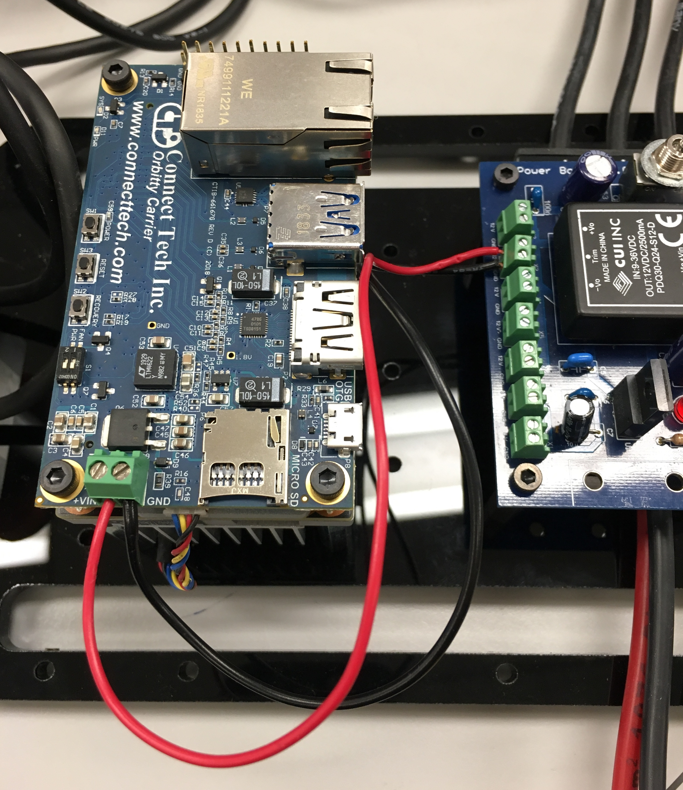

Mount the antenna to the left of the VESC. 

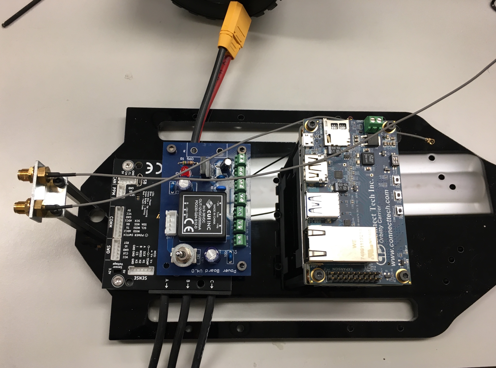

Make sure to also plug the gray antenna wires into the TX2.

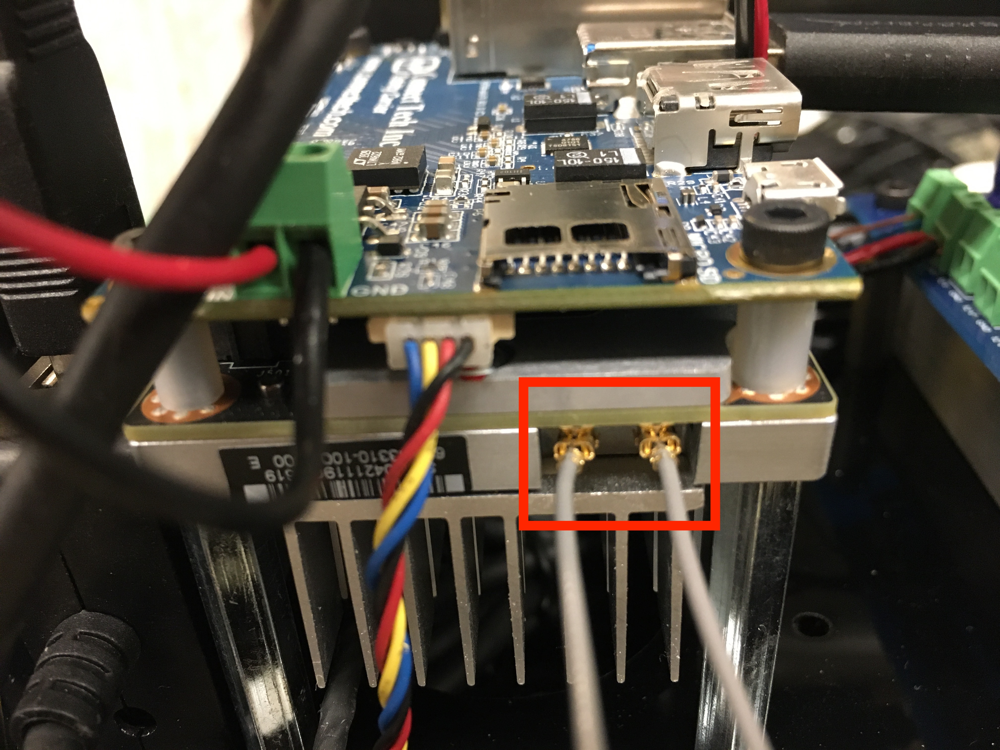

Mounting and Connecting the Lidar and USB Hub
----------------------------------------------
The last component to mount is the lidar. Use four M3 screws to mount from underneath. 

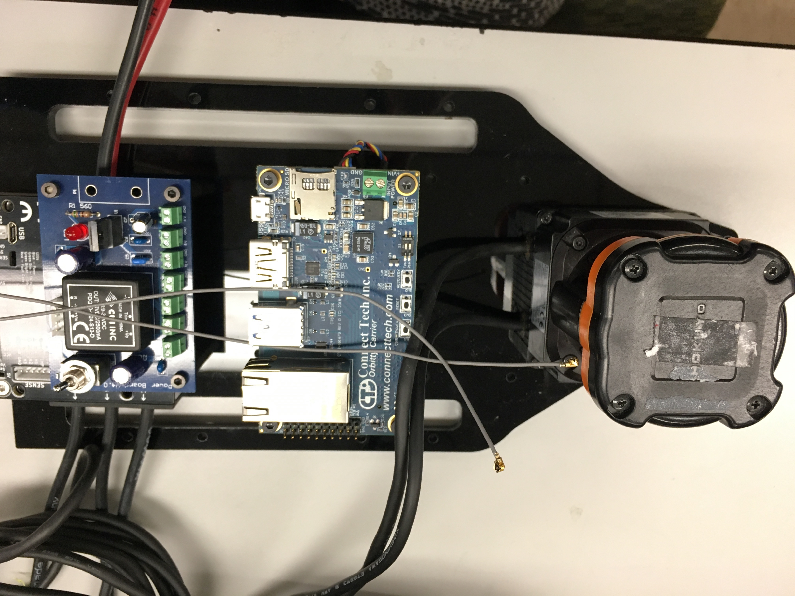

To mount the USB hub, place a piece of double sided tape on the back of the USB hub like so:

.. image:: img/ulchassis/ulchassis12.JPG  

Stick the hub next to the TX2 and press firmly down.

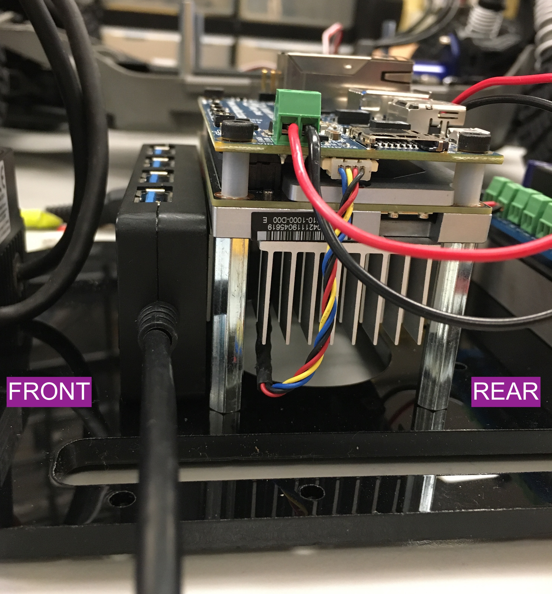

Plug the USB hub into the USB port on the Orbitty Carrier Board. So far, the top view of the upper level chassis should look like this:

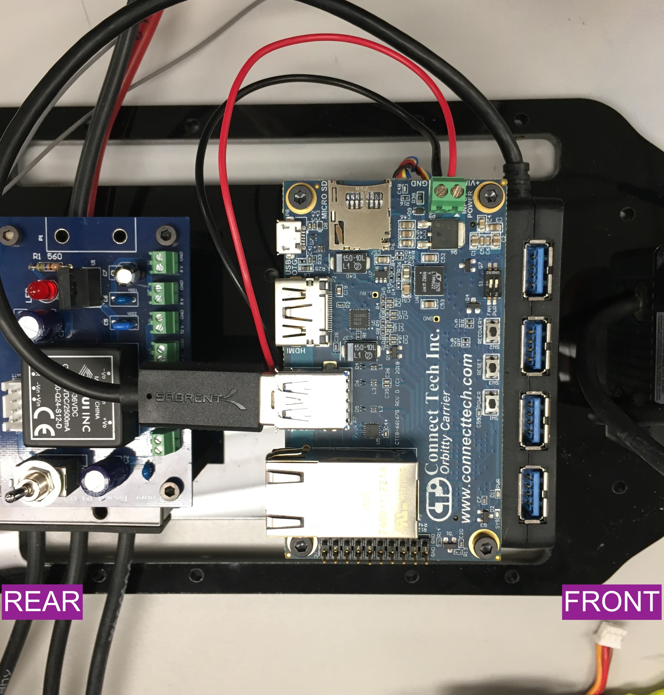

Cable Management
^^^^^^^^^^^^^^^^^^^
The lidar comes with two very long cables. We are going to try out best to manage them. Split the two cables of the lidar and loop them under the slots on the acrylic.

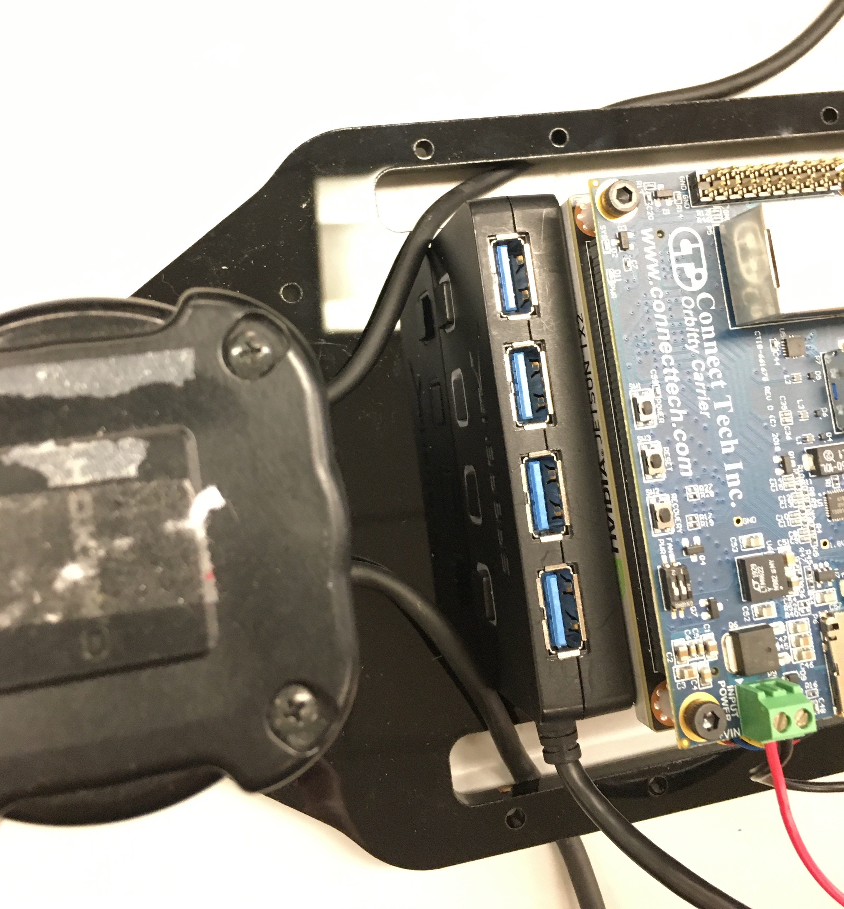

Using a twist tie, rubber band, or zip tie, gather the majority of the cables on each side. For the stripped cable side, insert the **BROWN (POWER)** and **BLUE (GROUND)** wires into one of the 12V terminal blocks on the powerboard. 

.. note::
	***BROWN is POWER and BLUE is GROUND.*  DO NOT MIX THESE UP OTHERWISE YOU WILL FRY YOUR VERY EXPENSIVE LIDAR.** When in doubt, check the side of the Hokuyo. It will list out the correspondence of each wire.

.. image:: img/ulchassis/ulchassis16.JPG  

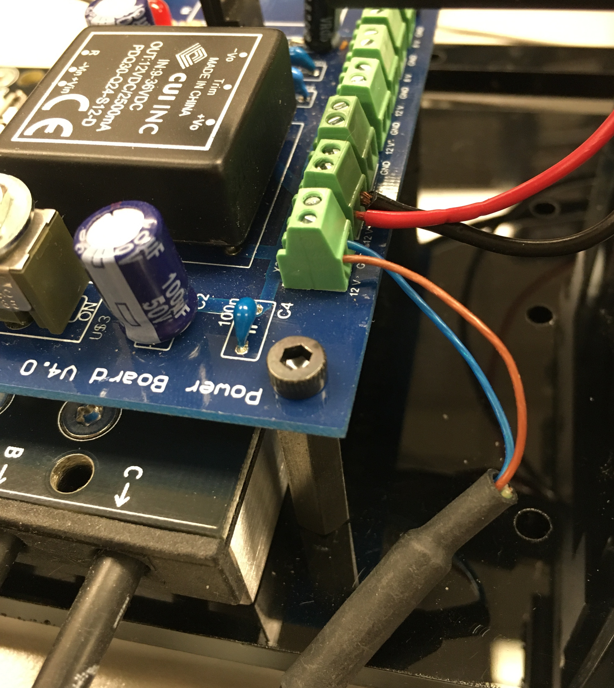

On the USB side, simply plug into one of the ports on the USB hub.

.. image:: img/ulchassis/ulchassis18.JPG  

The upper level chassis is complete and we're ready to assemble everything!
