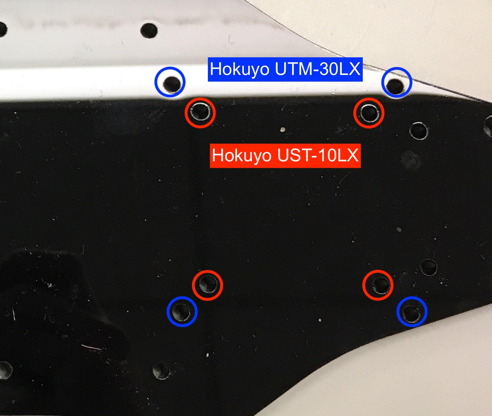

.. _doc_build_upper_level:

Upper Level Chassis
====================

Now we’re going to assemble the upper level chassis.

Place the laser cut piece so it’s facing you like this. The laser cut piece will be referred to as the `**Platform Deck** <https://drive.google.com/drive/u/1/folders/1emwVnfmk-XC0Gmi_FlR5dDSzg32j1fCX>`_ for the rest of the build documentation.

.. image:: img/ulchassis/ulchassis01.JPG

.. note:: 
	**This piece is not symmetric.** Notice that the big M5 VESC mounting holes to the rear of the car (towards the left in the left in the image above) are not centered. The holes need to be skewed closer to you. 

The following image shows the five components that we will be mounting on the Platform Deck.

.. image:: img/ulchassis/ulchassis02.JPG

Mounting the VESC and the Powerboard
--------------------------------------
Place the VESC on the Platform Deck so that the power wires are facing AWAY from you and the yellow, blue, and white cables are facing TOWARDS you.

.. image:: img/ulchassis/ulchassis03.JPG 

Flip the Platform Deck and the VESC over and use two M5 screws mounted diagonal from each other to attach the VESC to the Platform Deck, like shown below.

.. image:: img/ulchassis/ulchassis04.JPG 

The image above shows the three holes used to mount the Powerboard. Only three of the Powerboard mounting holes are used. Flip the Platform Deck with the VESC attached to it back over so the VESC is facing up. Attach the Powerboard to the Platform deck by using the M3 screws that were removed from the chassis in the Lower Level Chassis section. Thread the M3 screw from underneath the Platform Deck up and secure with a 25mm standoff. Then, Secure the Powerboard to the 25mm standoff with a M3 x 8mm screw.

.. image:: img/ulchassis/ulchassis19.JPG

.. image:: img/ulchassis/ulchassis05.JPG

There should be a gap between the Powerboard and the VESC.

.. image:: img/ulchassis/ulchassis06.JPG  

Mounting the TX2 and Antenna
------------------------------------------------
Using four of the M3 screws that held the Nerf Bars to the chassis, attach the TX2 assembly to the Platform Deck. The screws attach from the bottom side of the Platform Deck. The I/O connectors on the TX2 assembly should face towards the rear of the vehicle and the fan should be immediately above the middle opening of the Platform Deck.

.. image:: img/ulchassis/ulchassis07.JPG  

Connect two wires (preferably red and black) from the green terminal on the Orbitty to one 12V terminal on the Power Board. Make sure that the red wire connects +VIN on the Orbitty to 12V on the Power Board terminal. The black wire should connect GND on the Orbitty to GND on the Power Board terminal.

.. image:: img/ulchassis/ulchassis11.JPG  

.. warning::
	**MAKE SURE THE POLARITY IS CORRECT. +VIN TO 12V. ORBITTY GND TO GND.** If you plug this in backwards, fire will happen and global warming will immediately speed up exponentially.

Mount the antenna to the rear of the VESC. 

.. image:: img/ulchassis/ulchassis08.JPG  

Mounting and Connecting the Lidar and USB Hub
----------------------------------------------
The last component to mount is the lidar. Here, we use the Hokuyo UTM-30LX. The mounting holes for the Hokuyo UST-10LX are slightly different.

Use the appropriate mounting holes for your lidar.

Use four M3 screws to mount from underneath. 

.. image:: img/ulchassis/ulchassis10.JPG  

To mount the USB hub, place a piece of double sided tape on the back of the USB hub like so:

.. image:: img/ulchassis/ulchassis12.JPG  

Stick the hub next to the TX2 and press firmly down.

.. image:: img/ulchassis/ulchassis13.JPG  

Plug the USB hub into the USB port on the Orbitty Carrier Board. So far, the top view of the upper level chassis should look like this:

.. image:: img/ulchassis/ulchassis14.JPG  

Cable Management
^^^^^^^^^^^^^^^^^^^
The lidar comes with two very long cables. We are going to try out best to manage them. Split the two cables of the lidar and loop them under the slots on the Platform Deck.

.. image:: img/ulchassis/ulchassis15.JPG  

Using a twist tie, rubber band, or zip tie, gather the majority of the cables on each side. For the stripped cable side, insert the **BROWN (POWER)** and **BLUE (GROUND)** wires into one of the 12V terminal blocks on the Powerboard. 

.. warning::
	***BROWN is POWER and BLUE is GROUND.*  DO NOT MIX THESE UP OTHERWISE YOU WILL FRY YOUR VERY EXPENSIVE LIDAR.** And then life will be very very sad. When in doubt, check the side of the Hokuyo. It will list out the correspondence of each wire.

.. image:: img/ulchassis/ulchassis16.JPG  

.. image:: img/ulchassis/ulchassis17.JPG  

If using the UTM-30LX, plug the USB into one of the ports on the USB hub.

.. image:: img/ulchassis/ulchassis18.JPG  

If using the UST-10LX, plug the ethernet cable into the ethernet port on the Orbitty board.

The upper level chassis is complete and we're ready to assemble everything!

