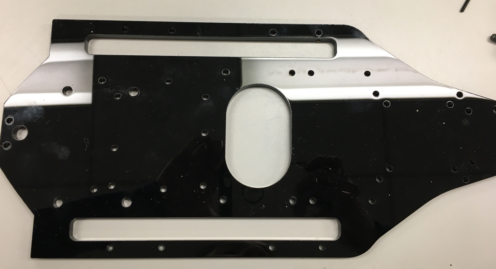
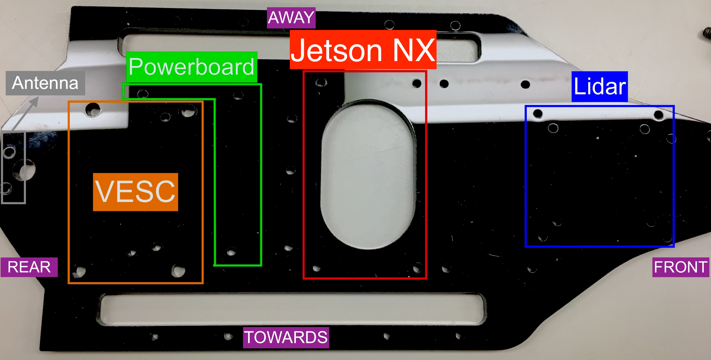
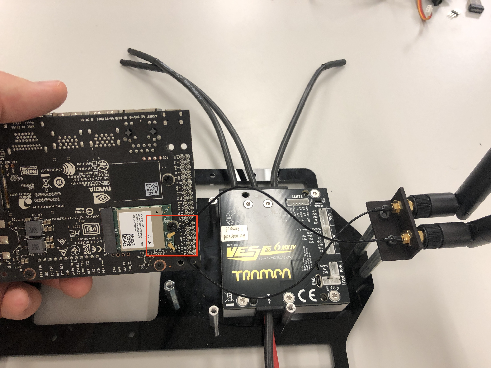
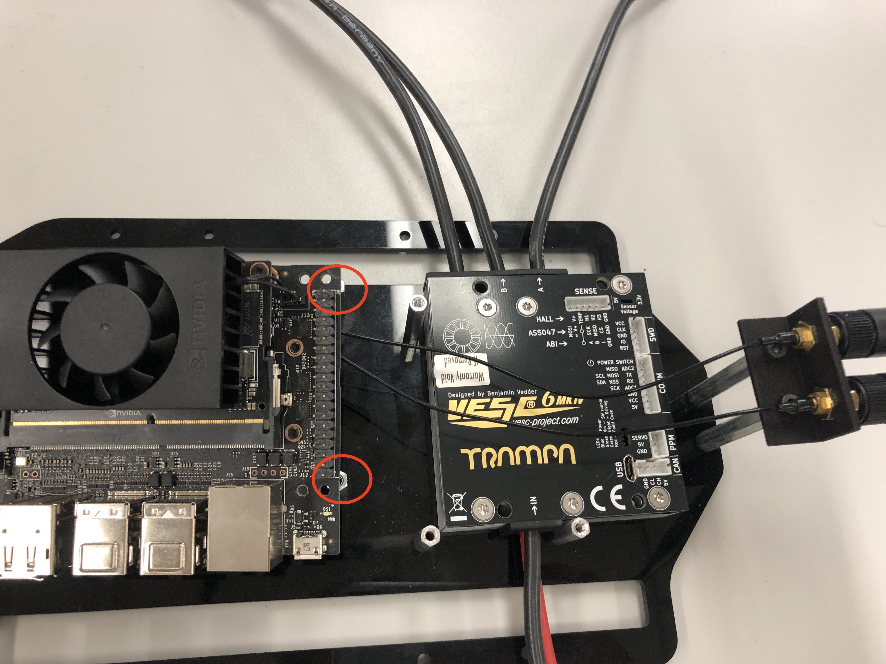
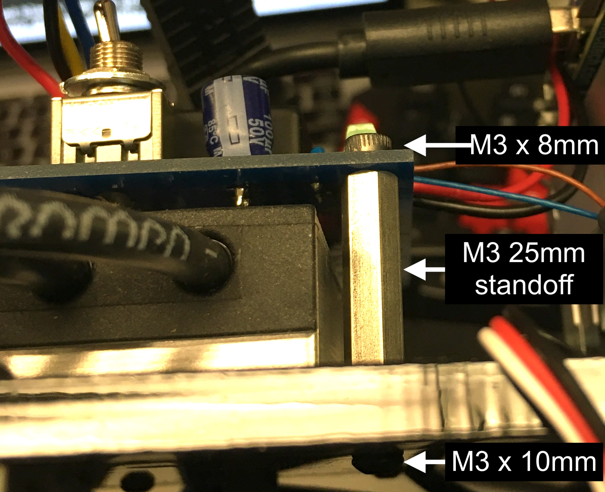
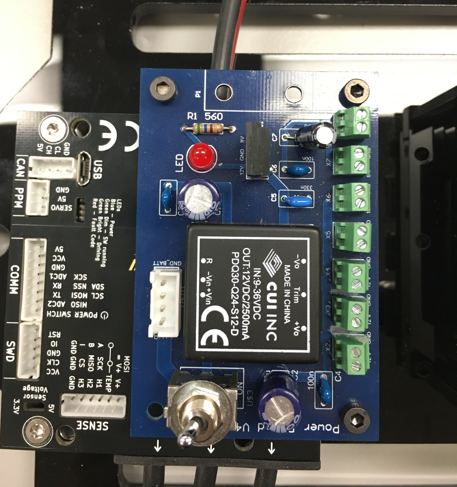
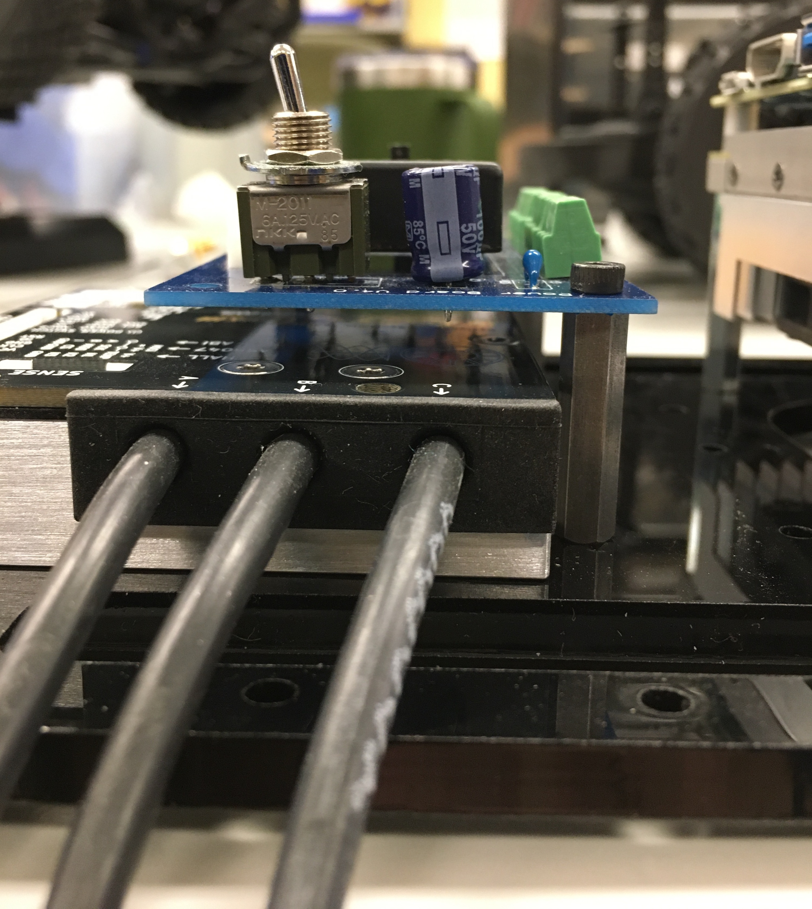
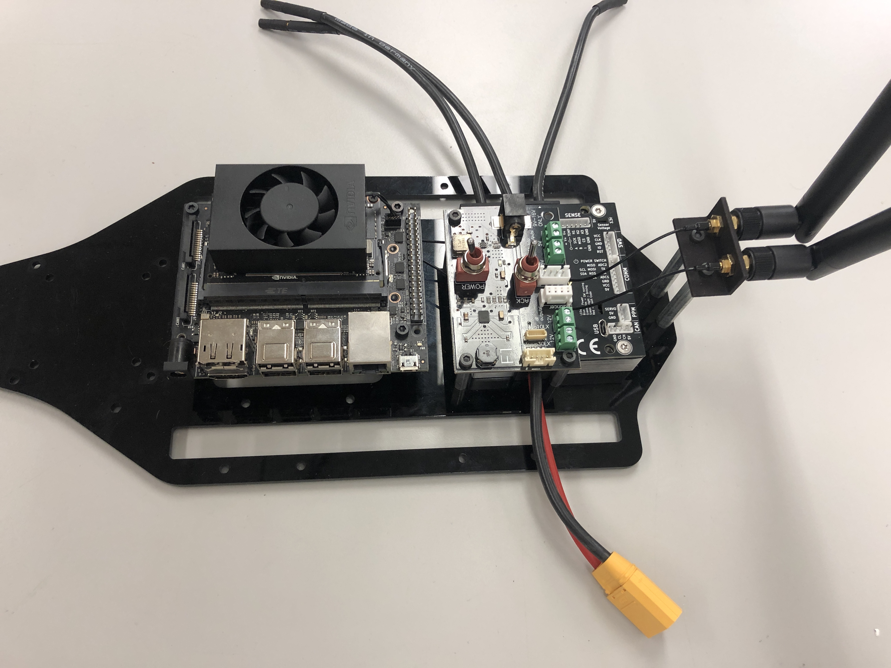
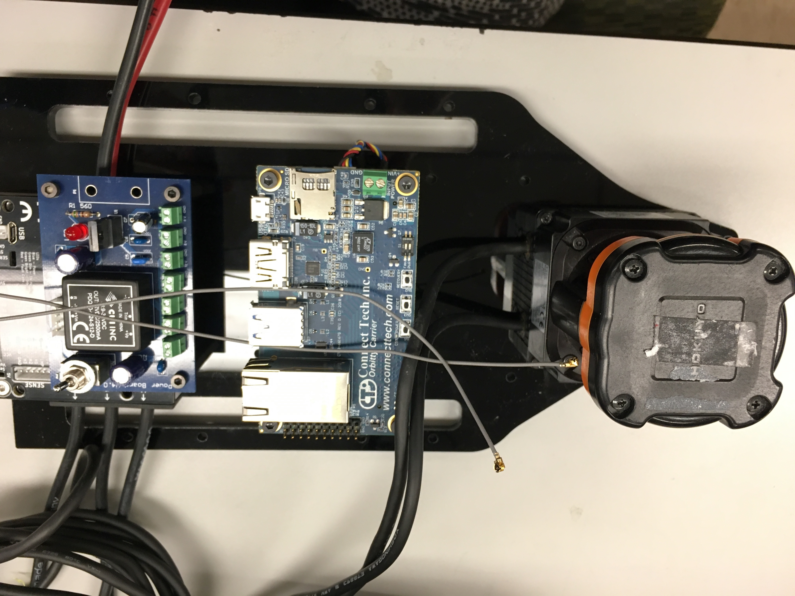

.. _doc_build_upper_level:

3. Upper Level Chassis
========================

In the third part we’re going to assemble the upper level chassis and mount the important components. The complete process for the third hardware part can be watched in this video tutorial too.

.. raw:: html

	<iframe width="560" height="315" src="https://www.youtube.com/embed/L-V-0zzkl10?start=530" frameborder="0" allow="accelerometer; autoplay; clipboard-write; encrypted-media; gyroscope; picture-in-picture" allowfullscreen></iframe>

Place the **Platform Deck** so it's facing you like this. The **Platform Deck** is the `laser cut piece <https://drive.google.com/drive/folders/1NU4FZzvMEGKCOFzDBvnjyePnnSMvsZPG?usp=sharing>`_.

	Platform Deck.

To make things easier to follow, we define **Front**, **Rear**, **Away**, and **Towards** like above.

.. important::
	**This piece is not symmetric.** Notice in the figure above that the big M5 VESC mounting holes marked in yellow are not centered. The holes need to be skewed **TOWARDS** to you.

The following image shows the five components that we will be mounting on the Platform Deck.

	Locations of parts to be mounted.

1. Mounting the VESC
-----------------------------------------
Place the VESC on the Platform Deck so that the power wires are facing AWAY from you and the three cables labelled **A**, **B**, and **C** are facing TOWARDS you.

.. figure:: img/ulchassis/ulchassis03.JPG
	:align: center

	VESC placed in correct position on Platform Deck.

Flip the Platform Deck and the VESC over and use two M5 screws mounted diagonal from each other to attach the VESC to the Platform Deck, like shown below.

.. figure:: img/ulchassis/ulchassis04.JPG
	:align: center

	Mounting holes for Powerboard and VESC. Note that this is view of the bottom of the Platform Deck.

2. Mounting the Antenna
-----------------------------------------
After the VESC we mount the antenna standoffs+cables to the rear of the VESC. The reason for that is that we want to lay the antenna cables beneath the powerboard and connect it afterwards directly to the NVIDIA Jetson NX before mounting it. Use the M3 screw to mount the antenna standoffs+cable.

.. figure:: img/ulchassis/ulchassisNX_02.JPG
	:align: center

	Mounted Antenna on the platform deck.

Afterwards you can directly attach the black antennas to the antenna mount. Just as you demounted the antenna rotate them back to the antenna mount.

	.. figure:: img/ulchassis/ulchassisNX_03.JPG
		:align: center

		Attach the antenna mount to the Antenna.

3. Mounting the NVIDIA Jetson NX
-----------------------------------------

Now its time to mount the NVIDIA Jetson NX. Before we mount the Jetson please connect the antenna cables first. Flip the Jetson around and clip both antenna cables to the antenna connectors on the Jetson.

	Connect the antenna cables to the Jetson NX.

Afterwards we need to install the M3 standoffs for the Jetson on the Platform deck. Screw the standoffs to the platform deck to the specific NVIDA Jetson NX mount holes. Thread the M3 screw from underneath the Platform Deck up and secure with a 25mm standoff.

	Install the standoffs for the Nvidia Jetson.

Now you can place the Jetson NX on the mounted standoffs. Use the 4 main holes on top of the Jetson to mount the Jetson to the platform deck with M3 screws. Then, Secure the Powerboard to the 25mm standoff with a M3 x 8mm screw.

	.. figure:: img/ulchassis/ulchassisNX_06.JPG
		:align: center

		Mount the Nvidia Jetson NX to the platform deck.

4. Mounting the Powerboard
-----------------------------------------

The image above shows the three holes used to mount the Powerboard. Only three of the Powerboard mounting holes are used. Flip the Platform Deck with the VESC attached to it back over so the VESC is facing up. Attach the Powerboard to the Platform deck by using the M3 screws that were removed from the chassis in the Lower Level Chassis section. Thread the M3 screw from underneath the Platform Deck up and secure with a 25mm standoff. Then, Secure the Powerboard to the 25mm standoff with a M3 x 8mm screw.

	Side view of Powerboard mounted on Platform Deck.

	Top view of Powerboard mounted on Platform Deck. The green terminal blocks are facing the FRONT of the car.

There should be a gap between the Powerboard and the VESC.

	Notice there is space between the VESC and the Powerboard.

After installing the powerboard your upper level should look like this.

	Platform deck with Jetson NX, VESC, Powerboard and antenna.

5. Mounting the Lidar
---------------------------------------------------
The last component to mount is the lidar. Here, we use the Hokuyo UTM-30LX. The mounting holes for the Hokuyo UST-10LX are slightly different.

.. figure:: img/ulchassis/ulchassis20.JPG
	:align: center

	Lidar mounting holes.

Use the appropriate mounting holes for your lidar.

Use four M3 screws to mount from underneath.

	Lidar mounted on Platform Deck.

The upper level chassis is complete and we're ready to assemble everything!

