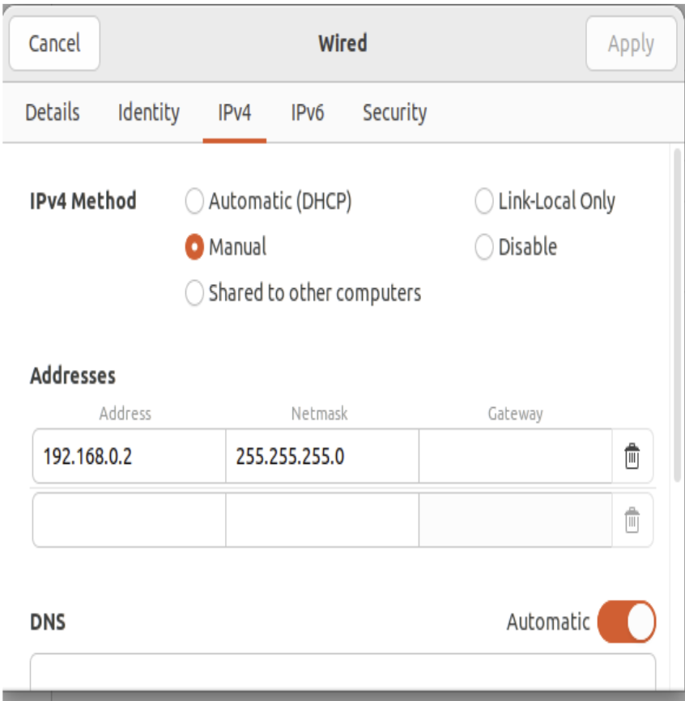
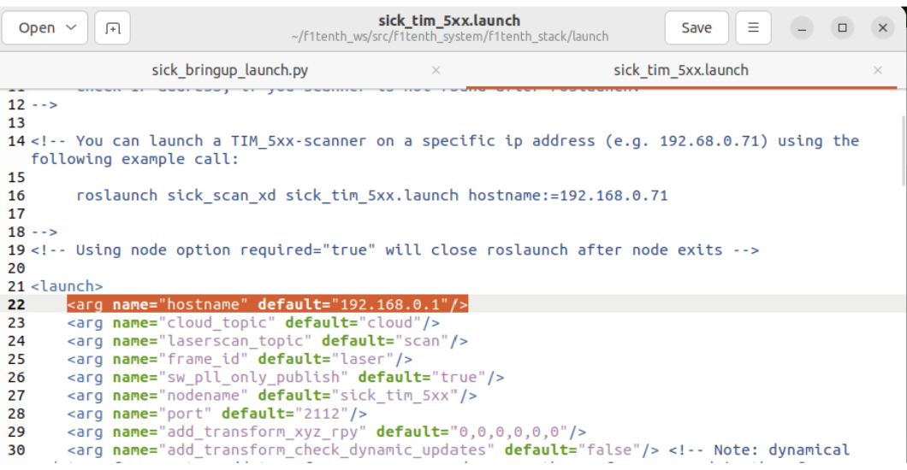
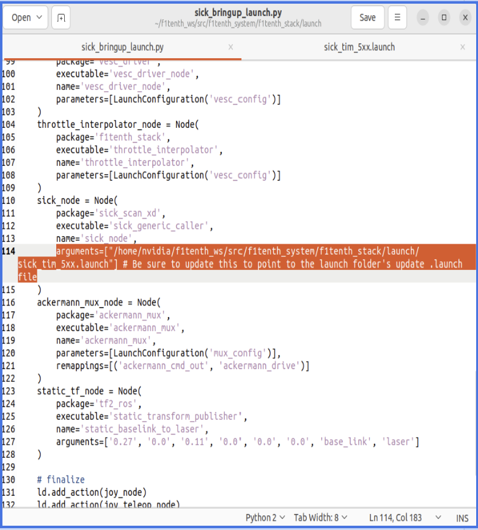

.. _doc_drive_workspace:

2. RoboRacer Driver Stack Setup
=================================
**Equipment Required:**
	* Fully built RoboRacer vehicle
	* Pit/Host computer OR
	* External monitor/display, HDMI cable, keyboard, mouse

**Approximate Time Investment:** 1.5 hour

.. warning:: **Before you proceed**, this section sets up the driver stack **natively** with **ROS 2 Humble**, for Jetsons running **JetPack 6 (Ubuntu 22.04)** — including the reference **Jetson Orin Nano Super**. If your Jetson runs an older JetPack (Ubuntu 20.04) or is a pre-Xavier board, use the :ref:`Driver Stack Setup with Docker Containers <doc_drive_workspace_docker>` instead, which runs Humble in a container.

Overview
----------
We use **ROS 2 Humble** for communication and to run the car. You can find a tutorial on ROS 2 `here <https://docs.ros.org/en/humble/Tutorials.html>`_.

In this section you'll install ROS 2 Humble and its utilities, set up udev rules for the sensors, install and build the F1TENTH driver stack, and configure your LiDAR.

Everything in this section is done on the **Jetson**, so you'll need to connect to it via SSH from the Pit laptop or plug in the monitor, keyboard, and mouse.

1. Installing ROS 2 Humble
----------------------------
Follow the official ROS 2 Humble installation guide to install ROS 2 from Debian packages:

`ROS 2 Humble — Ubuntu (Debian packages) Installation <https://docs.ros.org/en/humble/Installation/Ubuntu-Install-Debians.html>`_

When you reach the install step, install the **ROS-Base Install (Bare Bones)** — this provides the communication libraries, message packages, and command-line tools, with **no GUI tools**:

.. code-block:: bash

    sudo apt install ros-humble-ros-base

2. Installing rosdep
----------------------
``rosdep`` is the dependency-resolution tool we'll use to install the driver stack's dependencies. Install and initialize it by following the official guide:

`Installing and initializing rosdep <https://docs.ros.org/en/humble/Installation/Alternatives/Ubuntu-Install-Binary.html#installing-and-initializing-rosdep>`_

3. udev Rules Setup
----------------------
When you connect the VESC and a USB LiDAR to the Jetson, the operating system will assign them device names of the form ``/dev/ttyACMx``, where ``x`` is a number that depends on the order in which they were plugged in. For example, if you plug in the LiDAR before the VESC, the LiDAR will be assigned ``/dev/ttyACM0`` and the VESC ``/dev/ttyACM1``. This is a problem, as the car's configuration needs to know which device name belongs to which device, and these can change every time you reboot depending on the initialization order.

Fortunately, Linux has a utility named udev that lets us assign each device a "virtual" name based on its vendor and product IDs. We will use udev to assign persistent device names to the LiDAR, VESC, and joypad by creating configuration files ("rules") in the directory ``/etc/udev/rules.d``.

.. tip:: These rule files have to be created **as root** with a text editor. If you don't already have a terminal editor you're comfortable with, install ``nano`` and use it to open and edit each file — it's the easiest option:

    .. code-block:: bash

        sudo apt install nano

    Then open any file below with ``sudo nano <filename>`` (for example ``sudo nano /etc/udev/rules.d/99-vesc.rules``), paste the rule, and save with ``Ctrl+O`` then exit with ``Ctrl+X``.

**Hokuyo LiDAR rule (skip this first rule if you are not using a Hokuyo USB LiDAR — e.g. if you're using an ethernet SICK LiDAR).**

Open ``/etc/udev/rules.d/99-hokuyo.rules`` and copy in the following rule exactly as it appears below, on a single line, then save it:

.. code-block:: bash

    KERNEL=="ttyACM[0-9]*", ACTION=="add", ATTRS{idVendor}=="15d1", MODE="0666", GROUP="dialout", SYMLINK+="sensors/hokuyo"

Next, open ``/etc/udev/rules.d/99-vesc.rules`` and copy in the following rule for the VESC:

.. code-block:: bash

    KERNEL=="ttyACM[0-9]*", ACTION=="add", ATTRS{idVendor}=="0483", ATTRS{idProduct}=="5740", MODE="0666", GROUP="dialout", SYMLINK+="sensors/vesc"

Then open ``/etc/udev/rules.d/99-joypad-f710.rules`` and add this rule for the joypad:

.. code-block:: bash

    KERNEL=="js[0-9]*", ACTION=="add", ATTRS{idVendor}=="046d", ATTRS{idProduct}=="c219", SYMLINK+="input/joypad-f710"

.. note:: The Logitech F710 has a **D/X** switch on the back. The rule above uses the DirectInput (**D**) product ID ``c219``. If your joypad enumerates with product ID ``c21f`` instead, it is in XInput (**X**) mode — either flip the switch to **D**, or replace ``c219`` with ``c21f`` in the rule above. Run ``lsusb`` (look for the *Logitech* entry) to confirm which product ID your joypad reports.

Finally, trigger (activate) the rules by running:

.. code-block:: bash

    sudo udevadm control --reload-rules
    sudo udevadm trigger

Reboot your system, and you should find the new devices by running:

.. code-block:: bash

    ls /dev/sensors
    ls /dev/input

If you want to add additional devices and don't know their vendor or product IDs, you can use the command:

.. code-block:: bash

    sudo udevadm info --name=<your_device_name> --attribute-walk

making sure to replace ``<your_device_name>`` with the name of your device (e.g. ``ttyACM0`` if that's what the OS assigned it — the Unix utility ``dmesg`` can help you find that). The topmost entry will be the entry for your device; lower entries are for the device's parents.

4. Installing the F1TENTH Driver Stack
----------------------------------------
First, source ROS 2 so that ``colcon`` and the other build tools are available (do this in every new terminal, or add it to your ``~/.bashrc``):

.. code-block:: bash

    source /opt/ros/humble/setup.bash

Create a ROS workspace:

.. code-block:: bash

    cd $HOME && mkdir -p f1tenth_ws/src

Clone the F1TENTH stack repo from the ``humble-devel`` branch:

.. code-block:: bash

    cd f1tenth_ws/src
    git clone --branch humble-devel https://github.com/f1tenth/f1tenth_system.git

Update the git submodules to pull in all the necessary packages:

.. code-block:: bash

    cd f1tenth_system
    git submodule update --init --recursive --remote

Install the dependencies with ``rosdep``:

.. code-block:: bash

    cd $HOME/f1tenth_ws
    rosdep update --include-eol --rosdistro=humble
    rosdep install --include-eol --from-paths src -i -y --rosdistro=humble

Build the workspace:

.. code-block:: bash

    colcon build

.. note:: If you get a CMake error about ``asio_cmake_module`` being missing while building the ``vesc_driver`` package, install it and build again:

    .. code-block:: bash

        sudo apt install ros-humble-asio-cmake-module
        colcon build

You can find more details on how the drivers are set up in the README of the `f1tenth_system repo <https://github.com/f1tenth/f1tenth_system>`_.

.. _lidar_setup:
.. _doc_firmware_hokuyo10:

5. Setting Up Your LiDAR
--------------------------
The driver stack supports different LiDARs. Follow the option that matches your hardware.

Option 1 — Hokuyo LiDAR
^^^^^^^^^^^^^^^^^^^^^^^^^^
If you are using a **USB Hokuyo** (e.g. the 30LX), no extra setup is needed — it is referenced through the udev rule you created in the udev Rules Setup section above.

If you have a **Hokuyo 10LX** that connects over **ethernet**, you'll need to configure the ``eth0`` network. From the factory, the 10LX is assigned the IP ``192.168.0.10`` (note that the LiDAR is on subnet 0).

Open **Network Configuration** in the Linux GUI on the Jetson. In the IPv4 tab, add a connection so that the ``eth0`` port is assigned:

    * IP address ``192.168.0.15``
    * Subnet mask ``255.255.255.0``
    * Gateway ``192.168.0.10``

Name the connection ``Hokuyo``, save it, and close the network configuration GUI. When you plug in the 10LX, make sure the ``Hokuyo`` connection is selected. If everything is configured properly, you should now be able to ping ``192.168.0.10``.

Option 2 — SICK ethernet LiDAR
^^^^^^^^^^^^^^^^^^^^^^^^^^^^^^^^^
If you are using a SICK ethernet LiDAR (e.g. a SICK TiM), follow these steps.

1. Install the SICK LiDAR driver:

.. code-block:: bash

    sudo apt install ros-humble-sick-scan-xd

2. Configure the Jetson's wired (ethernet) connection so it is on the **same subnet** as the LiDAR. Open the network settings, edit the **Wired** connection's **IPv4** tab, set the method to **Manual**, and add an address:

    * Address: ``192.168.0.15``
    * Netmask: ``255.255.255.0``
    * Gateway: leave blank (no gateway is required for a direct connection)

The address just needs to be on the ``192.168.0.x`` subnet and different from the LiDAR's address. Click **Apply**.

    Setting a static IPv4 address for the wired connection to the SICK LiDAR.

3. Find the LiDAR's IP address. SICK LiDARs ship with a factory IP on the ``192.168.0.x`` subnet. Scan the subnet to discover which address it's using:

.. code-block:: bash

    sudo nmap -sn 192.168.0.0/24

4. Point the launch files at your LiDAR's IP address. Both files are in:

.. code-block:: bash

    /home/nvidia/f1tenth_ws/src/f1tenth_system/f1tenth_stack/launch/

Open ``sick_tim_5xx.launch``, go to **line 22**, and set the ``hostname`` to your LiDAR's IP address:

.. code-block:: xml

    <arg name="hostname" default="X.X.X.X"/>

    Setting the LiDAR IP in ``sick_tim_5xx.launch``.

Then open ``sick_bringup_launch.py``, go to **line 114**, and set the ``arguments`` path so it points at your ``sick_tim_5xx.launch`` file:

.. code-block:: python

    arguments=["/home/nvidia/f1tenth_ws/src/f1tenth_system/f1tenth_stack/launch/sick_tim_5xx.launch"]

    Pointing ``sick_bringup_launch.py`` at the SICK launch file.

.. note:: The exact line numbers (22 and 114) may shift slightly if the files have been updated — look for the ``hostname`` argument in ``sick_tim_5xx.launch`` and the ``arguments=[...]`` entry of the ``sick_node`` in ``sick_bringup_launch.py``.

6. Launching the Driver Stack
-------------------------------
Once your LiDAR is configured, source the ROS 2 underlay and your workspace's overlay, then launch the bringup:

.. code-block:: bash

    source /opt/ros/humble/setup.bash
    cd $HOME/f1tenth_ws
    source install/setup.bash
    ros2 launch f1tenth_stack bringup_launch.py

Running the bringup launch will start the VESC drivers, the LiDAR drivers, the joystick drivers, and all necessary packages for running the car. To see the LaserScan messages, open a new terminal and run:

.. code-block:: bash

    source /opt/ros/humble/setup.bash
    cd $HOME/f1tenth_ws
    source install/setup.bash
    rviz2

The rviz window should show up. Add a **LaserScan** visualization on the ``/scan`` topic to see your LiDAR data.
