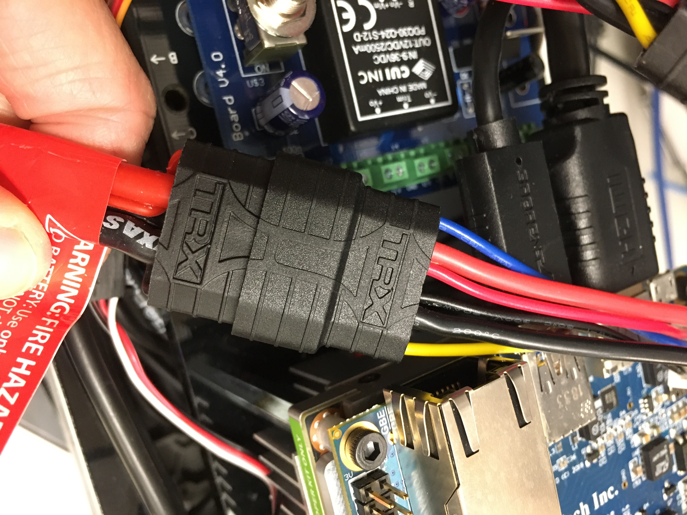
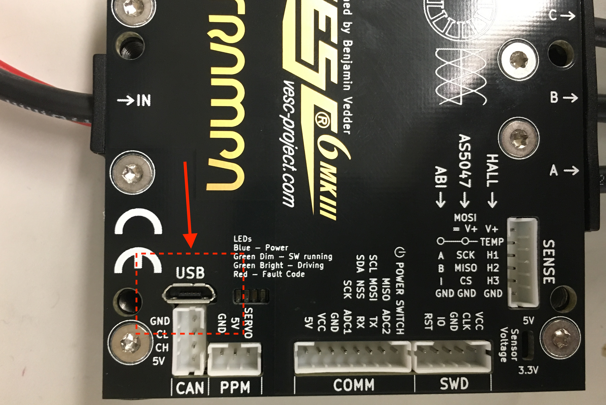
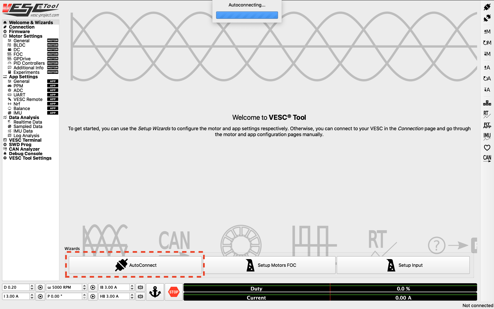
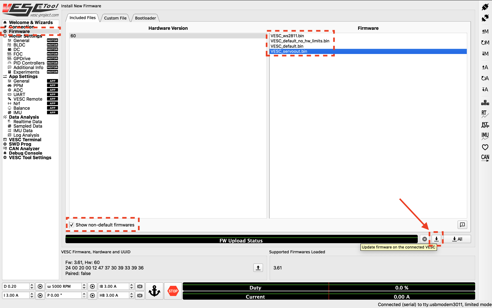
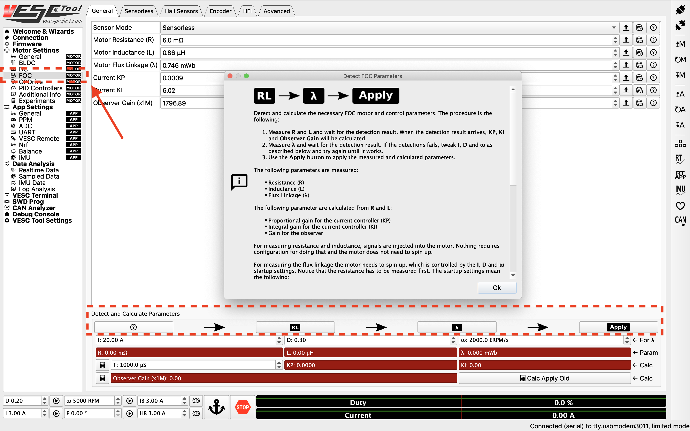
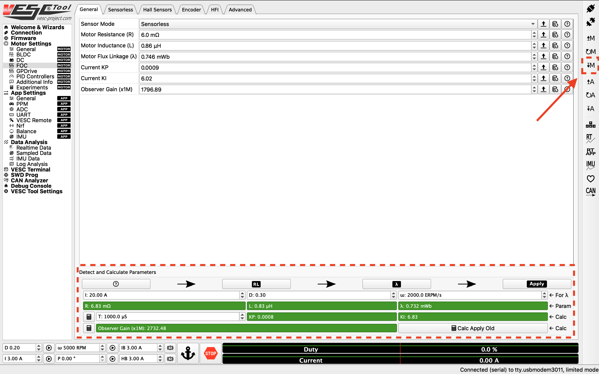
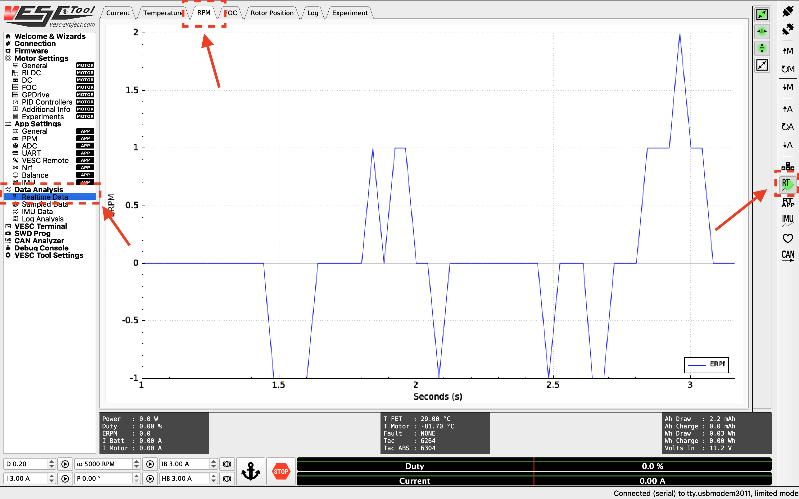
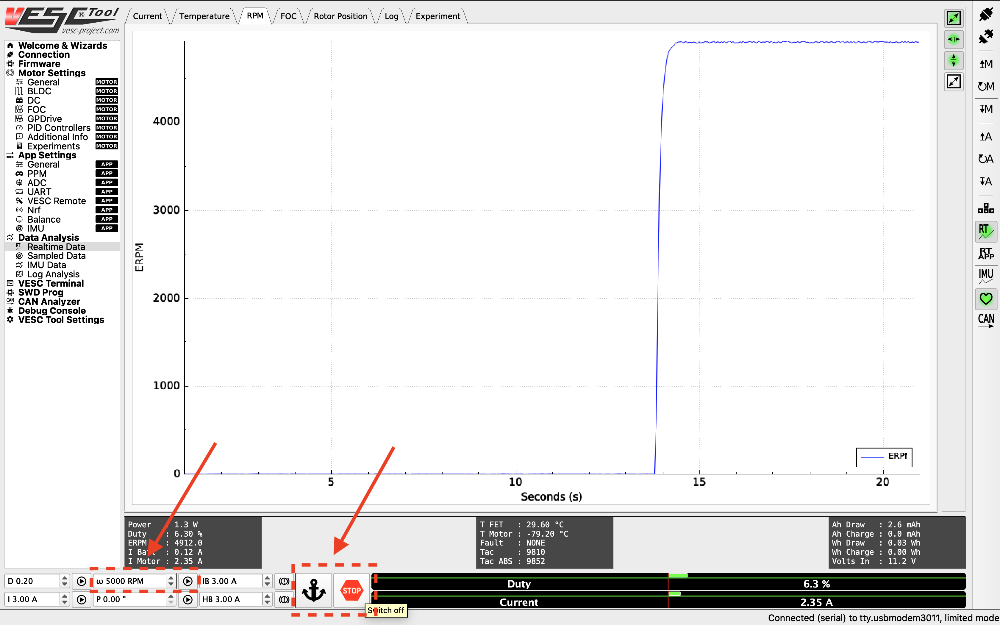

.. _doc_firmware_vesc:

1. Configuring the VESC
==========================
.. danger:: **Important Safety Tips**

    * Put your car on an elevated stand so that its wheels can turn without it going anywhere. If you don’t have an RC car stand, you can use the box that came with your Jetson.
    * Make sure you hold on to the car while testing the motor to prevent it from flying off the stand.
    * Make sure there are no objects (or people) in the vicinity of the wheels while testing.
    * Use a fully-charged LiPO battery instead of a power supply to ensure the motor has enough current to spin up.

**Equipment Required:**
	* Fully built F1TENTH vehicle
	* Box or `Car stand <https://www.amazon.com/Duratrax-Tech-Deluxe-Truck-Stand/dp/B0014T74MS/ref=sr_1_6?keywords=rc+car+jack&link_code=qs&qid=1584393402&sr=8-6>`_  to put vehicle on
	* Laptop/computer (does not need to be running Linux)

**Approximate Time Investment:** 1 hour

.. note::

	If using the VESC mkIV, e.g. hardware based on VESC 4.12, see `here <https://github.com/f1tenth/vesc_firmware>`_ for more details on how you can build your firmware for corresponding VESCs, and prebuilt firmware for different VESC hardware versions.

1. Installing the VESC Tool
-----------------------------
We need to configure the VESC so that it works with our motor and vehicle transmission. Before you start, you'll need to install the `VESC Tool <https://vesc-project.com/vesc_tool>`_. You'll have to register for an account to download. Add the free tier tool to cart (you don't have to fill in any information other than your email.) After checkout, a download link will be sent to your email address. There should be versions of the software for Linux, Windows and macOS.

2. Powering the VESC
-------------------------
First we need to power the VESC. Plug the battery in.

	Plug the battery in. Make sure the polarity is correct.

Note that you don't need to turn on the Powerboard for configuring the VESC.

Next, unplug the USB cable of the VESC from the Jetson NX and plug the USB into your laptop. You may want to use a longer cable.

	Plug a longer micro USB cable from the VESC to your computer.

3. Connecting the VESC to Your Laptop
-----------------------------------------
Launch the VESC Tool. On the Welcome page, press the **AutoConnect** button on bottom left of the page. After the VESC is connected, you should see an updated status on the bottom right of the screen.

	Click *Autoconnect* in the VESC Tool.

4. Updating the Firmware on the VESC
-----------------------------------------
..
	This is Kim's edit for people using VESC tool 2.05.
	We are currently using an older firmware version of the VESC. Download it `here <https://drive.google.com/file/d/19veWRe745p3efOyn-Ff3RRYlADhp_c5V/view?usp=sharing>`_. This is assuming that you are also using the version 4.12 of the VESC hardware. Read more about it `here <https://github.com/RacecarJ/vesc-firmware/tree/master/firmware>`_. Switch to the "Custom File" tab and upload the file that you downloaded. There will be a warning. Continue to upload.

The first thing you'll need to do is to update the firmware onboard the VESC. On the left side of the screen, click on the **Firmware** tab. On bottom left of the page, check the **Show non-default firmwares** check box. On the right, you should see extra firmware options show up. Select the **VESC_servoout.bin** option. Afterwards, on the bottom right of the page, press the button with the down arrow to update the firmware on the connected VESC. A status bar at the bottom of the page will show firmware update status. After it's finished, follow the prompt on screen.

	Update the firmware.

5. Uploading the Motor Configuration XML
-------------------------------------------
After firmware update, Select **Load Motor Configuration XML** from the drop down menu and select the provided XML file from `here <https://drive.google.com/file/d/1-KiAh3hCROPZAPeOJtXWvfxKY35lhhTO/view?usp=sharing>`_ . After the XML is uploaded, click on the **Write Motor Configuration** button (the button with a down arrow and the letter M) on the right side of the screen to apply the motor configuration. Note that in the future, you'll have to press this button whenever you make a change in motor configuration.

.. figure:: img/vesc/xml.png
	:align: center

	Upload the XML file.

6. Detecting and Calculating Motor Parameters
------------------------------------------------
To detect and calculate the FOC motor parameters, navigate to the **FOC** tab under **Motor Settings** on the left. At the bottom of the screen, follow the direction  of the arrows and clck on the four buttons one by one, and follow the on screen prompt. Note that during the measuring process, the motor will make noise and spin, make sure the wheels of your vehicle are clear.

	Detect the motor.

After the motor parameters are measured, the fields at the bottom of the screen should turn green. Click on the **Apply** button, and click the **Write Motor Configuration** button.

	Apply the motor parameters.

7. Changing the Openloop Hysteresis and Openloop Time
-------------------------------------------------------
Navigate to the **Sensorless** tab on top of the screen. Change the **Openloop Hysteresis** and **Openloop Time** to 0.01, and click the **Write Motor Configuration** button.

.. figure:: img/vesc/open_loop.png
	:align: center

	Change the openloop time.

8. Tuning the PID controller
---------------------------------
Now you can start tuning the speed PID controller. To see the RPM response from the motor, navigate to the **Realtime Data** tab under **Data Analysis** on the left. Click **Stream Realtime Data** button on the right (the button with letters RT), and navigate to the **RPM** tab on the top of the screen. You should see RPM data streaming now.

	RPM data streaming.

To create a step response for the motor, you can set a target RPM at the bottom of the screen (values between 2000 - 10000 RPM). Click the play button next to the text box to start the motor. Note that the motor will spin, so make sure the wheels of your vehicle are clear from objects. Click the Anchor or STOP button to stop the motor.

	Step response from the motor.

You want to look for a clean step response that has a quick rise time and zero to very little steady state error. Adjust the gains accordingly by navigating to the **PID Controllers** tab under **Motor Settings** on the left, and change the Speed Controller gains. General rules of tuning PID gains apply. If you're seeing a lot of oscillations, try changing the Speed PID Kd Filter.

.. figure:: img/vesc/pid_gains.png
	:align: center

	Adjusting PID gains.

.. danger:: **REMEMBER TO UNPLUG THE BATTERY WHEN YOU ARE FINISHED OTHERWISE YOU WILL OVERDRAIN THE LIPO BATTERY AND WILL HAVE TO BUY A NEW ONE ON TOP OF CAUSING A FIRE.**

Hopefully you've tuned it well enough that your car will run better than this:

