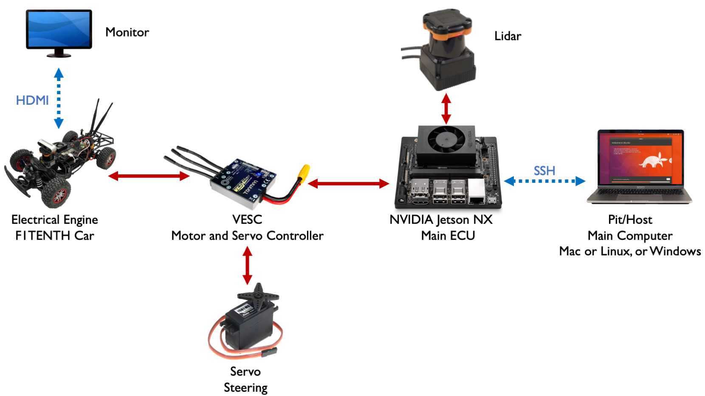

.. _doc_software_setup:

Configure Jetson and Peripherals
=================================
.. note:: This section assumes that you have already completed :ref:`Building the Car <doc_build_car>`.

At the end of this section, you will have the NVIDIA Jetson set up and connected to your computer via SSH and remote desktop.

**Required Equipment:**
	* Fully built RoboRacer vehicle
	* Laptop/computer: Linux, Windows, Mac
	* External monitor/display
	* HDMI cable
	* Keyboard
	* Mouse
	* Wireless router
	* Ethernet cable (needed if Pit/Host laptop does not have WiFi capability)

**Difficulty Level:** Intermediate-Advanced

**Approximate Time Investment:** 2-3 hours

.. Now that you have a working physical RoboRacer car, you'll want to program it to do something useful, otherwise it's just a glorified and expensive car model at this point.

This **Configure Jetson and Peripherals** section will walk you through how to configure the NVIDIA Jetson so that you will be able to run programs on the RoboRacer Autonomous Vehicle System and communicate with the Vehicle from your laptop.

The image below represents the flow of information on the RoboRacer Autonomous Vehicle System.

	Flow of information on the RoboRacer Autonomous Vehicle System.

The **NVIDIA Jetson** is the main brain of the entire system. It gives commands to the **VESC** which controls the **Servo** and the **Brushless Motor** on the RoboRacer Vehicle. The **NVIDIA Jetson Orin Nano Super** also receives information from the **LiDAR** either via USB or Ethernet. All of these communication are done through ROS 2, we'll go over how to set that up later on.

The **Pit/Host** laptop is your main computer that's used to remotely access the onboard computer of the car. The operating system on this laptop doesn't matter since we're only using it for remote access via SSH or remote desktop. We'll discuss how to use the simulator in a later section.

The configuration of the RoboRacer system is covered below:

#. :ref:`Configuring and Connecting to the NVIDIA Jetson <doc_optional_software_nx>` walks you through flashing the **NVIDIA Jetson**, connecting it and your **Pit/Host** laptop to the same wireless network, and setting up SSH and remote desktop access.

.. tip::
  If you have any build and/or setup questions, post to the `RoboRacer Slack <https://join.slack.com/t/robo-racer/shared_invite/zt-42lsbf50y-_3YPNLl_d3s~wPylAOMg0g>`_.

.. Many thanks to `Dr. Rosa Zheng <http://www.lehigh.edu/~yrz218/>`_ from Lehigh University for compiling the majority of information in this section.

.. toctree::
   :maxdepth: 1
   :name: Software Setup
	 :hidden:

   optional_software_nx
