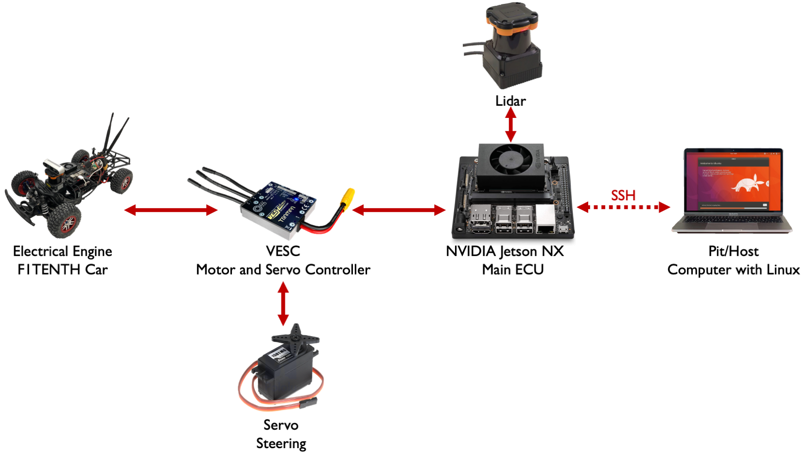

.. _doc_software_setup:

Configure Jetson and Peripherals
=================================
.. note:: This section assumes that you have already completed :ref:`Building the Car <doc_build_car>`.

At the end of this section, you will have the NVIDIA Jetson NX and set up and connected to your computer.

**Required Equipment:**
	* Fully built F1TENTH vehicle
	* Laptop/computer: Linux, Windows, Mac
	* External monitor/display
	* HDMI cable
	* Keyboard
	* Mouse
	* Wireless router
	* Ethernet cable (needed if Pit/Host laptop does not have WiFi capability)

**Difficulty Level:** Intermediate-Advanced

**Approximate Time Investment:** 2-3 hours

Now that you have a working physical F1TENTH car, you'll want to program it to do something useful, otherwise it's just a glorified and expensive car model at this point.

This **Configure Jetson and Peripherals** section will walk you through how to configure the NVIDIA Jetson NX so that you will be able to run programs on the F1TENTH Autonomous Vehicle System and communicate with the Vehicle.

The image below represents the flow of information on the F1TENTH Autonomous Vehicle System.

	Flow of information on the F1TENTH Autonomous Vehicle System.

The **NVIDIA Jetson NX** is the main brain of the entire system. It gives commands to the **VESC** which controls the **Servo** and the **Brushless Motor** on the F1TENTH Vehicle. The **NVIDIA Jetson NX** also receives information from the **Lidar** either via USB or Ethernet.

The **Pit/Host** laptop is is YOUR main computer which has access to the car and which is used to get data from the vehicle and to start the software. This can be a Windows, a Mac or a Linux computer - it does not matter. We use this computer ultimately to connect remotely via **SSH** to the **NVIDIA Jetson NX**. Furthermore, you can use that computer to code your software, but this part is not covered here.

The configuration of the F1TENTH system has three subsections:

#. :ref:`Configuring the NVIDIA Jetson NX <doc_optional_software_nx>` contains all necessary steps to configure the **NVIDIA Jetson Xavier NX**.
#. :ref:`Combine setup <doc_software_combine>` goes over how to set up a wireless communication system between the **Pit/Host** laptop and the **NVIDIA Jetson NX** once you have already completed the above two sections.
#. :ref:`DEPRECATED - Configuring the TX2 <doc_software_jetson>` contains all necessary steps to configure the **NVIDIA Jetson TX2**.

.. tip::
  If you have any build and/or setup questions, post to the `forum <http://f1tenth.org/forum.html>`_.

Many thanks to `Dr. Rosa Zheng <http://www.lehigh.edu/~yrz218/>`_ from Lehigh University for compiling the majority of information in this section.

.. toctree::
   :maxdepth: 1
   :name: Software Setup
	 :hidden:

   optional_software_nx
   software_combine
   software_jetson
