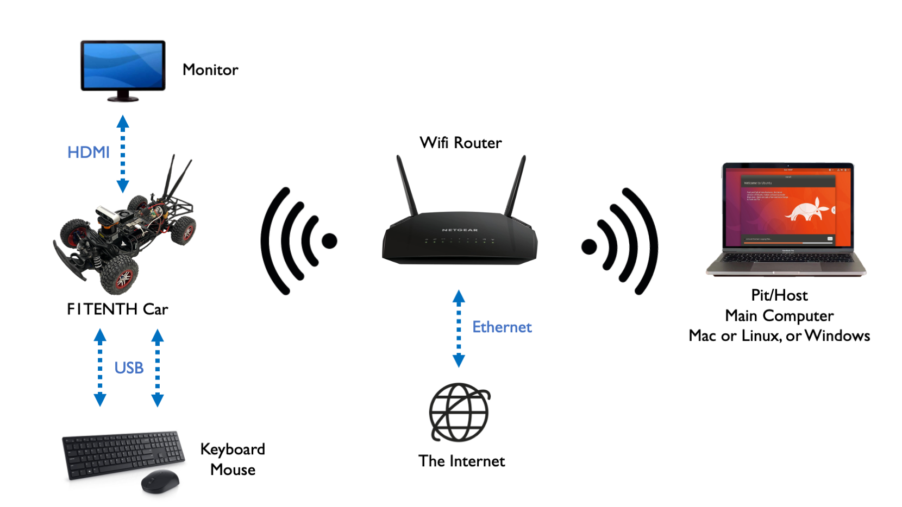
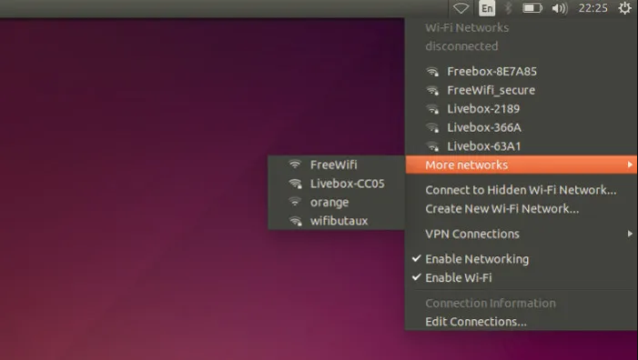

.. _doc_optional_software_nx:
.. _doc_software_combine:

Configuring and Connecting to the NVIDIA Jetson NX
====================================================

**Equipment Used:**

* Pit/Host laptop/computer (a host PC running Ubuntu is required to flash the Jetson)
* Fully-built RoboRacer vehicle
* External monitor/display
* HDMI cable
* Keyboard
* Mouse
* Wireless router

**Approximate Time Investment:** 2-3 hours

Overview
----------
We could log into the Jetson using a monitor, keyboard, and mouse, but ideally we want remote access while we're driving the car. In this section you'll flash the Jetson, connect it and your **Pit/Host** laptop to the same wireless network, and set up SSH and remote desktop access. Make sure to get the network settings right! Using the wrong IP address may lead to conflicts with another classmate, meaning neither of you will be able to connect.

If your **Pit/Host** computer has WiFi capability, connect both the computer and the RoboRacer car to a wireless router which reserves a static IP address for the Jetson NX on the vehicle.

If the **Pit/Host** computer doesn't have WiFi capability:

	#. Connect the **Pit/Host** computer to a WiFi router via an ethernet cable.
	#. Connect the **NVIDIA Jetson NX** to the same router via WiFi.

To make this section easy to follow, the router's WiFi network SSID will be referred to as ``F1TENTH_WIFI``. In your scenario, it'll be the SSID of your router's access point.

1. Flash the Jetson NX with the NVIDIA SDK Manager
----------------------------------------------------
Flashing the Jetson and installing the NVIDIA JetPack software is handled by the **NVIDIA SDK Manager**. Rather than burning an SD card image by hand, follow NVIDIA's official guide and use **Option 2 - NVIDIA SDK Manager** to flash your Jetson:

`NVIDIA SDK Manager flashing guide <https://docs.nvidia.com/jetson/orin-nano-devkit/user-guide/latest/setup_bsp.html#option-2-nvidia-sdk-manager>`_

Once flashing is complete, boot the Jetson with a monitor, keyboard, and mouse connected, and complete the initial Ubuntu setup (language, keyboard layout, time zone, and the ``f1tenth`` user account).

.. important:: The barrel jack on the powerboard is only rated for **9.0V - 16.0V**. The power supplies that come with the Jetson NX are 19V and therefore have a higher voltage. **Do not plug those in**. Otherwise you will destroy your powerboard.

2. Vehicle Hardware Setup
----------------------------
If you have an NVIDIA Jetson NX, it comes with a network card onboard. Make sure the antennas are connected. The battery should be plugged into the vehicle and the Powerboard should be on.

If you have an NVIDIA Jetson Nano or a Xavier, you'll need to install an additional M.2 network card from Intel to enable wireless networking.

3. Connecting to WiFi and SSH
-------------------------------
Power up the RoboRacer vehicle and connect the car to a monitor (via HDMI) and both a mouse and keyboard (via USB). The Jetson NX will boot to its Ubuntu Desktop.

To connect the NVIDIA Jetson NX to WiFi, click the wireless icon in the top-right corner of the Ubuntu Desktop and select your network (``F1TENTH_WIFI``). It might take a while for the NVIDIA Jetson NX to discover the wireless network.

After you're connected to the wireless network, open a terminal and type:

.. code-block:: bash

    ifconfig

You should be able to find your car's assigned IP address under :code:`wlan0`, after ``inet``.

Next, connect your **Pit/Host** laptop to the **same** wireless network, ``F1TENTH_WIFI``, and find its IP address. On Linux or macOS you can use the same :code:`ifconfig` command (on macOS it may be under ``en0`` or ``en1``). If you're running Linux on the Pit laptop in a virtual machine (VM), you may need to set its network adapter to NAT mode so the VM shares the host's wireless connection instead of controlling the adapter itself.

Now that the car and the laptop are on the **same network**, check that they can reach each other:

| On the NVIDIA Jetson NX, open a terminal and type :code:`ping [PIT_IP]` (the IP address of the Pit computer).
| On the Pit computer, open a terminal and type :code:`ping [JETSON_IP]` (the IP address of the NVIDIA Jetson NX).

Remember to replace the IP addresses above with **your specific addresses**.

You can now SSH into the car from your laptop:

.. code-block:: bash

    ssh f1tenth@[IP_ADDRESS]

where ``[IP_ADDRESS]`` is the Jetson's WiFi IP address that you found above. Use :code:`ssh` directly if you're on `macOS or Linux <https://support.rackspace.com/how-to/connecting-to-a-server-using-ssh-on-linux-or-mac-os/>`_, or use `PuTTY <https://www.123-reg.co.uk/support/servers/how-do-i-connect-using-ssh-putty/>`_ if you're on Windows.

We recommend using `tmux <https://www.hamvocke.com/blog/a-quick-and-easy-guide-to-tmux/>`_ while you're ssh-ed into the car. That way you can close the terminal and your code on the car keeps running, since the SSH session is only paused. You'll need to install :code:`tmux` on the respective system you are using.

4. Updating Packages
------------------------

All further steps assume that your NVIDIA Jetson Xavier NX Developer Kit is connected to the internet. You can execute all the commands directly in the terminal application of the NVIDIA Jetson. Now we are updating the Ubuntu system on the Jetson NX.

1. To update the list of available packages, run ``sudo apt update``.
2. To install all available updates, run ``sudo apt full-upgrade``.
3. Once all packages have been upgraded run ``sudo reboot`` to restart the Developer Kit and apply any changes.

5. Creating a Swapfile
---------------------------

1. Run the following commands to create a swapfile which can help with memory-intensive tasks

.. code-block:: bash

    sudo fallocate -l 4G /var/swapfile
    sudo chmod 600 /var/swapfile
    sudo mkswap /var/swapfile
    sudo swapon /var/swapfile
    sudo bash -c 'echo "/var/swapfile swap swap defaults 0 0" >> /etc/fstab'

6. Install the Logitech F710 driver on the Jetson.
------------------------------------------------------

    .. code:: bash

      git clone https://github.com/jetsonhacks/logitech-f710-module
      cd logitech-f710-module
      ./install-module.sh

7. Using a Remote Desktop
----------------------------
Although we now have SSH access to the car, it is still inconvenient to run GUI applications on the car remotely. In this section, we'll go over how to set up a remote desktop so you can easily use GUI applications like rviz. In our example, we'll use **NoMachine**. If you're an advanced user and can find another remote desktop solution that works on the car, feel free to use it.

First, download NoMachine for your **pit/host** computer's specific OS `here <https://www.nomachine.com/download>`__. Then, while your Jetson is still connected to the monitor, install NoMachine following this guide `here <https://knowledgebase.nomachine.com/AR02R01074>`__. Note that the guide uses Jetson Nano, the same applies to Jetson Xavier NX. You only have to follow the *Install NoMachine* section and don't have to set up an alternative desktop environment.

After NoMachine is installed on both sides, go to your pit/host's NoMachine, click **Add** to configure your connection and insert the IP address of the Jetson. You'll only need to change the *Host* field. Click connect to connect to the Jetson. You'll then be prompted for the Jetson's username and password to log in. Now you should have remote desktop access to the Jetson.
