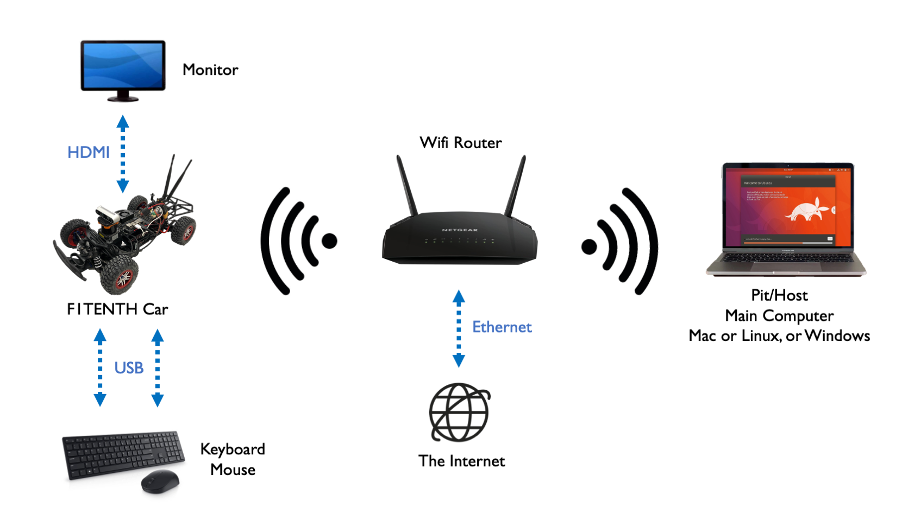
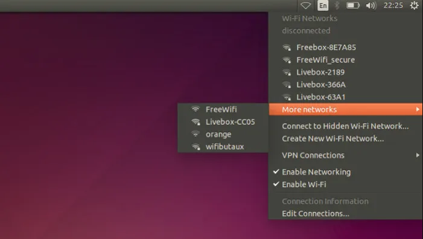

.. _doc_software_combine:

2. Connecting the Pit/Host and the NVIDIA Jetson NX
====================================================
**Equipment Used:**
	* Pit/Host laptop/computer running Mac, Windows, or Linux
	* Fully built F1TENTH vehicle with its NVIDIA Jetson NX connected to a keyboard, mouse, and an external monitor/display via HDMI cable
	* Wifi Router

**Approximate Time Investment:** 1 hour

Overview
----------
We could now log into the Jetson using a monitor, keyboard, and mouse, but ideally we would want remote access when we’re driving the car. Throughout this tutorial, you will be asked to configure the Jetson’s and your laptop’s network settings. Make sure to get these right! Using the wrong IP address may lead to conflicts with another classmate, meaning neither of you will be able to connect.

If your **Pit/Host** computer has WiFi capability, you connect both the computer and the F1TENTH car to a wireless router which reserves a static IP address for Jetson NX on the vehicle.

If the **Pit/Host** computer doesn't have Wifi capability:

	#. Connect the **Pit/Host** computer to a WiFi router via an ethernet cable.
	#. Connect the **NVIDIA Jetson NX** to the same router via Wifi.

To make this section easy to follow, the Routers WiFi network SSID will be called and referred to ``F1TENTH_WIFI``. In your scenario, it'll be the SSID of your router's access point.

1. Vehicle Hardware Setup
----------------------------------------------
If you have a NVIDIA Jetson NX, it comes with a network card onboard. Make sure the antennas are connected. The battery should be plugged into the vehicle and the Powerboard should be on.

If you have a NVIDIA Jetson Nano or a Xavier, you'll need to install an additional M.2 network card from Intel to enable wireless networking.

2. Connecting the NVIDIA Jetson NX to WiFi
-------------------------------------------------
Power up the F1TENTH vehicle and connect the car to a monitor (via HDMI) and both a mouse and keyboard (via USB). You see the Jetson NX is showing its main Desktop which is an UBUNTU 18.04 version.
You can now connect the NVIDIA Jetson NX to the ``F1TENTH_WIFI`` by clicking on wireless icon on top-right corner of Ubuntu Desktop and selecting ``F1TENTH_WIFI``. It might take a while for the NVIDIA Jetson NX to discover the wireless network.

After you're connected to the wireless network, open a terminal and type:

.. code-block:: bash

	ifconfig

You should see something similar to this:

.. code-block:: bash

	eth0: flags=4099<UP,BROADCAST,MULTICAST>  mtu 1500
	        ether 00:04:4b:cb:d9:52  txqueuelen 1000  (Ethernet)
	        RX packets 0  bytes 0 (0.0 B)
	        RX errors 0  dropped 0  overruns 0  frame 0
	        TX packets 0  bytes 0 (0.0 B)
	        TX errors 0  dropped 0 overruns 0  carrier 0  collisions 0
	        device interrupt 40

	lo: flags=73<UP,LOOPBACK,RUNNING>  mtu 65536
	        inet 127.0.0.1  netmask 255.0.0.0
	        inet6 ::1  prefixlen 128  scopeid 0x10<host>
	        loop  txqueuelen 1  (Local Loopback)
	        RX packets 1047  bytes 82631 (82.6 KB)
	        RX errors 0  dropped 0  overruns 0  frame 0
	        TX packets 1047  bytes 82631 (82.6 KB)
	        TX errors 0  dropped 0 overruns 0  carrier 0  collisions 0

	rndis0: flags=4099<UP,BROADCAST,MULTICAST>  mtu 1500
	        ether ea:a2:37:fd:d0:e1  txqueuelen 1000  (Ethernet)
	        RX packets 0  bytes 0 (0.0 B)
	        RX errors 0  dropped 0  overruns 0  frame 0
	        TX packets 0  bytes 0 (0.0 B)
	        TX errors 0  dropped 0 overruns 0  carrier 0  collisions 0

	usb0: flags=4099<UP,BROADCAST,MULTICAST>  mtu 1500
	        ether ea:a2:37:fd:d0:e3  txqueuelen 1000  (Ethernet)
	        RX packets 0  bytes 0 (0.0 B)
	        RX errors 0  dropped 0  overruns 0  frame 0
	        TX packets 0  bytes 0 (0.0 B)
	        TX errors 0  dropped 0 overruns 0  carrier 0  collisions 0

	wlan0: flags=4099<UP,BROADCAST,MULTICAST>  mtu 1500
	        inet 195.0.0.5  netmask 255.255.255.0  broadcast 195.0.0.255
	        inet6 fe80::4df8:b83b:9390:319d  prefixlen 64  scopeid 0x20<link>
	        ether 0c:dd:24:99:e6:52  txqueuelen 1000  (Ethernet)
	        RX packets 12511  bytes 4918686 (4.9 MB)
	        RX errors 0  dropped 0  overruns 0  frame 0
	        TX packets 1262  bytes 196668 (196.6 KB)
	        TX errors 0  dropped 0 overruns 0  carrier 0  collisions 0

You should be able to find your car's assigned IP address under :code:`wlan0`, then after ``inet``. In this example, the IP address is ``195.0.0.5``.

3. Connecting the Pit/Host Computer to WiFi
-------------------------------------------------
Now, on the Pit/Host laptop, connect to the same wireless network, ``F1TENTH_WIFI`` and find its IP Address. Based on what you have a main system (Mac, Linux, Windows) this process differs. If your laptop running Linux or macOS, you could use the same :code:`ifconfig` command in the terminal. On macOS, it may be under ``en0`` or ``en1``.
.. In this example, the IP address of the Pit is ``192.168.1.151``.

If you’re running Linux on the Pit laptop in a virtual machine (VM), connect the Pit computer to the router. Depending on which VM software you have and the default VM configuration, you may also need to set its network adapter configuration to NAT mode. This ensures your VM will share the wireless connection with your host OS instead of controlling the adapter itself.

4. Connecting to the Pit/Host to the NVIDIA Jetson NX
--------------------------------------------------------
Now that the car and the laptop are on the **same network**, you should check that you can ping the laptop from the car and you can ping the car from the laptop.

| On the NVIDIA Jetson NX, open a terminal and type: :code:`ping 192.168.1.151` (This is the IP address of the Pit computer.).
| On the Pit computer, open a terminal and type :code:`ping 195.0.0.5` (This is the IP address of the NVIDIA Jetson NX).

Remember to replace the IP addresses in the two lines above with **your specific addresses**.

You can now SSH into your car from your laptop. Use :code:`ssh` in the terminal if you're on `macOS or Linux <https://support.rackspace.com/how-to/connecting-to-a-server-using-ssh-on-linux-or-mac-os/>`_, use `PuTTY <https://www.123-reg.co.uk/support/servers/how-do-i-connect-using-ssh-putty/>`_ if you're on Windows.

We recommend using `tmux <https://www.hamvocke.com/blog/a-quick-and-easy-guide-to-tmux/>`_ while you're ssh-ed into the car. Therefore you close the terminal and your code on the car is still running, since the SSH session is only paused. You need to install :code:`tmux` on the respective system you are using.

.. You can now disconnect the HDMI cable, monitor, keyboard, and mouse from the NVIDIA Jetson NX and still be able to control the NVIDIA Jetson NX remotely from the Pit computer only via the terminal.

5. Using a Remote Desktop
----------------------------
Although we now have SSH access to the car, it is still inconvenient to run GUI application on the car remotely. In this section, we'll go over how to set up a remote desktop so you can easily use GUI applications like rviz. In our example, we'll use **NoMachine**. If you're an advance user, and can find another remote desktop solution that works on the car, feel free to use it.

First, download NoMachine for your **pit/host** computer's specific OS `here <https://www.nomachine.com/download>`_. Then, while your Jetson is still connected to the monitor, install NoMachine following this guide `here <https://knowledgebase.nomachine.com/AR02R01074>`_. Note that the guide uses Jetson Nano, the same applies to Jetson Xavier NX. You only have to following the *Install NoMachine* section and don't have to set up an alternative desktop environment.

After NoMachine is installed on both sides, go to your pit/host's NoMachine, click **Add** to configure your connection and insert the IP address of the Jetson. You'll only need to change the *Host* field. Click connect to connect to the Jetson. You'll then be prompted the Jetson's username and password to log in. Now you should have remote desktop access to the Jetson.

.. Congratulations on making it through the **System Configuration** section! The :ref:`Advanced Setups <doc_software_advance>` is optional and is not needed to finish setting up the vehicle.

.. .. image:: img/combine/wireless3.gif
.. 	:align: center
.. 	:width: 300px
