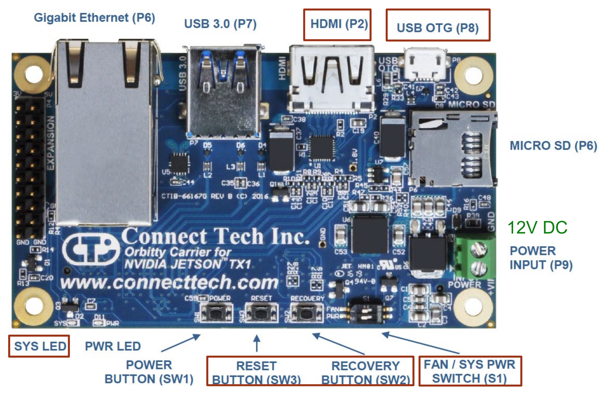

.. _doc_software_jetson:

DEPRECATED - Configuring the TX2
==========================
**Equipment Used:**
	* Pit/Host laptop/computer running Ubuntu 16.04 or 18.04
	* Fully built F1TENTH vehicle
	* External monitor/display
	* HDMI cable
	* Keyboard
	* Mouse

**Approximate Time Investment:** 1-2 hours

Overview
---------
The **TX2** is essentially a supercomputer on a module. We attach it to the Orbitty Carrier board so that we can access the TX2's peripheral. In order to configure the Jetson TX2, we need to install a few software on the **Pit/Host** laptop first and then use them to flash the **TX2**.

| Note that there are many available versions of the Jetpack and Jetson hardware.
| Jetson hardware versions:

	* Jetson Nano
	* Jetson AGX Xavier
	* **Jetson TX2 (what we use)**
	* Jetxon TX1

JetPack versions:

	* **JetPack 4.3 - OS L4T (Linux4Tegra) 32.3.1 (works w/ Ubuntu Melodic 18.04) (what we use)**
	* JetPack 3.2 - OS L4T 28.3.1 (Works w/ Ubuntu Xenial 16.04)
	* JetPack 2.4 - OS L4T 24.2.3 (old version OK for TX1)

We will refer to the **TX2** as **TX2** or **Jetson** interchangeably.

1. Install NVIDIA SDK Manager on Pit/Host Computer
-----------------------------------------------------
We first need to install NVIDIA SDK Manager. It provides an end-to-end development environment setup solution for NVIDIA’s DRIVE and Jetson SDKs for both host machine and target devices.

#. Go to nvidia.com and create a user account for yourself
#. Download `NVIDIA SDK Manager <https://developer.nvidia.com/nvidia-sdk-manager>`_ for *“All Jetson Developer Kits”* and run SDKM. Installation help can be found `here <https://docs.nvidia.com/sdk-manager/install-with-sdkm-jetson/index.html#install-with-sdkm-jetson>`_.
#. On host computer, extract and launch `SDK Manager <https://docs.nvidia.com/sdk-manager/install-with-sdkm-jetson/index.html>`_.

2. Installing JetPack on Pit/Host Computer
--------------------------------------------
Install JetPack 4.3 (L4T 32.3.1) on **Pit/Host** computer with `NVIDIA SDK Manager <https://docs.nvidia.com/sdk-manager/install-with-sdkm-jetson/index.html>`_.
	#. In Hardware Configuration: select Host Machine and in for Target Hardware, select Jetson TX2.
	#. If your window does not display all information, press Tab to scroll down, or use a bigger monitor.
	#. Follow instructions in SDKM,

	.. figure:: img/jetson/jetson02.png
	  	:align: center

		NVIDIA SDK Manager.

* If running into errors, close and relaunch SDKM, then choose repair/uninstall under the STEP 4 button.

3. Installing Orbitty BSP on Pit/Host Computer
------------------------------------------------
Download and install `BSP for Orbitty Carrier board <http://connecttech.com/support/resource-center/nvidia-jetson-tx2-tx1-product-support/>`_ on **Pit/Host** computer. Choose the **Jetson TX2/TX2 4GB/TX2i** module.

On *Board Support Packages* tab, select **TX2 L4T r32.3.1 – Jetpack 4.3**. This should be the first *Board Support Packages*.

..
	.. figure:: img/jetson/jetson03.png
	  	:align: center

		Choose *L4T r32.3.1 - Jetpack 4.3*.

Extract the .tgz file and find ``readme.txt`` in the folder; read the instructions and go through steps 1-4.

	#. Make sure the sdk manager is installed under ``$home/nvidia/nvidia_sdk``
	#. Copy the ``CTI-L4T-TX2-32.3.1-V001.tgz`` into ``$home/nvidia/nvidia_sdk/JetPack.3_Linux_GA_P3310/Linux_for_Tegra/``
	#. Extract the BSP by double clicking it or by running commands in Terminal under the correct directory

		.. code:: bash

			tar -xzf CTI-L4T-TX2-32.3.1-V001.tgz
			cd ..

	#. In the Terminal, under ``$home/nvidia/nvidia_sdk/JetPack.3_Linux_GA_P3310/``, run ``sudo ./install.sh``

4. Connecting the TX2
-------------------------
4 things need to be connected to the Orbitty Carrier Board.

#. A display via the HDMI port (P2)
#. A keyboard and mouse connected to the USB ports on the USB hub (P7) connected to the Orbitty
#. The Pit laptop via a micro USB (P8)
#. Power (green 12V terminal block)

	Layout of Orbitty Carrier Board.

#. Turn the *SYS PWR switch S1* to the left.
#. Plug in the battery in.
#. Turn the powerboard on.

The monitor shall display some text in a terminal window.

Note that the display and keyboard are separate from the **Pit/Host** computer. You essentially have two separate computers set up side by side at this point: the **TX2** and the **Pit/Host** computer.

5. Flashing the TX2 with the Orbitty Carrier
----------------------------------------------
Watch the first two minutes of `this <http://connecttech.com/flashing-nvidia-jetson-tx2-tx1-module/>`_.

#. Put the Orbitty board and Jetson in to RECOVERY mode.

	#. Press and hold the RECOVERY key, then press the RESET button, the SYS LED shall be off;
	#. Release the RESET button, wait 2 seconds and release the RECOVERY button. The monitor shall display nothing now. The Jetson and Orbitty are in RECOVERY mode.
	#. Check if the TX2 shows up in USB devices on the **Pit** computer by opening a terminal and typing ``lsusb``.

#. On the **Pit/Host** computer manually flash the boards by typing the following into the terminal

	.. code:: bash

		$sudo ./flash.sh cti/tx2/orbitty mmcblk0p1

	It will take about 10 minutes to finish flashing. When completed, the terminal should display:

	.. code:: bash

		The target t186ref has been flashed successfully.
		Reset the board to boot from internal eMMC.

	Note: CTI assisted flash does not work. (i.e. ``$sudo ./cti-flash.sh`` (error message ``flash.sh requires root privilege`` if no sudo), then choose 3 (Orbitty) in Menu 1 and 1 or 3 in Menu 2. error message saying ``failed flashing t186ref``

3. Turn the *SYS PWR switch (S1)* to the right. Press the *PWR button* on Orbitty. The monitor on Orbitty shall
display CTI-L4T welcome screen.

6. Working on the TX2
-----------------------
This is where you will need to use the keyboard and mouse connected to the USB hub on the vehicle.

Follow instructions on screen to finish setting up CTI-L4T on Jetson.

Install ROS like you did in the previous section, :ref:`Pit/Host Setup <doc_software_host>`.

	If you are tired of entering all those commands again, then download the installation script `installROS.sh <https://github.com/jetsonhacks/installROSTX2>`_ and adapt it for the new ROS version. Similarly, you may modify ``setupCatkinWorkspace.sh`` for the new Ubuntu+ROS versions.

Now you should have the TX2 up and running and ready to use!

.. `Professor Rosa Zheng <http://www.lehigh.edu/~yrz218/>`_ from Lehigh University has compiled a fantastic on how to set up the software.

	.. raw:: html

		<iframe width="700" height="500" src="https://drive.google.com/file/d/1N1FiPtAqpbeAYlKoFA4Tsxl0XC_Y8niT/preview" width="640" height="480"></iframe>
