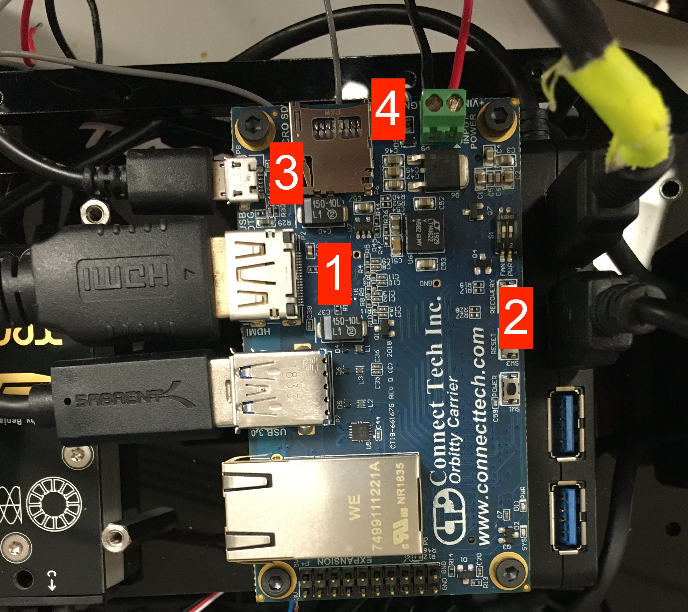

.. _doc_software_vesc:

.. TODO

Configuring the VESC
==========================

We need to configure the VESC so that it works with the ROS driver package. Before you start, you'll need to install the latest `VESC Tool <https://vesc-project.com/vesc_tool>`_ .

0. Powering the Vesc
-------------------------

1. Connecting the VESC to your laptop
-----------------------------------------

2. Updating the firmware on the VESC
-----------------------------------------

3. Upload the motor configuration XML
-----------------------------------------

4. Change the Openloop Hysteresis and Openloop Time
-------------------------------------------------------

5. Check motor spin direction
---------------------------------

6. Tune the PID controller
---------------------------------

