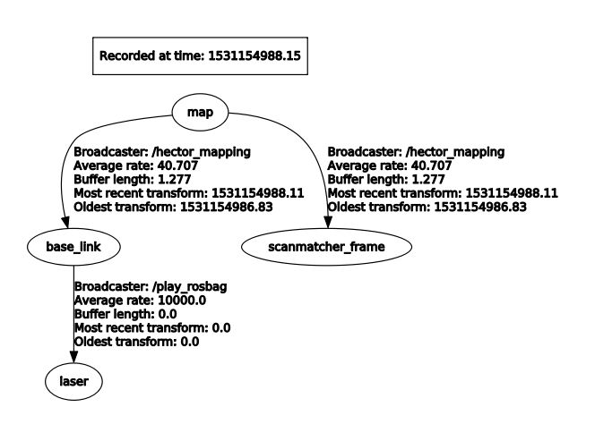
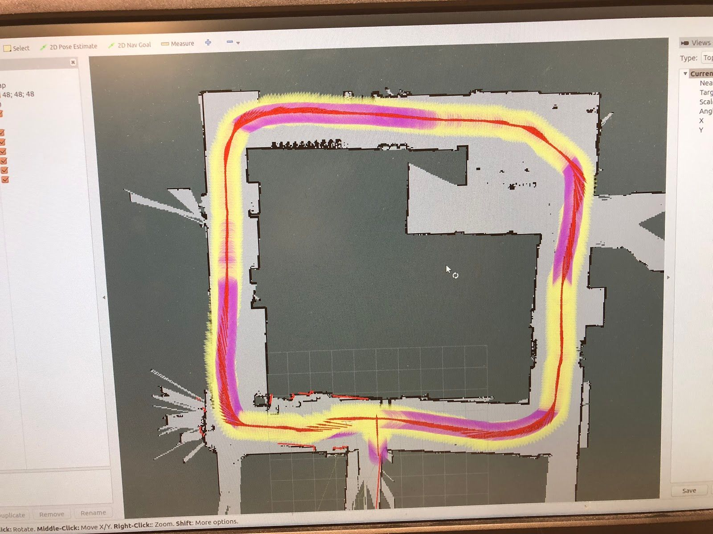
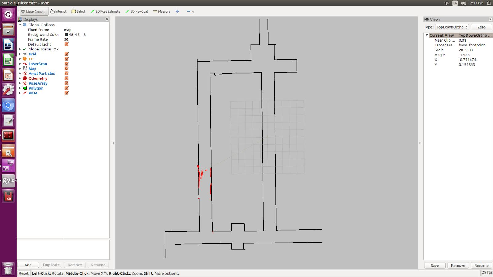
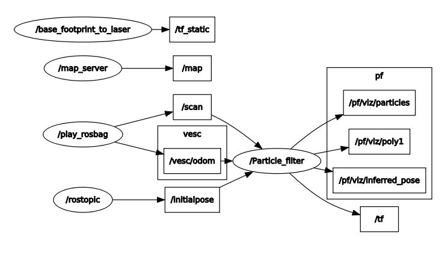

.. _doc_going_forward_algorithms:

Algorithms
============

Here are just a handful of algorithms that we've implemented. Feel free to create your own!

Wall Following
---------------------------
With our Hokuyo lidar sensor attached to the car, one of the simplest algorithms we can run is a wall following algorithm. The basic idea is that the car uses the lidar sensor to measure the distance to either the left wall, right wall, or both walls, and tries to maintain a certain distance from the wall. Inside the wall_following package under ``/launch`` you will see a file called ``wall_following.launch``.

Run the following commands in terminal in order to see the robot do a simple left wall follow in Gazebo simulator.

In one terminal run:

.. code-block:: bash

	$​ roscore

In a second terminal, run:

.. code-block:: bash

	$​ ​source​ devel/setup.bash
	$​ roslaunch wall_following wall_following.launch

Now you should see the Gazebo simulator load with the car placed at the origin in our Levine Building 2nd floor world. The car tries to maintain a certain distance of 0.5 meters from the left all, and will continue following it around left turns in a counter-clockwise fashion. How is the code organized? From a high level view, data passes in this order:
``pid_error.py -> control.py -> sim_connector.py``

The main code for the wall_following is under ``wall_following/scripts/pid_error.py``. In this script you will find methods for ``followLeft``, ``followRight``, and ``followCenter``. 

* ``Pid_error.py`` subscribes to the laser scan ``/scan`` topic and calls the callback function each time it gets new lidar data (around 40 times per second). It uses PID to calculate the error and adjusts the steering angle accordingly in order to try to keep its desired trajectory a certain distance away from the wall. ``Pid_error.py`` then outputs over the ``/error`` topic a message type we custom defined called pid_input which contains pid_vel and pid_error. 
 
* ``Control.py`` subscribes to the ``/error`` topic and limits the car’s turning angle to 30 degrees and slows down the car when it is making a turn, or speeds up the car when it is going straight. ``Control.py`` publishes to the ``/drive_parameters`` topic using our custom message type called drive_param which contains velocity and angle. 

* ``sim_connector.py`` subscribes to ``/drive_parameters`` and basically repackages the velocity and steering angle data into the ``AckermannDriveStamped`` message type so that it can be read in by the simulator under the ``/vesc/ackermann_cmd_mux/input/teleop`` topic.

If you run the Gazebo simulator long enough, you’ll notice that when the car reaches around ¾ of the way through the track, it encounter an opening on the left that leads to a dead-end. Because the car is programmed to just do a wall follow, it gets stuck here. How might we alleviate this problem? With hard-coded turn instructions, as described in the next section.

If you want to try running the wall following in the real world, run these instructions. Depending on how wide the hallway is that the car is driving in, you may want to modify the parameters for ``LEFT_DISTANCE`` and ``RIGHT_DISTANCE`` at the top of the ``pid_error.py`` file.

In one terminal run:

.. code-block:: bash

	$​ roscore

In a second terminal, run:

.. code-block:: bash

	$​ ​source​ devel/setup.bash
	$​ roslaunch real_world_wall_following wall_following.launch

Wall Following with Explicit Instructions
^^^^^^^^^^^^^^^^^^^^^^^^^^^^^^^^^^^^^^^^^^^
If we do a simple wall follow (left, right, or center), the robot will always make turns at openings it sees. But sometimes we may not want the robot to turn into an opening because it dead ends, or we just want it to keep going down the hallway. The idea in this section is to give the robot a sequence of turn instructions, which it calls sequentially each time it sees an opening. For instance, imagine in the Levine World telling the robot to turn [“left”, “left”, “left”, “center”, “left”]. The “center” would allow it to skip the dead end opening and continue straight with a center wall follow instead. Explicit instructions also includes velocity instructions.

To run the hard-coded turn instructions code in the simulator, do the following in your terminal.

In one terminal run:

.. code-block:: bash

	$​ roscore

In a second terminal, run:

.. code-block:: bash

	$​ ​ source​ devel/setup.bash
	$​ roslaunch real_world_wall_following_explicit_instructions.Launch

To change the instructions, navigate to the ``explicit_instructions/instructions.csv`` file and change the values. You will see something that looks like this:

.. code-block:: bash

	left, 1.5
	left, 2.0
	left, 1.0
	center, 0.5
	left, 2.0
	center, 1.5
	stop, 0.0

The first value is the turn instruction and the second value is the velocity which gets executed after making that turn for some duration of time specified in the ``pid_error_explicit_instructions.py`` file.

The core logic is contained in the file ``wall_following/scripts/pid_error_explicit_instructions.py``. There are a lot of comments in the code that describe the algorithm. At a high level, the car is constantly scanning for an opening by subscribing to the laser scan data. If the car detects an opening, then it takes the next instruction off of the turn instruction array and commits to that turn instruction for a specified number of seconds. The reason we commit for some seconds is that we don’t want the car to mistakenly think it sees a “new” opening midway through a turn, and prematurely call the next turn instruction.

How does the robot detect an opening? The robot scans to the right (and left as well) between some window of degrees. It compares lidar scans sequentially (so for instance, 0 degrees vs 0.25 degrees) and checks if the distance measured to 0 degrees and the distance measured to 0.25 degrees has a difference of some distance in meters. If there is a dropoff distance, then we know there is an opening.

A challenge we ran into is reflections off of metal plates on the doors in Levine Building. The robot calculated these as openings because Lidar data showed the points reflecting off the metal to be 60 meters away! Our solution was to ignore points that were further than 40 meters away because we know that they are metal.

You will also notice that in the ``real_world_wall_following_explicit_planning.launch`` file, we call a ``dead_mans_switch.py`` node. This allows us to use the joystick and the car only moves when the top right dead mans switch bumper is held down. This is for safety reasons.

If you notice your car is oscillating a lot on straightaways, try turning the kp value down in ``control.py``.

Wall following with hard coded turns is a tedious algorithm because it requires us to manually predict where the car will detect openings before we launch the algorithm. Sometimes the car detects openings unpredictably, such as when it passes by an office with glass walls or when it goes down the ramp from Levine 3rd floor into Towne. This causes the car to prematurely take the next instruction set, which then interferes with the rest of the instruction sets. Hence we move on to localization and mapping next in search of a better solution to autonomous driving that doesn’t require as much human input and is more robust.

Gap-finding in LiDAR Scans [Houssam]
------------------------------------------------------
The topic on which lidar information messages are published is the ``/scan`` topic. If you run the :ref:`simulator <doc_going_forward_simulation>` and run ``$rostopic info /scan​``, you will see the messages are of type ``std_msgs/LaserScan``.

Scan Matching Odometry [Sheil]
------------------------------------------------------
ROS’ ​laser_scan_matcher​ package performs scan matching odometry.

Installing Packages
^^^^^^^^^^^^^^^^^^^^^^^^^^^
Open a terminal and run the following commands to instal the required packages.

.. code-block:: bash

	$ sudo apt-get install ros-kinetic-amcl
	$ sudo apt-get install ros-kinetic-scan-tools

Getting the Example Launch File
^^^^^^^^^^^^^^^^^^^^^^^^^^^^^^^^^^^^
The f110 repo contains a launch file that demonstrates running the laser_scan_matcher on pre-recorded bag data. Copy it into your workspace’s ``src/`` folder, e.g.

.. code-block:: bash

	$​ cp -r f110-course-upenn/algorithms/localization src/

This folder defines a package, ​localization, which uses ROS’ ​``laser_scan_matcher`` package.

Re-source your ``setup.bash``, and you should be able to run

.. code-block:: bash

	$​ rospack find localization

The majority of the parameters in the ​``laser_scan_matcher​node`` are taken from the ROS docs on the ​​``laser_scan_matcher`` package, available `here​ <https://wiki.ros.org/laser_scan_matcher#Parameters>`_.

In order to run the ``laser_scan_matcher​`` on the pre-recorded bag file, execute the following lines in your terminal.

.. code-block:: bash

	$ roslaunch localization laser_scan_matcher.launch

If you don’t want to see RViz, change the ``use_rviz`` arg in the launch file to ``“false”``. The rostopic printing the pose of the car and covariance matrix is called​ ``/pose_with_covariance_stamped``. You can read about it online.

Localization
--------------
Now that we have information from the lidar, we can start to localize the car.

Localization with Hector SLAM
^^^^^^^^^^^^^^^^^^^^^^^^^^^^^^^^^
We use Hector SLAM in order to generate a map given a bag file. First install ``hector-slam``.

.. code-block:: bash

	$​ sudo apt-get install ros-kinetic-hector-slam

Run these following commands in order to reproduce it on your machine.

.. code-block:: bash

	$​ roslaunch localization hector_slam.launch

You will see an Rviz window open up that maps out the Moore Building 2nd floor loop. The launch file reads in a bag file which recorded all of the topics. Hector SLAM only needs the ``/scan`` topic (which contains the laser scans) in order to simultaneously map and localize. Note that no odometry data is used, whereas more advanced mapping packages such as Google Cartographer have the option to use odometry data and even IMU data.

Once the map is completely generated, in a new terminal window run the following in order to save the map as a yaml. The last string after “-f” is the name of the map you’d like to save. Since in this case we are using the Moore Building bag file, we appropriately name the map “moore”.

.. code-block:: bash

	$​ rosrun map_server map_saver -f moore

Now you will see in your home directory a ``levine.yaml`` file and a ``moore.pgm`` file. You will need both of these. We have already copied and pasted a version of this under ``localization/localization/maps/moore.yaml``, as well as its corresponding ``moore.pgm`` file.

Now that you have Hector SLAM working, we can dive a bit more into the details of the ``hector_slam.launch`` file. At the top of the file you will see that we set the parameter ``/use_sim_time`` to true because the launch file plays a bag file. In this case, it’s a bag file recorded while the car did a single loop around Moore. Whenever we play bag files, it’s important to include the --clock argument because it causes ROS to play bag files with simulated time synchronized to the bag messages (more information `here <https://answers.ros.org/question/12577/when-should-i-need-clock-parameter-on-rosbag-play/%E2%80%8B>`_).

After the rosbag play instruction in the ``hector_slam.launch`` file, you will notice that there is a ``tf2_ros`` transform node that transforms between ``base_link`` to laser. This is very important to include or else Hector SLAM will not know where the laser is relative to the center of gravity of the car. In this case we use a static transform since the laser does not move relative to the car.

After the ``tf2_ros`` transform instruction in the launch file, you will see a reference to the ``hector_mapping mapping_default.launch`` file with parameters that specify the names of the ``base_frame``, ``odom_frame``, ``map_size``, ``scan_topic``, etc. Then there is a ``hector_geotiff`` which is used to save the map as a Geotiff file. Lastly, we launch rviz with a specific ``rviz_cfg`` (Rviz configuration) so that we don’t have to select all the topics we want to visualize every time weopen up Rviz. As a special note of interest, in algorithms below if you see in the launch file that there is a --delay of a few seconds added to Rviz, the reason is probably that we need to give Rviz time for certain nodes that generally take longer to publish to start publishing, otherwise Rviz will get old data.

If your hector_slam.launch isn’t working correctly, a good way to debug is to compare your ``rqt_graph`` and ``rqt_tf_tree`` to the ones we have screenshotted below.

.. figure:: img/hectorslam1.jpg
Rqt_graph for Hector SLAM generated by running “rosrun rqt_graph rqt_graph”

Rqt_tf_tree generated for Hector SLAM by running “rosrun rqt_tf_tree rqt_tf_tree”

Localization with AMCL (Adaptive Monte Carlo Localization)
^^^^^^^^^^^^^^^^^^^^^^^^^^^^^^^^^^^^^^^^^^^^^^^^^^^^^^^^^^^^^^^^^^
Now that we have generated our map, the next step is to be able to localize the car within the map. Now you may ask, if we already did SLAM, then why don’t we use Hector SLAM to simultaneously localize and map each time this is run? The reason is that Hector SLAM is computationally intensive, and we don’t wish to generate a new map each time we run the car. Since we assume the world does not change (after all, walls do not break down very often), we only want to localize the car within the fixed world. In order to localize the car, we use an algorithm called AMCL (Adaptive Monte Carlo Localization).

First install amcl for ROS.

.. code-block:: bash

	$ sudo apt-get install ros-kinetic-amc1

Next, run the launch file for amcl we have created. Note that we do not want roscore running because amcl will create its own ROS master. If we have two ROS masters there will probably be interference problems and hence AMCL will not run correctly.

.. code-block:: bash

	$​ roslaunch localization amcl.launch

You should see Rviz open up after a delay of 5 seconds (which we purposely set in order to make sure everything is loaded, specifically the map server). Then, you will see the map appear and the car moving through the map with green particles around it. In Rviz, on the top center click on 2D Pose Estimate, then click and drag on where the car starts. It is important to set the initial pose because if we don’t then the car will start at the origin and its localization will be wrong. In the moore.yaml map, the car starts at the bottom center T-shaped crossroads, facing to the left. The car will do clockwise loop back to its original location.

.. figure:: img/amcl1.jpg

Setting an initial 2D pose estimate for AMCL. Top bar, fourth button. Then click and drag in the map.

In the end, you should see a path that looks something like this image below. It won’t be perfect because `AMCL <http://wiki.ros.org/amcl%E2%80%8B>`_ requires a ``/tf`` (transform) topic. The best way we have to generate the ``/tf`` is to use the ``/vesc/odom`` topic, which literally counts the number of wheel spins and degree turns in order to estimate odometry. VESC odometry is not the most accurate because errors accumulate over time, but it gives a good general direction that guides AMCL with a general location for our car. We then used a messagetotf node in order to convert the ``/vesc/odom`` into ``/tf`` so that it can be used by AMCL.

Now that you have AMCL working successfully, time for some details on what’s going behind the scenes in the ``amcl.launch`` file. Like when we ran Hector SLAM, since we are playing this off of a bag file we need to set the ``/use_sim_time parameter`` to true. We also load a ``map_server`` node in order to publish the moore.yaml map. Note that we include the same ``base_link_to_laser`` transform as the one we provided Hector SLAM. After that line in the launch file is loading the amcl node, where we kept all the numerical parameters the same and only modified the ``base_frame_id`` and added initial pose x, y, and a. A is the orientation of the car relative to the map frame. You can read more on these in the `AMCL page <http://wiki.ros.org/amcl%E2%80%8B>`_ for information on each parameter.

If your AMCL isn’t working, it’s a good idea to compare your rqt_graph and rqt_tf_tree to the ones we have included screenshots of below.

.. figure:: img/amcl2.jpg

This is what the ``rqt_tf_tree`` looks like. You can verify if yours looks like this too by running​ ``rosrun rqt_tf_tree rqt_tf_tree`` in another terminal window while AMCL is running.

.. figure:: img/amcl3.jpg

This is the rqt graph generated by running in a new terminal window ​``rosrun rqt_graph rqt_graph``.

Now that we can localize the car in a map, what’s next? Well, we can do really cool things! We can set waypoints for the car to follow, and those waypoints can have information not just about location but also speed at each point on the track. The car can use some type of pure pursuit algorithm in order to traverse from waypoint to waypoint. These will all be covered in the next sections.

Localization with Particle Filter (Faster and More Accurate than AMCL)
^^^^^^^^^^^^^^^^^^^^^^^^^^^^^^^^^^^^^^^^^^^^^^^^^^^^^^^^^^^^^^^^^^^^^^^
Why might you want to upgrade from AMCL to MIT particle filter? For one, AMCL only updates at around 4 times per second, whereas particle filter updates around 30 times per second. Additionally, particle filter uses the GPU whereas AMCL only uses the CPU. This results in the ability to use around 100x the number of particles, which results in more accuracy in localization. When we tried to use AMCL for localization with pure pursuit, we ran into challenges where we weren’t receiving any messages on the estimated pose topic because the car had not moved a certain threshold distance. When we set that threshold in AMCL parameters to be lower, the localization performance lagged. Hence we have been using the particle filter code written by Corey Walsh. The code follows this `publication <https://arxiv.org/abs/1705.01167>`_.

Follow instructions `here <https://github.com/mit-racecar/particle_filter>`_ to install ``RangeLibc`` and other dependencies for particle filter.

Once you have installed the dependencies, there is no need to install the source code because we have already included it inside of the ``/src/algorithms/particle_filter``. To see a demo of the particle filter in action, navigate to the terminal and type in the following launch command.

.. code-block:: bash

	$​ roslaunch localization particle_filter.launch

You can expect to see something like this:

An Rviz window opens up with a map and particles (in red), indicating where the car is in the world. The ``particle_filter.launch`` file is playing back a rosbag, so you should see the car and particles moving around the map in a counter-clockwise fashion. In the ``article_filter.launch`` file we manually send a message to ``/initialpose`` topic but if you want to set it yourself in Rviz you can select the 2D Pose Estimate button on the top (4th button from the left) and click and drag in the map.

If you wanted to try it out in the real world with a joystick to see the localization live, you can run the ``particle_filter_live.launch`` file like this:

.. code-block:: bash

	$​ roslaunch localization particle_filter_live.launch

The difference between ``particle_filter_live.launch`` and ``particle_filter.launch`` is ``particle_filter_live.launch`` doesn’t play a rosbag, doesn’t use simulated time, and instead includes the teleop.launch file. Everything else is the same.

Now that you have the ``particle_filter.launc`` working, let’s examine the contents of the file more carefully. You will notice many overlaps between ``particle_filter.launch`` and ``amcl.launch`` and ``hector_slam.launch``. For instance, you will recognize the map server, the ``/use_sim_time`` parameter, the rosbag and the static transform between base_footprint to laser. Note that in ``particle_filter.launch`` we use the name ``base_footprin`` instead of ``base_link`` because particle filter calls it the ``base_footprint``. Then we load the ``particle_filter`` node with a few arguments. We tell ``particle_filter`` that our ``scan_topic`` is called ``/scan`` and that our odometry topic is called ``/vesc/odom``. We keep the ``max_particles`` of 4,000 at the default number. Below are screenshots of the ``rqt_tf_tree`` and ``rqt_graph``.

What if we want to run particle filter with a slower update rate? (In order to appreciate the speed that the GPU offers or to simulate on a slower computer). Inside the particle_filter.launch file, you can change the “range_method” from “rmgpu” to “bl”. As documented on the particle filter Github repo, “bl” does not use the GPU and has much less particles. Our testing shows that “bl” achieves an inferred_pose update rate of around 7Hz, whereas “rmgpu” achieves 40Hz.

Rqt_graph for particle filter

.. figure:: img/pf3.jpg

Rqt_tf_tree for particle filter

Working with Waypoints
---------------------------

Generating Waypoints
^^^^^^^^^^^^^^^^^^^^^
Now that we have localization down, the next step is to be able to follow a set of waypoints. The waypoints are (x, y) coordinates with respect to the map frame. We can expect around 2,000 - 4,000 waypoints for a loop of length around 66 meters.

Do the following to save waypoints.

.. code-block:: bash

	# ​ Allow the car to be controlled with joystick
	$​ roslaunch racecar teleop.launch

	#​ Record a rosbag with just the scan and vesc/odom topics. Will be saved
	into your Home directory. (In a new terminal window)
	$​ rosbag record scan vesc/odom

	# You will need to modify particle_filter.launch with path to rosbag you
	just recorded
	$ roslaunch localization particle_filter.launch

	# Records waypoints and saves as waypoints.csv in current working directory
	$​ rosrun waypoint_logger waypoint_logger.py

At this point, in your current working directory you will see a csv file called ``waypoints.csv``. Let’s go into further detail on what is going behind the scenes. ``Particle_filter.launch`` plays the rosbag that you recorded (of course, you have to update the particle_filter.launch with the path to your bag file you recorded). The particle filter subscribes to the ``vesc/odom`` and scan topics, and it outputs a stream of messages over the topic ``pf/viz/inferred_pose``. ``Waypoint_logger.py`` subscribes to ``pf/viz/inferred_pose`` and saves the x, y coordinates in each callback to a CSV file.

Now that you have your ``waypoints.csv ``file, the next step will be to use this list of waypoints and have the car follow them using pure pursuit.

Following Waypoints with Pure Pursuit
^^^^^^^^^^^^^^^^^^^^^^^^^^^^^^^^^^^^^^^^
Now this is the really exciting part.

Before you run the ``pure_pursuit.launch`` file, you will need to change the path to the map you would like loaded in ``pure_pursuit.launch``. Additionally, you can also set the initial position of the car in the map frame. That way, you don’t need to manually draw it out each time in Rviz. By default we will set a map and initial pose so that you can see the pure pursuit running.

Additionally, inside of ``pure_pursuits.py``, you will need to update the path to the waypoints file that you would like to use. In ``pure_pursuits.py`` you can also set a velocity. We recommend starting with something slow like 0.5 m/s with a lookahead distance of 1.5 meters.

Now you are ready to run the launch command to start the car moving.

To run in the simulator (recommended to do this first):

.. code-block:: bash

	$​ roslaunch pure_pursuit pure_pursuit_sim.launch

Note that the Gazebo simulator works well with pure pursuit algorithm only at slower speeds, around 1 m/s on turns and less than 4 m/s on straightaways. The reason is that on turns with higher speeds than 1 m/s, Gazebo models the car as sliding out more with a much larger turn radius. We’ve tried a dozen ways to try to fix this overestimation of turning drift, but with no success. Hence we use Gazebo mainly to test that algorithms work at slower speeds, then take the car into real world to slowly ramp up the speed.

Another thing to note is that in the simulator we are using the true (x, y) position of the car by listening to the topic ``/gazebo/model_states`` and remapping the information to ``/pf/viz/inferred_pose`` (which would normally be output by particle filter). It is fair to expect that particle filter is not perfect in the real world and may have some noise. Hence inside ``/algorithms/pure_pursuit/scripts`` we have a ``remap_gazebo_pose.py`` and a ``remap_gazebo_pose_with_noise.py``. By default ``pure_pursuit_sim.launch`` calls the ``remap_gazebo_pose.py`` (the one without noise) but if you would like to try the one with noise you can replace the line in the launch file to point to ``remap_gazebo_pose_with_noise.py``. The parameters for the Gaussian XY variance and rotation variance can be adjusted within that python file.

To run in the real world:

.. code-block:: bash

	$​ roslaunch pure_pursuit pure_pursuit.launch

All of the core logic for ``pure_pursuit`` is contained in the ``pure_pursuit.py`` file which can be found under ``algorithms/pure_pursuit/scripts``. From a high level, the pseudocode for pure pursuit is like `this <https://www.ri.cmu.edu/pub_files/pub3/coulter_r_craig_1992_1/coulter_r_craig_1992_1.pdf>`_.

#. Determine the location of the vehicle (provided by particle filter localization).
#. Find the path point closest to the vehicle.
#. Find the goal point.
#. Transform the goal point to vehicle coordinates.
#. Calculate the curvature for the car to steer to reach that goal point.
#. Update the vehicle’s position.

The most challenging part of the algorithm was transforming the goal point to vehicle coordinates. There probably is some library out there to do this, but we weren’t able to find it trivially and thought it’d be a sound learning exercise to try to implement it ourselves so we could explain it to you in this doc. Below is a picture of a whiteboard which shows the math behind deriving the goal point coordinates with respect to the car’s frame. We calculate the angle gamma, defined as the direction to goal point in car’s frame with respect to the x-axis, because using gamma we can derive the goal point coordinates with respect to the car’s frame.

Note that there are also limitations for our pure pursuit algorithm. Here is a list of them:

#.Car is at constant velocity, on straightaways and turns. Ideally we want faster straightaways and slower turns.
#.Look ahead distance is constant for straightaways and turns. We probably want a farther lookahead distance for straightaways so car doesn’t oscillate left and right when it goes faster, and a smaller look ahead distance for turns so car doesn’t look too far ahead and end up cutting off a corner too tight and hitting the wall.
#.We want the code to be able to do loop closure, that is have the car know when it is completing a loop and continue back to the first index.

Improvements are made that address these limitations in the next section, on pure pursuit with speed control.

.. figure:: img/pp1.jpg

Pure Pursuit Speed Control Algorithm
^^^^^^^^^^^^^^^^^^^^^^^^^^^^^^^^^^^^^
Our implementation of pure pursuit with speed control (``purepursuitwithspeedcontrol.py``) allows the car to go faster in straight hallways and slow down in turns. The car is following a set of waypoints (x, y) coordinates.

To run the pure pursuit with speed control:

.. code-block:: bash

	$​ roslaunch pure_pursuit pure_pursuit_with_speed_control.launch

The car examines the points ahead of it within the search window defined by the constants ``WP_TURN_WINDOW_MIN`` and ``WP_TURN_WINDOW_MAX`` and takes the average x-coordinate of those points. (You can think of ``WP_TURN_WINDOW_MIN`` as being the radius of the inner circle of the region to check and ``WP_TURN_WINDOW_MAX`` as being the radius of the outer circle. See the diagram below.) The amount that the car slows down depends on how steep the turn is: if the turn is steeper (that is, the average x-coordinate is far from the car’s centerline), the car will slow down more; if the turn is shallow, it will slow down less. For smooth speed adjustment, the speed is interpolated between the maximum straightaway speed (``VELOCITY_STRAIGHT``) and the minimum turn speed (``VELOCITY_TURN``).

Below is a visual explanation of the speed adjustment algorithm.

#. The car is driving in a straightaway and hasn’t entered a turn yet (lots of path points on the centerline): proceed at full speed. (4 m/s)

	.. figure:: img/pp2.jpg

#. The car has begun entering a turn: start slowing down (3 m/s)

	.. figure:: img/pp3.jpg

#. The car is now fully in the turn: slow down to near the minimum speed (2 m/s)

	.. figure:: img/pp4.jpg

#. The car is starting to exit the turn: speed up a little bit (3 m/s)

	.. figure:: img/pp5.jpg

#. The car has exited the turn: drive at full speed again (4 m/s)

	.. figure:: img/pp6.jpg

Path Planning
---------------
At this point we have been able to run pure pursuit relatively fast (up to 6 m/s) following a pre-generated set of waypoints. Before, we were generating waypoints by manually driving the desired car path beforehand, and then generating the list of (x, y) coordinates by localizing withparticle filter. But what if we want to be able to dynamically generate waypoints, without having had driven the car beforehand? What if we want the car to be able to dynamically generate paths that can navigate around unseen obstacles? This is where things get even more fun!

Path Planning with ROS move_base
^^^^^^^^^^^^^^^^^^^^^^^^^^^^^^^^^^
We use ROS ​``move_base`` to incorporate a global planner and a local planner. Almost everything in this section is taken from the official ROS tutorial on setting up move_base. It’s a very important document. We’ve literally read it at least 10 times.

Install move_base by running:

.. code-block:: bash

	$​ sudo apt-get install ros-kinetic-move-base

To see ``move_base`` running in the simulator, type this in your terminal:

.. code-block:: bash

	$​ roslaunch path_planning move_base_sim.launch

When you launch this file, you will see both Gazebo and Rviz open up. You may also see a list of yellow warning messages that an “Invalid argument passed to canTransform argument source_frame in tf2 frame_ids cannot be empty”. We haven’t yet figured out how to fix this, but the car seems to run fine in the simulator even with the warning message.

``Move_base_sim.launch`` calls a Python file called ``follow_move_base_cmd_vel.py`` which subscribes to the ``/cmd_vel`` topic. ``/cmd_vel`` is published by ``move_base``’s local planner and is a list of Twist messages which basically tells the car what x, y, z velocities and what x, y, z angular velocities to move at. The strategy here is to just take these output values in order to compute the car velocity and steering angle. The equations are as follows:

	Velocity = sqrt(x^2 + y^2)
	Steering angle = atan2(WHEELBASE_LENGTH * theta_dot
	 / velocity), where theta_dot is the z angular velocity (aka yaw)

Note that because the default local planner in move_base is designed for differential drive robots (robots that can spin in place, like the Roomba vacuum cleaner robots), the paths that are generated are not ideal for our car which is an Ackermann steering robot. Hence in the next section we will talk about the TEB (Timed Elastic Band) local planner which can be used for Ackermann robots. But before we get there, you may also want to test out move_base in the real world.

To see move_base running in the real world, run the following:

.. code-block:: bash

	$​ roslaunch path_planning pure_pursuit_local_plan.launch

You should see Rviz open with a map of Levine Hall 2nd floor. Note that this launch file is meant for running the car live, as in in the real world. If you are running this on your car, in order to get the car to move, we have added a dead man’s switch onto the joystick. The car doesn’t move unless we hold down the “RB” button on the top right of the joystick. The strategy for the car to follow the local plan here is different from the strategy used in the simulator above. Earlier in the simulator we subscribed to the ``/cmd_vel`` topic which literally gave us the velocity and steering angle to follow. Here our strategy is to take the global plan which is a list of Pose data type, and use our pure pursuit code from an earlier section. The biggest challenge with pure pursuit for us is that with too great of a lookahead distance (in this case greater than 1 meter), the car will run into corners on turns because it sees waypoints too far in front. This is a problem because if we turn the lookahead distance to something smaller, then the car oscillates a lot going down straightaways. Hence this code isn’t ideal for any type of racing, but is merely to demonstrate the differences in the two strategies for following the generated paths. The first strategy is blindly following the ``/cmd_vel`` output by move_base. The second strategy is to take the list of waypoints (poses) and use pure pursuit to follow them.

In order to get the car to drive in a loop by path planning, we wrote a script called ``send_goal_poses.py``. This file spawns a ``move_base`` action server which publishes a series of 3 nav goals. The trick is that the ``move_base`` server - because it knows when the car has reached its current nav goal - will then send the next nav goal once the car has reached the previous one. Once the car reaches the last nav goal (which is represented by x and y coordinates), then the count resets to 0 for the car to fetch the first nav goal. Something important here is that we had to tune the ``xy_goal_tolerance`` and the ``yaw_goal_tolerance`` parameters in the yaml file so that the car will register as reaching its goal within 2.0 meters of the goal, and within 180 degrees yaw of the nav goal. We want a larger ``xy_goal_tolerance`` of 2.0 meters so that the car can begin planning its next path when it has almost reached the current nav goal. And we set the ``yaw_goal_tolerance`` to the max value because for sake of simplicity we only send the x, y coordinates of nav goals. We don’t send the orientation of nav goals. It’s also important to mention that when we set the list of nav goals, to get the coordinates we just dragged initial poses in Rviz of where we wanted the car to go, and copied the x, y coordinates displayed in the terminal.

We wrote a ``pure_pursuit_path_planner.py`` file in order to use pure pursuit to follow this generated path at a slow constant speed. Note that you will see a green path generated by the global planner. Specifically, the ``pure_pursuit_path_planner.py`` python file subscribes to 2 topics:

#. ``/pf/viz/inferred_pose`` -> This is the estimated pose published by particle filter (from an earlier section). Pure pursuit needs the robot’s estimated pose in order to know which waypoint to follow next and where that waypoint is in the car’s frame.
#. ``/move_base/TrajectoryPlannerROS/global_plan`` -> Published by move_base after setting a 2D nav goal, this is a list of Pose data type. Normally we see around 150 to 250 poses per message. We set the ``global_plan`` to update 20 times per second, so that it is fast enough to react to obstacles that appear.

.. figure:: img/movebase1.jpg

This is an image of the ``rqt_tf_tree``. Note that there is no odom frame because we purposely removed it for simplicity.

One other note on move_base: launch files that use move_base take in 4 yaml files found in the ``/params`` folder. These parameters were mainly set according to this `tutorial <http://wiki.ros.org/navigation/Tutorials/RobotSetup%E2%80%8B>`_.

Included below is a screenshot of Rviz. Note the global costmap in blue, red, and purple that spans the entire map. And note the local costmap which spans a smaller 10 x 10 meter box (in grey). The path (difficult to see in the image) is a green line that starts from the front of the car and ends at the boundaries of the local costmap rolling box.

.. figure:: img/movebase2.jpg

Path Planning with TEB (Timed Elastic Band) Local Planner
^^^^^^^^^^^^^^^^^^^^^^^^^^^^^^^^^^^^^^^^^^^^^^^^^^^^^^^^^^^
We’ve just seen ``move_base`` working in the simulator and real world. The default local planner for ``move_base`` was designed for differential drive robots - not Ackermann carlike robots - so you may have noticed some of these problems when running move_base code earlier:

#. When the car got stuck facing a wall or was too close to a corner (and hence stuck in the high cost areas of the cost map), the car would just stop and didn’t know how to back up or get out of the situation.
#. Car might oscillate a lot going down straightaways
#. Turns are sometimes really wide, or sometimes cut corners very tightly. Because move_base local planner doesn’t have parameter for car turning radius.
#. If car overshoots a turn, meaning it’s supposed to turn but then its inertia carries it past the turn, the car can’t recover.
#. Placing obstacles in front of the car (like tennis ball cans), the car sometimes crashes into them.

To address these problems, we use the `TEB (Timed Elastic Band) <http://wiki.ros.org/teb_local_planner>`_ local planner. TEB gets its name from the fact that it takes into account *time*, meaning that it plans trajectories instead of just paths. What is the difference between a trajectory and a path? A trajectory outputs not only x and y coordinates, but also the time when the robot needs to reach each point - and implicitly the velocity at each step. Whereas a path is just a list of x and y coordinates.

Install TEB:

.. code-block:: bash

	$​ sudo apt-get install ros-kinetic-teb-local-planner

TEB is a very thorough, well documented library with LOTS of parameters. Like over 40 parameters. We configured parameters in ``algorithms/path_planning/params/teb_local_planner_params.yaml``. There are params for ``min_turning_radius``, wheelbase of the car, ``max_vel_x``, and much more. In our ``follow_teb_local_plan.launch`` file, under the ``move_base`` node we add a rosparam that loads the ``teb_local_planner_params.yaml`` and have removed the default local planner params file. The underlying python file, ``follow_teb_local_plan.py``, is very similar to the ``follow_move_base_cmd_vel.py`` used for the default local planner. The main difference is that because Teb literally outputs the velocity and steering angle as is, we don’t need to do conversion.

Here are some of the really cool things that TEB enables us to do:

#. When the car gets stuck in an area of the map with high cost, the car can back up and get out of the situation. How cool!
#. When there are dynamic obstacles such as a person stopping in front of the car, the car will go around the person. Note that the default local planner could also do this, but TEB can do it better since the car can back up in case its turning radius is not big enough to clear the obstacle.
#. The car can actually race autonomously one on one with another car now. Because the car can plan around the other car for passing.
#. The car can do parallel parking (kind of). But it needs a lot of parameter tuning in terms of the min_obstacle_dist, the weight_kinetmatic_forward_drive, etc.

All in all, TEB is just really cool!