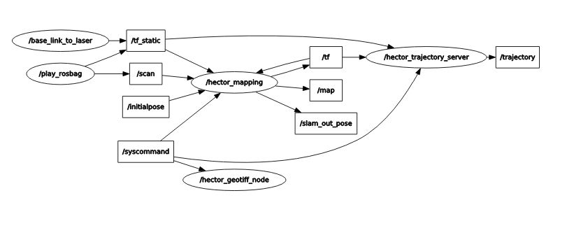
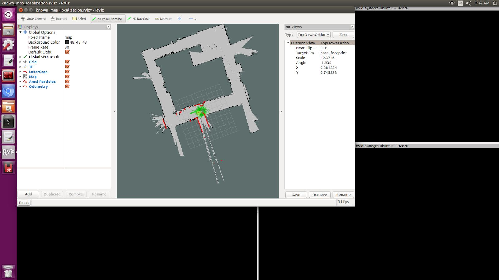
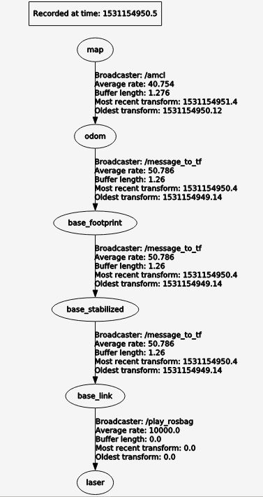
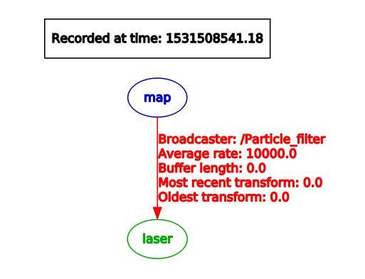

.. _doc_gap_finding:

Gap-finding in LiDAR Scans
======================================

..note:: This section requies a computer/laptop running Ubuntu Xenial 16.04/ROS Kinetic or Bionic 18.04/ROS Melodic.

The topic on which lidar information messages are published is the ``/scan`` topic. If you run the :ref:`simulator <doc_going_forward_simulation>` and run ``$rostopic info /scan​``, you will see the messages are of type ``std_msgs/LaserScan``.

Scan Matching Odometry 
------------------------------------------------------
ROS’ ​laser_scan_matcher​ package performs scan matching odometry.

Installing Packages
------------------------
Open a terminal and run the following commands to instal the required packages.

.. code-block:: bash

	$ sudo apt-get install ros-kinetic-amcl
	$ sudo apt-get install ros-kinetic-scan-tools

Getting the Example Launch File
---------------------------------------
The f110 repo contains a launch file that demonstrates running the laser_scan_matcher on pre-recorded bag data. Copy it into your workspace’s ``src/`` folder, e.g.

.. code-block:: bash

	$​ cp -r f110-course-upenn/algorithms/localization src/

This folder defines a package, ​localization, which uses ROS’ ​``laser_scan_matcher`` package.

Re-source your ``setup.bash``, and you should be able to run

.. code-block:: bash

	$​ rospack find localization

The majority of the parameters in the ​``laser_scan_matcher​node`` are taken from the ROS docs on the ​​``laser_scan_matcher`` package, available `here​ <https://wiki.ros.org/laser_scan_matcher#Parameters>`_.

In order to run the ``laser_scan_matcher​`` on the pre-recorded bag file, execute the following lines in your terminal.

.. code-block:: bash

	$ roslaunch localization laser_scan_matcher.launch

If you don’t want to see RViz, change the ``use_rviz`` arg in the launch file to ``“false”``. The rostopic printing the pose of the car and covariance matrix is called​ ``/pose_with_covariance_stamped``. You can read about it online.

Localization
--------------
Now that we have information from the lidar, we can start to localize the car.

Localization with Hector SLAM
^^^^^^^^^^^^^^^^^^^^^^^^^^^^^^^^^
We use Hector SLAM in order to generate a map given a bag file. First install ``hector-slam``.

.. code-block:: bash

	$​ sudo apt-get install ros-kinetic-hector-slam

Run these following commands in order to reproduce it on your machine.

.. code-block:: bash

	$​ roslaunch localization hector_slam.launch

You will see an Rviz window open up that maps out the Moore Building 2nd floor loop. The launch file reads in a bag file which recorded all of the topics. Hector SLAM only needs the ``/scan`` topic (which contains the laser scans) in order to simultaneously map and localize. Note that no odometry data is used, whereas more advanced mapping packages such as Google Cartographer have the option to use odometry data and even IMU data.

Once the map is completely generated, in a new terminal window run the following in order to save the map as a yaml. The last string after “-f” is the name of the map you’d like to save. Since in this case we are using the Moore Building bag file, we appropriately name the map “moore”.

.. code-block:: bash

	$​ rosrun map_server map_saver -f moore

Now you will see in your home directory a ``levine.yaml`` file and a ``moore.pgm`` file. You will need both of these. We have already copied and pasted a version of this under ``localization/localization/maps/moore.yaml``, as well as its corresponding ``moore.pgm`` file.

Now that you have Hector SLAM working, we can dive a bit more into the details of the ``hector_slam.launch`` file. At the top of the file you will see that we set the parameter ``/use_sim_time`` to true because the launch file plays a bag file. In this case, it’s a bag file recorded while the car did a single loop around Moore. Whenever we play bag files, it’s important to include the --clock argument because it causes ROS to play bag files with simulated time synchronized to the bag messages (more information `here <https://answers.ros.org/question/12577/when-should-i-need-clock-parameter-on-rosbag-play/%E2%80%8B>`_).

After the rosbag play instruction in the ``hector_slam.launch`` file, you will notice that there is a ``tf2_ros`` transform node that transforms between ``base_link`` to laser. This is very important to include or else Hector SLAM will not know where the laser is relative to the center of gravity of the car. In this case we use a static transform since the laser does not move relative to the car.

After the ``tf2_ros`` transform instruction in the launch file, you will see a reference to the ``hector_mapping mapping_default.launch`` file with parameters that specify the names of the ``base_frame``, ``odom_frame``, ``map_size``, ``scan_topic``, etc. Then there is a ``hector_geotiff`` which is used to save the map as a Geotiff file. Lastly, we launch rviz with a specific ``rviz_cfg`` (Rviz configuration) so that we don’t have to select all the topics we want to visualize every time weopen up Rviz. As a special note of interest, in algorithms below if you see in the launch file that there is a --delay of a few seconds added to Rviz, the reason is probably that we need to give Rviz time for certain nodes that generally take longer to publish to start publishing, otherwise Rviz will get old data.

If your hector_slam.launch isn’t working correctly, a good way to debug is to compare your ``rqt_graph`` and ``rqt_tf_tree`` to the ones we have screenshotted below.

Rqt_graph for Hector SLAM generated by running “rosrun rqt_graph rqt_graph”

.. figure:: img/hectorslam2.jpg
	:align: center

Rqt_tf_tree generated for Hector SLAM by running “rosrun rqt_tf_tree rqt_tf_tree”

Localization with AMCL (Adaptive Monte Carlo Localization)
^^^^^^^^^^^^^^^^^^^^^^^^^^^^^^^^^^^^^^^^^^^^^^^^^^^^^^^^^^^^^^^^^^
Now that we have generated our map, the next step is to be able to localize the car within the map. Now you may ask, if we already did SLAM, then why don’t we use Hector SLAM to simultaneously localize and map each time this is run? The reason is that Hector SLAM is computationally intensive, and we don’t wish to generate a new map each time we run the car. Since we assume the world does not change (after all, walls do not break down very often), we only want to localize the car within the fixed world. In order to localize the car, we use an algorithm called AMCL (Adaptive Monte Carlo Localization).

First install amcl for ROS.

.. code-block:: bash

	$ sudo apt-get install ros-kinetic-amc1

Next, run the launch file for amcl we have created. Note that we do not want roscore running because amcl will create its own ROS master. If we have two ROS masters there will probably be interference problems and hence AMCL will not run correctly.

.. code-block:: bash

	$​ roslaunch localization amcl.launch

You should see Rviz open up after a delay of 5 seconds (which we purposely set in order to make sure everything is loaded, specifically the map server). Then, you will see the map appear and the car moving through the map with green particles around it. In Rviz, on the top center click on 2D Pose Estimate, then click and drag on where the car starts. It is important to set the initial pose because if we don’t then the car will start at the origin and its localization will be wrong. In the moore.yaml map, the car starts at the bottom center T-shaped crossroads, facing to the left. The car will do clockwise loop back to its original location.

Setting an initial 2D pose estimate for AMCL. Top bar, fourth button. Then click and drag in the map.

In the end, you should see a path that looks something like this image below. It won’t be perfect because `AMCL <http://wiki.ros.org/amcl%E2%80%8B>`_ requires a ``/tf`` (transform) topic. The best way we have to generate the ``/tf`` is to use the ``/vesc/odom`` topic, which literally counts the number of wheel spins and degree turns in order to estimate odometry. VESC odometry is not the most accurate because errors accumulate over time, but it gives a good general direction that guides AMCL with a general location for our car. We then used a messagetotf node in order to convert the ``/vesc/odom`` into ``/tf`` so that it can be used by AMCL.

Now that you have AMCL working successfully, time for some details on what’s going behind the scenes in the ``amcl.launch`` file. Like when we ran Hector SLAM, since we are playing this off of a bag file we need to set the ``/use_sim_time parameter`` to true. We also load a ``map_server`` node in order to publish the moore.yaml map. Note that we include the same ``base_link_to_laser`` transform as the one we provided Hector SLAM. After that line in the launch file is loading the amcl node, where we kept all the numerical parameters the same and only modified the ``base_frame_id`` and added initial pose x, y, and a. A is the orientation of the car relative to the map frame. You can read more on these in the `AMCL page <http://wiki.ros.org/amcl%E2%80%8B>`_ for information on each parameter.

If your AMCL isn’t working, it’s a good idea to compare your rqt_graph and rqt_tf_tree to the ones we have included screenshots of below.

This is what the ``rqt_tf_tree`` looks like. You can verify if yours looks like this too by running​ ``rosrun rqt_tf_tree rqt_tf_tree`` in another terminal window while AMCL is running.

.. figure:: img/amcl3.jpg

This is the rqt graph generated by running in a new terminal window ​``rosrun rqt_graph rqt_graph``.

.. figure:: img/amcl4.jpg

Now that we can localize the car in a map, what’s next? Well, we can do really cool things! We can set waypoints for the car to follow, and those waypoints can have information not just about location but also speed at each point on the track. The car can use some type of pure pursuit algorithm in order to traverse from waypoint to waypoint. These will all be covered in the next sections.

Localization with Particle Filter (Faster and More Accurate than AMCL)
^^^^^^^^^^^^^^^^^^^^^^^^^^^^^^^^^^^^^^^^^^^^^^^^^^^^^^^^^^^^^^^^^^^^^^^
Why might you want to upgrade from AMCL to MIT particle filter? For one, AMCL only updates at around 4 times per second, whereas particle filter updates around 30 times per second. Additionally, particle filter uses the GPU whereas AMCL only uses the CPU. This results in the ability to use around 100x the number of particles, which results in more accuracy in localization. When we tried to use AMCL for localization with pure pursuit, we ran into challenges where we weren’t receiving any messages on the estimated pose topic because the car had not moved a certain threshold distance. When we set that threshold in AMCL parameters to be lower, the localization performance lagged. Hence we have been using the particle filter code written by Corey Walsh. The code follows this `publication <https://arxiv.org/abs/1705.01167>`_.

Follow instructions `here <https://github.com/f1tenth/particle_filter>`_ to install ``RangeLibc`` and other dependencies for particle filter.

Once you have installed the dependencies, there is no need to install the source code because we have already included it inside of the ``/src/algorithms/particle_filter``. To see a demo of the particle filter in action, navigate to the terminal and type in the following launch command.

.. code-block:: bash

	$​ roslaunch localization particle_filter.launch

You can expect to see something like this:

.. figure:: img/pf1.jpg
	:align: center

An Rviz window opens up with a map and particles (in red), indicating where the car is in the world. The ``particle_filter.launch`` file is playing back a rosbag, so you should see the car and particles moving around the map in a counter-clockwise fashion. In the ``article_filter.launch`` file we manually send a message to ``/initialpose`` topic but if you want to set it yourself in Rviz you can select the 2D Pose Estimate button on the top (4th button from the left) and click and drag in the map.

If you wanted to try it out in the real world with a joystick to see the localization live, you can run the ``particle_filter_live.launch`` file like this:

.. code-block:: bash

	$​ roslaunch localization particle_filter_live.launch

The difference between ``particle_filter_live.launch`` and ``particle_filter.launch`` is ``particle_filter_live.launch`` doesn’t play a rosbag, doesn’t use simulated time, and instead includes the teleop.launch file. Everything else is the same.

Now that you have the ``particle_filter.launc`` working, let’s examine the contents of the file more carefully. You will notice many overlaps between ``particle_filter.launch`` and ``amcl.launch`` and ``hector_slam.launch``. For instance, you will recognize the map server, the ``/use_sim_time`` parameter, the rosbag and the static transform between base_footprint to laser. Note that in ``particle_filter.launch`` we use the name ``base_footprin`` instead of ``base_link`` because particle filter calls it the ``base_footprint``. Then we load the ``particle_filter`` node with a few arguments. We tell ``particle_filter`` that our ``scan_topic`` is called ``/scan`` and that our odometry topic is called ``/vesc/odom``. We keep the ``max_particles`` of 4,000 at the default number. Below are screenshots of the ``rqt_tf_tree`` and ``rqt_graph``.

What if we want to run particle filter with a slower update rate? (In order to appreciate the speed that the GPU offers or to simulate on a slower computer). Inside the particle_filter.launch file, you can change the “range_method” from “rmgpu” to “bl”. As documented on the particle filter Github repo, “bl” does not use the GPU and has much less particles. Our testing shows that “bl” achieves an inferred_pose update rate of around 7Hz, whereas “rmgpu” achieves 40Hz.

.. figure:: img/pf2.jpg
	:align: center

	Rqt_graph for particle filter

	Rqt_tf_tree for particle filter

