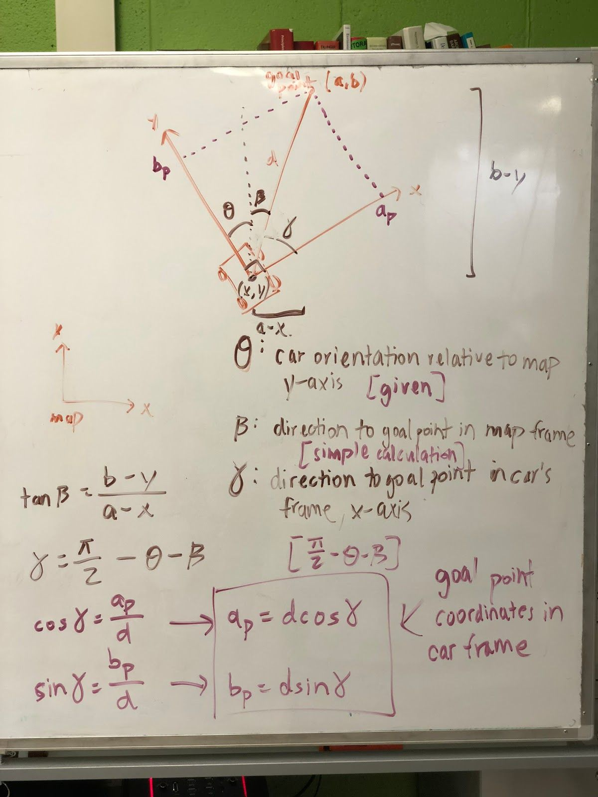
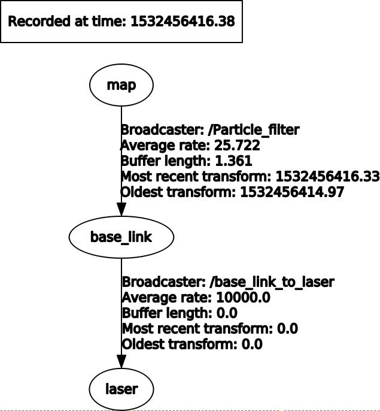
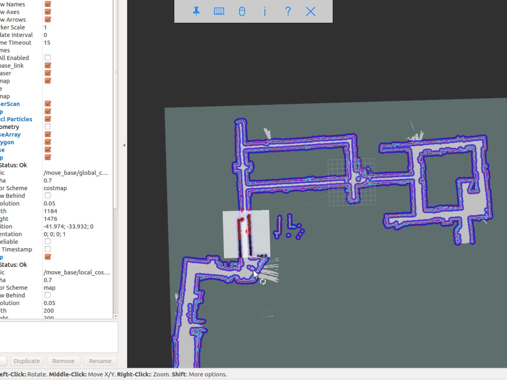

.. _doc_waypoints:

Working with Waypoints
============================

..note:: This section requies a computer/laptop running Ubuntu Xenial 16.04/ROS Kinetic or Bionic 18.04/ROS Melodic.

Generating Waypoints
--------------------------
Now that we have localization down, the next step is to be able to follow a set of waypoints. The waypoints are (x, y) coordinates with respect to the map frame. We can expect around 2,000 - 4,000 waypoints for a loop of length around 66 meters.

Do the following to save waypoints.

.. code-block:: bash

	# ​ Allow the car to be controlled with joystick
	$​ roslaunch racecar teleop.launch

	#​ Record a rosbag with just the scan and vesc/odom topics. Will be saved
	into your Home directory. (In a new terminal window)
	$​ rosbag record scan vesc/odom

	# You will need to modify particle_filter.launch with path to rosbag you
	just recorded
	$ roslaunch localization particle_filter.launch

	# Records waypoints and saves as waypoints.csv in current working directory
	$​ rosrun waypoint_logger waypoint_logger.py

At this point, in your current working directory you will see a csv file called ``waypoints.csv``. Let’s go into further detail on what is going behind the scenes. ``Particle_filter.launch`` plays the rosbag that you recorded (of course, you have to update the particle_filter.launch with the path to your bag file you recorded). The particle filter subscribes to the ``vesc/odom`` and scan topics, and it outputs a stream of messages over the topic ``pf/viz/inferred_pose``. ``Waypoint_logger.py`` subscribes to ``pf/viz/inferred_pose`` and saves the x, y coordinates in each callback to a CSV file.

Now that you have your ``waypoints.csv`` file, the next step will be to use this list of waypoints and have the car follow them using pure pursuit.

Following Waypoints with Pure Pursuit
-------------------------------------------
Now this is the really exciting part.

Before you run the ``pure_pursuit.launch`` file, you will need to change the path to the map you would like loaded in ``pure_pursuit.launch``. Additionally, you can also set the initial position of the car in the map frame. That way, you don’t need to manually draw it out each time in Rviz. By default we will set a map and initial pose so that you can see the pure pursuit running.

Additionally, inside of ``pure_pursuits.py``, you will need to update the path to the waypoints file that you would like to use. In ``pure_pursuits.py`` you can also set a velocity. We recommend starting with something slow like 0.5 m/s with a lookahead distance of 1.5 meters.

Now you are ready to run the launch command to start the car moving.

To run in the simulator (recommended to do this first):

.. code-block:: bash

	$​ roslaunch pure_pursuit pure_pursuit_sim.launch

Note that the Gazebo simulator works well with pure pursuit algorithm only at slower speeds, around 1 m/s on turns and less than 4 m/s on straightaways. The reason is that on turns with higher speeds than 1 m/s, Gazebo models the car as sliding out more with a much larger turn radius. We’ve tried a dozen ways to try to fix this overestimation of turning drift, but with no success. Hence we use Gazebo mainly to test that algorithms work at slower speeds, then take the car into real world to slowly ramp up the speed.

Another thing to note is that in the simulator we are using the true (x, y) position of the car by listening to the topic ``/gazebo/model_states`` and remapping the information to ``/pf/viz/inferred_pose`` (which would normally be output by particle filter). It is fair to expect that particle filter is not perfect in the real world and may have some noise. Hence inside ``/algorithms/pure_pursuit/scripts`` we have a ``remap_gazebo_pose.py`` and a ``remap_gazebo_pose_with_noise.py``. By default ``pure_pursuit_sim.launch`` calls the ``remap_gazebo_pose.py`` (the one without noise) but if you would like to try the one with noise you can replace the line in the launch file to point to ``remap_gazebo_pose_with_noise.py``. The parameters for the Gaussian XY variance and rotation variance can be adjusted within that python file.

To run in the real world:

.. code-block:: bash

	$​ roslaunch pure_pursuit pure_pursuit.launch

All of the core logic for ``pure_pursuit`` is contained in the ``pure_pursuit.py`` file which can be found under ``algorithms/pure_pursuit/scripts``. From a high level, the pseudocode for pure pursuit is like `this <https://www.ri.cmu.edu/pub_files/pub3/coulter_r_craig_1992_1/coulter_r_craig_1992_1.pdf>`_.

#. Determine the location of the vehicle (provided by particle filter localization).
#. Find the path point closest to the vehicle.
#. Find the goal point.
#. Transform the goal point to vehicle coordinates.
#. Calculate the curvature for the car to steer to reach that goal point.
#. Update the vehicle’s position.

The most challenging part of the algorithm was transforming the goal point to vehicle coordinates. There probably is some library out there to do this, but we weren’t able to find it trivially and thought it’d be a sound learning exercise to try to implement it ourselves so we could explain it to you in this doc. Below is a picture of a whiteboard which shows the math behind deriving the goal point coordinates with respect to the car’s frame. We calculate the angle gamma, defined as the direction to goal point in car’s frame with respect to the x-axis, because using gamma we can derive the goal point coordinates with respect to the car’s frame.

Note that there are also limitations for our pure pursuit algorithm. Here is a list of them:

#.Car is at constant velocity, on straightaways and turns. Ideally we want faster straightaways and slower turns.
#.Look ahead distance is constant for straightaways and turns. We probably want a farther lookahead distance for straightaways so car doesn’t oscillate left and right when it goes faster, and a smaller look ahead distance for turns so car doesn’t look too far ahead and end up cutting off a corner too tight and hitting the wall.
#.We want the code to be able to do loop closure, that is have the car know when it is completing a loop and continue back to the first index.

Improvements are made that address these limitations in the next section, on pure pursuit with speed control.

Pure Pursuit Speed Control Algorithm
-----------------------------------------
Our implementation of pure pursuit with speed control (``purepursuitwithspeedcontrol.py``) allows the car to go faster in straight hallways and slow down in turns. The car is following a set of waypoints (x, y) coordinates.

To run the pure pursuit with speed control:

.. code-block:: bash

	$​ roslaunch pure_pursuit pure_pursuit_with_speed_control.launch

The car examines the points ahead of it within the search window defined by the constants ``WP_TURN_WINDOW_MIN`` and ``WP_TURN_WINDOW_MAX`` and takes the average x-coordinate of those points. (You can think of ``WP_TURN_WINDOW_MIN`` as being the radius of the inner circle of the region to check and ``WP_TURN_WINDOW_MAX`` as being the radius of the outer circle. See the diagram below.) The amount that the car slows down depends on how steep the turn is: if the turn is steeper (that is, the average x-coordinate is far from the car’s centerline), the car will slow down more; if the turn is shallow, it will slow down less. For smooth speed adjustment, the speed is interpolated between the maximum straightaway speed (``VELOCITY_STRAIGHT``) and the minimum turn speed (``VELOCITY_TURN``).

Below is a visual explanation of the speed adjustment algorithm.

#. The car is driving in a straightaway and hasn’t entered a turn yet (lots of path points on the centerline): proceed at full speed. (4 m/s)

	.. figure:: img/pp2.jpg

#. The car has begun entering a turn: start slowing down (3 m/s)

	.. figure:: img/pp3.jpg

#. The car is now fully in the turn: slow down to near the minimum speed (2 m/s)

	.. figure:: img/pp4.jpg

#. The car is starting to exit the turn: speed up a little bit (3 m/s)

	.. figure:: img/pp5.jpg

#. The car has exited the turn: drive at full speed again (4 m/s)

	.. figure:: img/pp6.jpg

Path Planning
---------------
At this point we have been able to run pure pursuit relatively fast (up to 6 m/s) following a pre-generated set of waypoints. Before, we were generating waypoints by manually driving the desired car path beforehand, and then generating the list of (x, y) coordinates by localizing withparticle filter. But what if we want to be able to dynamically generate waypoints, without having had driven the car beforehand? What if we want the car to be able to dynamically generate paths that can navigate around unseen obstacles? This is where things get even more fun!

Path Planning with ROS move_base
^^^^^^^^^^^^^^^^^^^^^^^^^^^^^^^^^^
We use ROS ​``move_base`` to incorporate a global planner and a local planner. Almost everything in this section is taken from the official ROS tutorial on setting up move_base. It’s a very important document. We’ve literally read it at least 10 times.

Install move_base by running:

.. code-block:: bash

	$​ sudo apt-get install ros-kinetic-move-base

To see ``move_base`` running in the simulator, type this in your terminal:

.. code-block:: bash

	$​ roslaunch path_planning move_base_sim.launch

When you launch this file, you will see both Gazebo and Rviz open up. You may also see a list of yellow warning messages that an “Invalid argument passed to canTransform argument source_frame in tf2 frame_ids cannot be empty”. We haven’t yet figured out how to fix this, but the car seems to run fine in the simulator even with the warning message.

``Move_base_sim.launch`` calls a Python file called ``follow_move_base_cmd_vel.py`` which subscribes to the ``/cmd_vel`` topic. ``/cmd_vel`` is published by ``move_base``’s local planner and is a list of Twist messages which basically tells the car what x, y, z velocities and what x, y, z angular velocities to move at. The strategy here is to just take these output values in order to compute the car velocity and steering angle. The equations are as follows:

	Velocity = sqrt(x^2 + y^2)
	Steering angle = atan2(WHEELBASE_LENGTH * theta_dot / velocity), where theta_dot is the z angular velocity (aka yaw)

Note that because the default local planner in move_base is designed for differential drive robots (robots that can spin in place, like the Roomba vacuum cleaner robots), the paths that are generated are not ideal for our car which is an Ackermann steering robot. Hence in the next section we will talk about the TEB (Timed Elastic Band) local planner which can be used for Ackermann robots. But before we get there, you may also want to test out move_base in the real world.

To see move_base running in the real world, run the following:

.. code-block:: bash

	$​ roslaunch path_planning pure_pursuit_local_plan.launch

You should see Rviz open with a map of Levine Hall 2nd floor. Note that this launch file is meant for running the car live, as in in the real world. If you are running this on your car, in order to get the car to move, we have added a dead man’s switch onto the joystick. The car doesn’t move unless we hold down the “RB” button on the top right of the joystick. The strategy for the car to follow the local plan here is different from the strategy used in the simulator above. Earlier in the simulator we subscribed to the ``/cmd_vel`` topic which literally gave us the velocity and steering angle to follow. Here our strategy is to take the global plan which is a list of Pose data type, and use our pure pursuit code from an earlier section. The biggest challenge with pure pursuit for us is that with too great of a lookahead distance (in this case greater than 1 meter), the car will run into corners on turns because it sees waypoints too far in front. This is a problem because if we turn the lookahead distance to something smaller, then the car oscillates a lot going down straightaways. Hence this code isn’t ideal for any type of racing, but is merely to demonstrate the differences in the two strategies for following the generated paths. The first strategy is blindly following the ``/cmd_vel`` output by move_base. The second strategy is to take the list of waypoints (poses) and use pure pursuit to follow them.

In order to get the car to drive in a loop by path planning, we wrote a script called ``send_goal_poses.py``. This file spawns a ``move_base`` action server which publishes a series of 3 nav goals. The trick is that the ``move_base`` server - because it knows when the car has reached its current nav goal - will then send the next nav goal once the car has reached the previous one. Once the car reaches the last nav goal (which is represented by x and y coordinates), then the count resets to 0 for the car to fetch the first nav goal. Something important here is that we had to tune the ``xy_goal_tolerance`` and the ``yaw_goal_tolerance`` parameters in the yaml file so that the car will register as reaching its goal within 2.0 meters of the goal, and within 180 degrees yaw of the nav goal. We want a larger ``xy_goal_tolerance`` of 2.0 meters so that the car can begin planning its next path when it has almost reached the current nav goal. And we set the ``yaw_goal_tolerance`` to the max value because for sake of simplicity we only send the x, y coordinates of nav goals. We don’t send the orientation of nav goals. It’s also important to mention that when we set the list of nav goals, to get the coordinates we just dragged initial poses in Rviz of where we wanted the car to go, and copied the x, y coordinates displayed in the terminal.

We wrote a ``pure_pursuit_path_planner.py`` file in order to use pure pursuit to follow this generated path at a slow constant speed. Note that you will see a green path generated by the global planner. Specifically, the ``pure_pursuit_path_planner.py`` python file subscribes to 2 topics:

#. ``/pf/viz/inferred_pose`` -> This is the estimated pose published by particle filter (from an earlier section). Pure pursuit needs the robot’s estimated pose in order to know which waypoint to follow next and where that waypoint is in the car’s frame.
#. ``/move_base/TrajectoryPlannerROS/global_plan`` -> Published by move_base after setting a 2D nav goal, this is a list of Pose data type. Normally we see around 150 to 250 poses per message. We set the ``global_plan`` to update 20 times per second, so that it is fast enough to react to obstacles that appear.

This is an image of the ``rqt_tf_tree``. Note that there is no odom frame because we purposely removed it for simplicity.

One other note on move_base: launch files that use move_base take in 4 yaml files found in the ``/params`` folder. These parameters were mainly set according to this `tutorial <http://wiki.ros.org/navigation/Tutorials/RobotSetup%E2%80%8B>`_.

Included below is a screenshot of Rviz. Note the global costmap in blue, red, and purple that spans the entire map. And note the local costmap which spans a smaller 10 x 10 meter box (in grey). The path (difficult to see in the image) is a green line that starts from the front of the car and ends at the boundaries of the local costmap rolling box.

Path Planning with TEB (Timed Elastic Band) Local Planner
^^^^^^^^^^^^^^^^^^^^^^^^^^^^^^^^^^^^^^^^^^^^^^^^^^^^^^^^^^^
We’ve just seen ``move_base`` working in the simulator and real world. The default local planner for ``move_base`` was designed for differential drive robots - not Ackermann carlike robots - so you may have noticed some of these problems when running move_base code earlier:

#. When the car got stuck facing a wall or was too close to a corner (and hence stuck in the high cost areas of the cost map), the car would just stop and didn’t know how to back up or get out of the situation.
#. Car might oscillate a lot going down straightaways
#. Turns are sometimes really wide, or sometimes cut corners very tightly. Because move_base local planner doesn’t have parameter for car turning radius.
#. If car overshoots a turn, meaning it’s supposed to turn but then its inertia carries it past the turn, the car can’t recover.
#. Placing obstacles in front of the car (like tennis ball cans), the car sometimes crashes into them.

To address these problems, we use the `TEB (Timed Elastic Band) <http://wiki.ros.org/teb_local_planner>`_ local planner. TEB gets its name from the fact that it takes into account *time*, meaning that it plans trajectories instead of just paths. What is the difference between a trajectory and a path? A trajectory outputs not only x and y coordinates, but also the time when the robot needs to reach each point - and implicitly the velocity at each step. Whereas a path is just a list of x and y coordinates.

Install TEB:

.. code-block:: bash

	$​ sudo apt-get install ros-kinetic-teb-local-planner

TEB is a very thorough, well documented library with LOTS of parameters. Like over 40 parameters. We configured parameters in ``algorithms/path_planning/params/teb_local_planner_params.yaml``. There are params for ``min_turning_radius``, wheelbase of the car, ``max_vel_x``, and much more. In our ``follow_teb_local_plan.launch`` file, under the ``move_base`` node we add a rosparam that loads the ``teb_local_planner_params.yaml`` and have removed the default local planner params file. The underlying python file, ``follow_teb_local_plan.py``, is very similar to the ``follow_move_base_cmd_vel.py`` used for the default local planner. The main difference is that because Teb literally outputs the velocity and steering angle as is, we don’t need to do conversion.

Here are some of the really cool things that TEB enables us to do:

#. When the car gets stuck in an area of the map with high cost, the car can back up and get out of the situation. How cool!
#. When there are dynamic obstacles such as a person stopping in front of the car, the car will go around the person. Note that the default local planner could also do this, but TEB can do it better since the car can back up in case its turning radius is not big enough to clear the obstacle.
#. The car can actually race autonomously one on one with another car now. Because the car can plan around the other car for passing.
#. The car can do parallel parking (kind of). But it needs a lot of parameter tuning in terms of the min_obstacle_dist, the weight_kinetmatic_forward_drive, etc.

All in all, TEB is just really cool!
