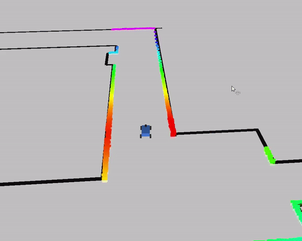

F1TENTH Simulator
================================================

This page goes over how to install the F1TENTH simulator. This simulator is for single car, has ROS in the loop, and does not have camera integration. If you are looking for a simulator that has multi agent capabilities and uses the OpenAI gym environment, you can find that `here <https://github.com/f1tenth/f1tenth_gym>`_.

.. toctree::
   :maxdepth: 1
   :caption: Installation
   :name: sim-install

   sim_install
   sim_use
   sim_info

