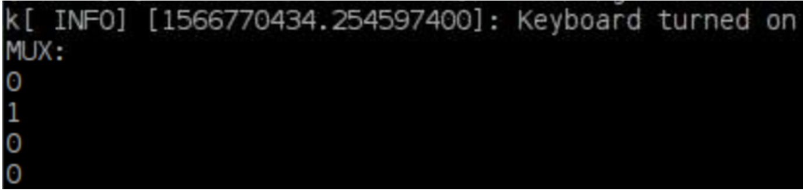
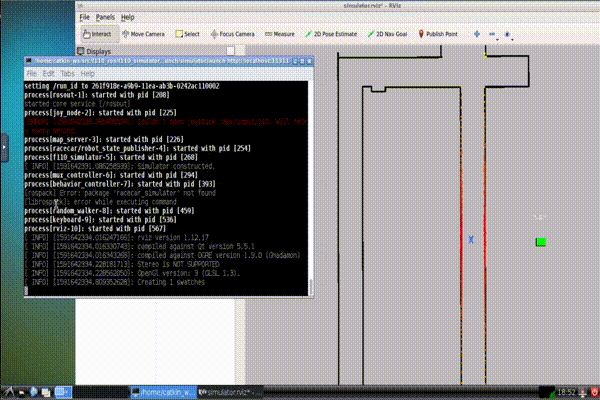
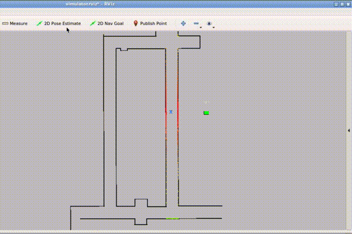

Using the Simulator
====================

Driving
-----------------
Try controlling the racecar manually using your keyboard. Press ``K`` to give driving control to the keyboard, you should see the following in your terminal:

Then, drive using the standard WASD keys:

	- ``W`` drives the car forward
	- ``A`` steers to the left 
	- ``S`` drives it backwards
	- ``D`` steers to the right. 

Press ``spacebar`` to bring the car to a stop. 

.. note::

	Be aware that if you crash, the keyboard will be turned off, and you’ll have to press ``K`` again to turn it back on. Also, it can only handle one key press at a time, so holding down multiple keys at once does not work. Lastly, pressing ``A`` or ``D`` will steer to a fixed angle, and the only way to straighten out is with ``spacebar``.

The controls are a bit tricky, but hopefully you won't have to do too much manual driving!

If you are using a joystick, make sure the correct axis is set in params.yaml for steering and acceleration- this changes between different joysticks.

Instant Pose Setting
-----------------------
A useful function of the simulator is that you can instantly move the car without driving it to its new location. To do this, click the ``2D Pose Estimate`` pose button at the top of the rViz window, and then click the desired location on the track to move the car there.

