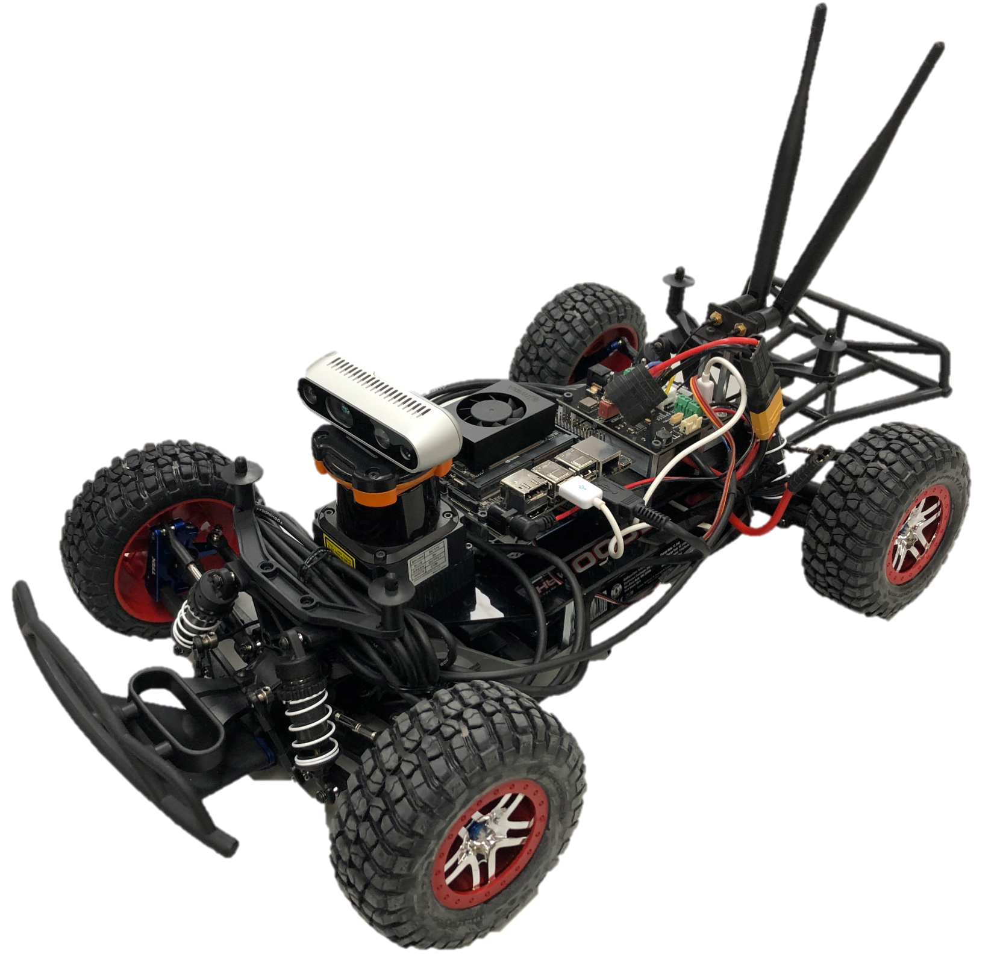

RoboRacer - Build Documentation
================================================

Welcome to the official build documentation of `RoboRacer <http://roboracer.ai/>`_.

.. note::
  You're currently viewing the documentation for RoboRacer on ROS 2. Check `here <https://f1tenth.readthedocs.io/en/stable/>`_ for the ROS 1 documentations!

.. attention::
  #. If you are new to RoboRacer, :ref:`Getting Started <doc_build_intro>` is a good place to start.

  #. If you already have a working car and the work environment set up:

 	- Head over to `Learn <https://roboracer.ai/learn.html>`_ and try out some of the **Labs**.
  	- Check out the :ref:`Simulator <doc_going_forward_simulation>` and implement some fun algorithms.

..
  #. If you don't want to build a physical car and just want to play around in the simulator, head straight to :ref:`Simulation <doc_going_forward_simulation>`.

If you are looking for the old page, you can find it `here <https://f1tenth.github.io/build-old.html>`_. Please note that we no longer provide support for the old build page. If you have questions, please post to the `RoboRacer Slack <https://join.slack.com/t/robo-racer/shared_invite/zt-42lsbf50y-_3YPNLl_d3s~wPylAOMg0g>`_.

.. centered:: Talk with other RoboRacer teams on Slack!

.. note:: RoboRacer is an open source project developed by a community of
          researchers and students. The documentation team can always use your
          feedback and help to improve the tutorials and class reference. If
          you don't understand something, or cannot find what you
          are looking for in the docs, help us make the documentation better
          by letting us know!

          Submit an issue `GitHub repository <https://github.com/f1tenth/f1tenth_doc>`_.

The table of contents in the sidebar should let you easily access the
documentation for your topic of interest. You can also use the search function
in the top left corner.

.. toctree::
   :maxdepth: 1
   :caption: Build and Drive
   :name: sec-getting-started
   :hidden:

   getting_started/intro
   getting_started/build_car/index
   getting_started/software_setup/index
   getting_started/firmware/index
   getting_started/driving/index

.. toctree::
   :maxdepth: 1
   :caption: Simulate
   :name: sec-forward
   :hidden:

   going_forward/simulator/index
   going_forward/drive_rosbag
   going_forward/algorithms/index

.. toctree::
   :maxdepth: 1
   :caption: Autoware @ RoboRacer
   :name: sec-autoware
   :hidden:

   autoware/intro

.. toctree::
   :maxdepth: 1
   :caption: Support
   :name: sec-support-contact
   :hidden:

   getting_started/faq
   support/contact
   support/acknowledgment

.. Indices and tables
.. ------------------
..
.. * :ref:`genindex`
.. * :ref:`modindex`
.. * :ref:`search`
